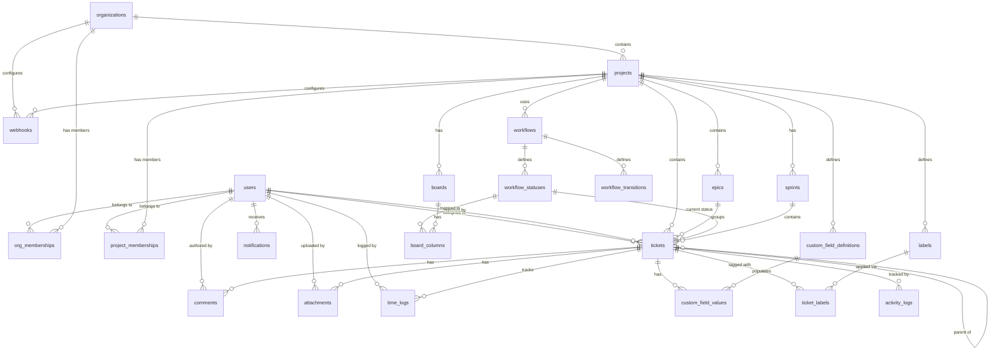

# Database Schema Design

## Overview

All data is stored in PostgreSQL 16. The schema is managed by Alembic migrations generated from SQLAlchemy 2.0 models. The design prioritizes:

- **Referential integrity** via foreign keys with appropriate `ON DELETE` behavior
- **Soft deletes** for audit-sensitive entities (organizations, projects, tickets)
- **JSONB** for flexible, schema-less data (settings, custom field values, workflow conditions)
- **Full-text search** via `tsvector` columns with GIN indexes
- **Hierarchical queries** via recursive CTEs on self-referencing foreign keys
- **Lexicographic ranking** for ordered items (board cards, backlog) using string-based rank keys

## Entity-Relationship Diagram



## Table Definitions

### `users`

Stores user profiles. Created/synced on first OIDC login from Keycloak claims.

| Column | Type | Constraints | Description |
|---|---|---|---|
| `id` | `UUID` | PK, DEFAULT gen_random_uuid() | Internal user ID |
| `oidc_subject` | `VARCHAR(255)` | UNIQUE, NOT NULL | Keycloak `sub` claim, used for identity matching |
| `email` | `VARCHAR(320)` | UNIQUE, NOT NULL | From Keycloak `email` claim |
| `display_name` | `VARCHAR(255)` | NOT NULL | From Keycloak `name` or `preferred_username` |
| `avatar_url` | `VARCHAR(2048)` | NULL | Profile picture URL |
| `is_system_admin` | `BOOLEAN` | NOT NULL, DEFAULT false | Platform-wide admin flag |
| `is_active` | `BOOLEAN` | NOT NULL, DEFAULT true | Deactivated users cannot log in |
| `preferences` | `JSONB` | NOT NULL, DEFAULT '{}' | UI preferences (theme, notifications, etc.) |
| `last_login_at` | `TIMESTAMPTZ` | NULL | Updated on each authentication |
| `created_at` | `TIMESTAMPTZ` | NOT NULL, DEFAULT now() | |
| `updated_at` | `TIMESTAMPTZ` | NOT NULL, DEFAULT now() | Auto-updated by trigger |

**Indexes:**
- `ix_users_oidc_subject` UNIQUE on `oidc_subject`
- `ix_users_email` UNIQUE on `email`
- `ix_users_display_name` on `display_name` (for search/sort)

---

### `organizations`

Top-level entity. All projects, members, and configuration live under an organization.

| Column | Type | Constraints | Description |
|---|---|---|---|
| `id` | `UUID` | PK, DEFAULT gen_random_uuid() | |
| `name` | `VARCHAR(255)` | NOT NULL | Display name |
| `slug` | `VARCHAR(100)` | UNIQUE, NOT NULL | URL-safe identifier |
| `description` | `TEXT` | NULL | |
| `avatar_url` | `VARCHAR(2048)` | NULL | |
| `settings` | `JSONB` | NOT NULL, DEFAULT '{}' | Org-wide settings |
| `is_active` | `BOOLEAN` | NOT NULL, DEFAULT true | Soft delete flag |
| `created_at` | `TIMESTAMPTZ` | NOT NULL, DEFAULT now() | |
| `updated_at` | `TIMESTAMPTZ` | NOT NULL, DEFAULT now() | |

**Indexes:**
- `ix_organizations_slug` UNIQUE on `slug`

**Settings JSONB schema:**
```json
{
    "default_project_visibility": "private",
    "allowed_ticket_types": ["story", "task", "bug", "subtask"],
    "max_attachment_size_mb": 50,
    "features": {
        "time_tracking_enabled": true,
        "custom_fields_enabled": true
    }
}
```

---

### `org_memberships`

Maps users to organizations with a role.

| Column | Type | Constraints | Description |
|---|---|---|---|
| `id` | `UUID` | PK, DEFAULT gen_random_uuid() | |
| `user_id` | `UUID` | FK -> users.id ON DELETE CASCADE, NOT NULL | |
| `organization_id` | `UUID` | FK -> organizations.id ON DELETE CASCADE, NOT NULL | |
| `role` | `VARCHAR(20)` | NOT NULL, CHECK IN ('owner', 'admin', 'member') | |
| `created_at` | `TIMESTAMPTZ` | NOT NULL, DEFAULT now() | |
| `updated_at` | `TIMESTAMPTZ` | NOT NULL, DEFAULT now() | |

**Indexes:**
- `uq_org_memberships_user_org` UNIQUE on (`user_id`, `organization_id`)
- `ix_org_memberships_org_id` on `organization_id`

---

### `projects`

A project belongs to one organization and contains epics, tickets, sprints, and boards.

| Column | Type | Constraints | Description |
|---|---|---|---|
| `id` | `UUID` | PK, DEFAULT gen_random_uuid() | |
| `organization_id` | `UUID` | FK -> organizations.id ON DELETE CASCADE, NOT NULL | |
| `name` | `VARCHAR(255)` | NOT NULL | Display name |
| `key` | `VARCHAR(10)` | NOT NULL | Short key for ticket numbering (e.g., "PROJ") |
| `description` | `TEXT` | NULL | |
| `avatar_url` | `VARCHAR(2048)` | NULL | |
| `visibility` | `VARCHAR(20)` | NOT NULL, DEFAULT 'private', CHECK IN ('private', 'internal', 'public') | `private`: members only, `internal`: all org members, `public`: future use |
| `default_workflow_id` | `UUID` | FK -> workflows.id ON DELETE SET NULL, NULL | |
| `ticket_sequence` | `INTEGER` | NOT NULL, DEFAULT 0 | Counter for auto-incrementing ticket numbers |
| `settings` | `JSONB` | NOT NULL, DEFAULT '{}' | Project-specific settings |
| `is_archived` | `BOOLEAN` | NOT NULL, DEFAULT false | |
| `created_at` | `TIMESTAMPTZ` | NOT NULL, DEFAULT now() | |
| `updated_at` | `TIMESTAMPTZ` | NOT NULL, DEFAULT now() | |

**Indexes:**
- `uq_projects_org_key` UNIQUE on (`organization_id`, `key`)
- `ix_projects_org_id` on `organization_id`

**Settings JSONB schema:**
```json
{
    "ticket_types": ["story", "task", "bug", "subtask", "spike"],
    "default_priority": "medium",
    "estimation_method": "story_points",
    "sprint_duration_weeks": 2,
    "board_default_swimlane": "none"
}
```

---

### `project_memberships`

GitLab-style role-based project access.

| Column | Type | Constraints | Description |
|---|---|---|---|
| `id` | `UUID` | PK, DEFAULT gen_random_uuid() | |
| `user_id` | `UUID` | FK -> users.id ON DELETE CASCADE, NOT NULL | |
| `project_id` | `UUID` | FK -> projects.id ON DELETE CASCADE, NOT NULL | |
| `role` | `VARCHAR(20)` | NOT NULL, CHECK IN ('owner', 'maintainer', 'developer', 'reporter', 'guest') | |
| `created_at` | `TIMESTAMPTZ` | NOT NULL, DEFAULT now() | |
| `updated_at` | `TIMESTAMPTZ` | NOT NULL, DEFAULT now() | |

**Indexes:**
- `uq_project_memberships_user_project` UNIQUE on (`user_id`, `project_id`)
- `ix_project_memberships_project_id` on `project_id`

---

### `workflows`

Defines a set of statuses and allowed transitions. Each project uses one workflow.

| Column | Type | Constraints | Description |
|---|---|---|---|
| `id` | `UUID` | PK, DEFAULT gen_random_uuid() | |
| `organization_id` | `UUID` | FK -> organizations.id ON DELETE CASCADE, NOT NULL | Org that owns this workflow |
| `project_id` | `UUID` | FK -> projects.id ON DELETE CASCADE, NULL | NULL = org-level template |
| `name` | `VARCHAR(255)` | NOT NULL | e.g., "Kanban Default", "Scrum Workflow" |
| `description` | `TEXT` | NULL | |
| `is_default` | `BOOLEAN` | NOT NULL, DEFAULT false | Default workflow for new projects |
| `created_at` | `TIMESTAMPTZ` | NOT NULL, DEFAULT now() | |
| `updated_at` | `TIMESTAMPTZ` | NOT NULL, DEFAULT now() | |

**Indexes:**
- `ix_workflows_org_id` on `organization_id`
- `ix_workflows_project_id` on `project_id`

---

### `workflow_statuses`

Individual statuses within a workflow.

| Column | Type | Constraints | Description |
|---|---|---|---|
| `id` | `UUID` | PK, DEFAULT gen_random_uuid() | |
| `workflow_id` | `UUID` | FK -> workflows.id ON DELETE CASCADE, NOT NULL | |
| `name` | `VARCHAR(100)` | NOT NULL | e.g., "To Do", "In Progress", "Done" |
| `category` | `VARCHAR(20)` | NOT NULL, CHECK IN ('to_do', 'in_progress', 'done') | Used for reporting (determines burndown, velocity, etc.) |
| `position` | `INTEGER` | NOT NULL | Display order |
| `color` | `VARCHAR(7)` | NOT NULL, DEFAULT '#6B7280' | Hex color code |
| `is_initial` | `BOOLEAN` | NOT NULL, DEFAULT false | Status assigned to newly created tickets |
| `is_terminal` | `BOOLEAN` | NOT NULL, DEFAULT false | Represents completion |
| `created_at` | `TIMESTAMPTZ` | NOT NULL, DEFAULT now() | |

**Indexes:**
- `ix_workflow_statuses_workflow_id` on `workflow_id`
- `uq_workflow_statuses_workflow_position` UNIQUE on (`workflow_id`, `position`)

---

### `workflow_transitions`

Allowed transitions between statuses.

| Column | Type | Constraints | Description |
|---|---|---|---|
| `id` | `UUID` | PK, DEFAULT gen_random_uuid() | |
| `workflow_id` | `UUID` | FK -> workflows.id ON DELETE CASCADE, NOT NULL | |
| `from_status_id` | `UUID` | FK -> workflow_statuses.id ON DELETE CASCADE, NOT NULL | |
| `to_status_id` | `UUID` | FK -> workflow_statuses.id ON DELETE CASCADE, NOT NULL | |
| `name` | `VARCHAR(255)` | NULL | Optional transition label |
| `conditions` | `JSONB` | NOT NULL, DEFAULT '{}' | Rules for who/when can trigger this transition |
| `created_at` | `TIMESTAMPTZ` | NOT NULL, DEFAULT now() | |

**Indexes:**
- `uq_workflow_transitions_from_to` UNIQUE on (`workflow_id`, `from_status_id`, `to_status_id`)
- `ix_workflow_transitions_workflow_id` on `workflow_id`

**Conditions JSONB schema:**
```json
{
    "allowed_roles": ["developer", "maintainer", "owner"],
    "require_assignee": true,
    "require_fields": ["resolution"]
}
```

---

### `epics`

Epics group related tickets. Belong to a project.

| Column | Type | Constraints | Description |
|---|---|---|---|
| `id` | `UUID` | PK, DEFAULT gen_random_uuid() | |
| `project_id` | `UUID` | FK -> projects.id ON DELETE CASCADE, NOT NULL | |
| `title` | `VARCHAR(500)` | NOT NULL | |
| `description` | `TEXT` | NULL | Rich text (TipTap HTML) |
| `status` | `VARCHAR(20)` | NOT NULL, DEFAULT 'open', CHECK IN ('open', 'in_progress', 'done', 'closed') | |
| `color` | `VARCHAR(7)` | NOT NULL, DEFAULT '#3B82F6' | For visual identification on boards/timeline |
| `start_date` | `DATE` | NULL | Planned start |
| `target_date` | `DATE` | NULL | Planned end |
| `sort_order` | `VARCHAR(255)` | NOT NULL | Lexicographic rank |
| `created_by_id` | `UUID` | FK -> users.id ON DELETE SET NULL, NULL | |
| `created_at` | `TIMESTAMPTZ` | NOT NULL, DEFAULT now() | |
| `updated_at` | `TIMESTAMPTZ` | NOT NULL, DEFAULT now() | |

**Indexes:**
- `ix_epics_project_id` on `project_id`

---

### `tickets`

Core entity. Supports infinite nesting via `parent_ticket_id`.

| Column | Type | Constraints | Description |
|---|---|---|---|
| `id` | `UUID` | PK, DEFAULT gen_random_uuid() | |
| `project_id` | `UUID` | FK -> projects.id ON DELETE CASCADE, NOT NULL | |
| `epic_id` | `UUID` | FK -> epics.id ON DELETE SET NULL, NULL | Optional epic grouping |
| `sprint_id` | `UUID` | FK -> sprints.id ON DELETE SET NULL, NULL | Which sprint this ticket is in |
| `parent_ticket_id` | `UUID` | FK -> tickets.id ON DELETE CASCADE, NULL | Self-reference for nesting |
| `ticket_number` | `INTEGER` | NOT NULL | Auto-incremented per project (PROJ-1, PROJ-2) |
| `ticket_type` | `VARCHAR(50)` | NOT NULL, DEFAULT 'task' | story, task, bug, subtask, spike, etc. |
| `title` | `VARCHAR(500)` | NOT NULL | |
| `description` | `TEXT` | NULL | Rich text (TipTap JSON stored as HTML) |
| `workflow_status_id` | `UUID` | FK -> workflow_statuses.id ON DELETE RESTRICT, NOT NULL | Current status |
| `priority` | `VARCHAR(20)` | NOT NULL, DEFAULT 'medium', CHECK IN ('critical', 'high', 'medium', 'low', 'none') | |
| `assignee_id` | `UUID` | FK -> users.id ON DELETE SET NULL, NULL | |
| `reporter_id` | `UUID` | FK -> users.id ON DELETE SET NULL, NULL | |
| `story_points` | `SMALLINT` | NULL | Estimation in story points |
| `original_estimate_seconds` | `INTEGER` | NULL | Time estimate in seconds |
| `remaining_estimate_seconds` | `INTEGER` | NULL | Remaining work in seconds |
| `due_date` | `DATE` | NULL | |
| `start_date` | `DATE` | NULL | For timeline/Gantt view |
| `resolution` | `VARCHAR(50)` | NULL | done, wont_fix, duplicate, cannot_reproduce, etc. |
| `resolved_at` | `TIMESTAMPTZ` | NULL | When ticket was resolved |
| `board_rank` | `VARCHAR(255)` | NOT NULL | Lexicographic rank for board column ordering |
| `backlog_rank` | `VARCHAR(255)` | NOT NULL | Lexicographic rank for backlog ordering |
| `is_deleted` | `BOOLEAN` | NOT NULL, DEFAULT false | Soft delete |
| `search_vector` | `tsvector` | NOT NULL | Full-text search vector |
| `created_at` | `TIMESTAMPTZ` | NOT NULL, DEFAULT now() | |
| `updated_at` | `TIMESTAMPTZ` | NOT NULL, DEFAULT now() | |

**Indexes:**
- `uq_tickets_project_number` UNIQUE on (`project_id`, `ticket_number`)
- `ix_tickets_project_id` on `project_id` WHERE `is_deleted = false`
- `ix_tickets_epic_id` on `epic_id`
- `ix_tickets_sprint_id` on `sprint_id`
- `ix_tickets_parent_id` on `parent_ticket_id`
- `ix_tickets_assignee_id` on `assignee_id`
- `ix_tickets_status_id` on `workflow_status_id`
- `ix_tickets_board_rank` on (`project_id`, `workflow_status_id`, `board_rank`) WHERE `is_deleted = false`
- `ix_tickets_backlog_rank` on (`project_id`, `backlog_rank`) WHERE `is_deleted = false` AND `sprint_id IS NULL`
- `ix_tickets_search_vector` GIN on `search_vector`
- `ix_tickets_due_date` on `due_date` WHERE `due_date IS NOT NULL` AND `is_deleted = false`

**Trigger:** Update `search_vector` on INSERT/UPDATE of `title` or `description`:
```sql
CREATE FUNCTION tickets_search_vector_update() RETURNS trigger AS $$
BEGIN
    NEW.search_vector :=
        setweight(to_tsvector('english', COALESCE(NEW.title, '')), 'A') ||
        setweight(to_tsvector('english', COALESCE(
            regexp_replace(NEW.description, '<[^>]*>', '', 'g'), ''
        )), 'B');
    RETURN NEW;
END;
$$ LANGUAGE plpgsql;
```

**Ticket number generation** uses `UPDATE projects SET ticket_sequence = ticket_sequence + 1 ... RETURNING ticket_sequence` inside the ticket creation transaction to guarantee uniqueness.

---

### `ticket_dependencies`

Tracks blocked-by / blocks relationships between tickets.

| Column | Type | Constraints | Description |
|---|---|---|---|
| `id` | `UUID` | PK, DEFAULT gen_random_uuid() | |
| `blocking_ticket_id` | `UUID` | FK -> tickets.id ON DELETE CASCADE, NOT NULL | The ticket that blocks |
| `blocked_ticket_id` | `UUID` | FK -> tickets.id ON DELETE CASCADE, NOT NULL | The ticket that is blocked |
| `dependency_type` | `VARCHAR(20)` | NOT NULL, DEFAULT 'blocks', CHECK IN ('blocks', 'is_blocked_by', 'relates_to', 'duplicates') | |
| `created_at` | `TIMESTAMPTZ` | NOT NULL, DEFAULT now() | |

**Indexes:**
- `uq_ticket_deps_blocking_blocked` UNIQUE on (`blocking_ticket_id`, `blocked_ticket_id`)
- `ix_ticket_deps_blocked` on `blocked_ticket_id`

---

### `comments`

Threaded comments on tickets.

| Column | Type | Constraints | Description |
|---|---|---|---|
| `id` | `UUID` | PK, DEFAULT gen_random_uuid() | |
| `ticket_id` | `UUID` | FK -> tickets.id ON DELETE CASCADE, NOT NULL | |
| `author_id` | `UUID` | FK -> users.id ON DELETE SET NULL, NULL | |
| `body` | `TEXT` | NOT NULL | Rich text (TipTap HTML) |
| `is_edited` | `BOOLEAN` | NOT NULL, DEFAULT false | |
| `is_deleted` | `BOOLEAN` | NOT NULL, DEFAULT false | Soft delete |
| `created_at` | `TIMESTAMPTZ` | NOT NULL, DEFAULT now() | |
| `updated_at` | `TIMESTAMPTZ` | NOT NULL, DEFAULT now() | |

**Indexes:**
- `ix_comments_ticket_id` on `ticket_id`
- `ix_comments_author_id` on `author_id`

---

### `attachments`

File attachments on tickets or comments. Actual files stored in S3.

| Column | Type | Constraints | Description |
|---|---|---|---|
| `id` | `UUID` | PK, DEFAULT gen_random_uuid() | |
| `ticket_id` | `UUID` | FK -> tickets.id ON DELETE CASCADE, NOT NULL | |
| `comment_id` | `UUID` | FK -> comments.id ON DELETE SET NULL, NULL | Optional: attached to a specific comment |
| `uploader_id` | `UUID` | FK -> users.id ON DELETE SET NULL, NULL | |
| `filename` | `VARCHAR(500)` | NOT NULL | Original filename |
| `s3_key` | `VARCHAR(1024)` | NOT NULL | S3 object key |
| `content_type` | `VARCHAR(255)` | NOT NULL | MIME type |
| `size_bytes` | `BIGINT` | NOT NULL | |
| `created_at` | `TIMESTAMPTZ` | NOT NULL, DEFAULT now() | |

**Indexes:**
- `ix_attachments_ticket_id` on `ticket_id`

---

### `labels`

Project-scoped labels for categorizing tickets.

| Column | Type | Constraints | Description |
|---|---|---|---|
| `id` | `UUID` | PK, DEFAULT gen_random_uuid() | |
| `project_id` | `UUID` | FK -> projects.id ON DELETE CASCADE, NOT NULL | |
| `name` | `VARCHAR(100)` | NOT NULL | |
| `color` | `VARCHAR(7)` | NOT NULL, DEFAULT '#6B7280' | Hex color |
| `description` | `VARCHAR(500)` | NULL | |
| `created_at` | `TIMESTAMPTZ` | NOT NULL, DEFAULT now() | |

**Indexes:**
- `uq_labels_project_name` UNIQUE on (`project_id`, `name`)

---

### `ticket_labels`

Junction table for many-to-many ticket-label relationship.

| Column | Type | Constraints | Description |
|---|---|---|---|
| `ticket_id` | `UUID` | FK -> tickets.id ON DELETE CASCADE, NOT NULL | Composite PK part 1 |
| `label_id` | `UUID` | FK -> labels.id ON DELETE CASCADE, NOT NULL | Composite PK part 2 |
| `created_at` | `TIMESTAMPTZ` | NOT NULL, DEFAULT now() | |

**Indexes:**
- PRIMARY KEY on (`ticket_id`, `label_id`)
- `ix_ticket_labels_label_id` on `label_id`

---

### `sprints`

Time-boxed iterations. Only one sprint can be active per project at a time.

| Column | Type | Constraints | Description |
|---|---|---|---|
| `id` | `UUID` | PK, DEFAULT gen_random_uuid() | |
| `project_id` | `UUID` | FK -> projects.id ON DELETE CASCADE, NOT NULL | |
| `name` | `VARCHAR(255)` | NOT NULL | e.g., "Sprint 14" |
| `goal` | `TEXT` | NULL | Sprint goal description |
| `start_date` | `DATE` | NULL | |
| `end_date` | `DATE` | NULL | |
| `status` | `VARCHAR(20)` | NOT NULL, DEFAULT 'planning', CHECK IN ('planning', 'active', 'completed') | |
| `completed_at` | `TIMESTAMPTZ` | NULL | When sprint was completed |
| `velocity` | `INTEGER` | NULL | Story points completed (set on completion) |
| `created_at` | `TIMESTAMPTZ` | NOT NULL, DEFAULT now() | |
| `updated_at` | `TIMESTAMPTZ` | NOT NULL, DEFAULT now() | |

**Indexes:**
- `ix_sprints_project_id` on `project_id`
- `uq_sprints_active_per_project` UNIQUE on `project_id` WHERE `status = 'active'` (partial unique index enforcing one active sprint)

---

### `boards`

Visual board configurations. A project can have multiple boards.

| Column | Type | Constraints | Description |
|---|---|---|---|
| `id` | `UUID` | PK, DEFAULT gen_random_uuid() | |
| `project_id` | `UUID` | FK -> projects.id ON DELETE CASCADE, NOT NULL | |
| `name` | `VARCHAR(255)` | NOT NULL | |
| `board_type` | `VARCHAR(20)` | NOT NULL, DEFAULT 'kanban', CHECK IN ('kanban', 'scrum') | |
| `filter_config` | `JSONB` | NOT NULL, DEFAULT '{}' | Saved board filters |
| `is_default` | `BOOLEAN` | NOT NULL, DEFAULT false | |
| `created_at` | `TIMESTAMPTZ` | NOT NULL, DEFAULT now() | |
| `updated_at` | `TIMESTAMPTZ` | NOT NULL, DEFAULT now() | |

**Indexes:**
- `ix_boards_project_id` on `project_id`

**Filter config JSONB schema:**
```json
{
    "ticket_types": ["story", "bug"],
    "assignees": ["uuid1", "uuid2"],
    "labels": ["uuid3"],
    "priorities": ["high", "critical"],
    "swimlane_by": "assignee"
}
```

---

### `board_columns`

Columns within a board, each mapped to a workflow status.

| Column | Type | Constraints | Description |
|---|---|---|---|
| `id` | `UUID` | PK, DEFAULT gen_random_uuid() | |
| `board_id` | `UUID` | FK -> boards.id ON DELETE CASCADE, NOT NULL | |
| `workflow_status_id` | `UUID` | FK -> workflow_statuses.id ON DELETE CASCADE, NOT NULL | |
| `position` | `INTEGER` | NOT NULL | Column display order |
| `wip_limit` | `INTEGER` | NULL | Max tickets in this column (NULL = unlimited) |
| `is_collapsed` | `BOOLEAN` | NOT NULL, DEFAULT false | |
| `created_at` | `TIMESTAMPTZ` | NOT NULL, DEFAULT now() | |

**Indexes:**
- `uq_board_columns_board_position` UNIQUE on (`board_id`, `position`)
- `uq_board_columns_board_status` UNIQUE on (`board_id`, `workflow_status_id`)

---

### `custom_field_definitions`

User-defined fields that can be added to tickets. Defined per project.

| Column | Type | Constraints | Description |
|---|---|---|---|
| `id` | `UUID` | PK, DEFAULT gen_random_uuid() | |
| `project_id` | `UUID` | FK -> projects.id ON DELETE CASCADE, NOT NULL | |
| `name` | `VARCHAR(255)` | NOT NULL | Field label |
| `field_key` | `VARCHAR(100)` | NOT NULL | Machine-readable key (snake_case) |
| `field_type` | `VARCHAR(30)` | NOT NULL, CHECK IN ('text', 'number', 'date', 'datetime', 'select', 'multi_select', 'user', 'url', 'checkbox') | |
| `description` | `VARCHAR(500)` | NULL | Help text |
| `options` | `JSONB` | NULL | For select/multi_select: array of {value, label, color} |
| `validation` | `JSONB` | NOT NULL, DEFAULT '{}' | Validation rules |
| `is_required` | `BOOLEAN` | NOT NULL, DEFAULT false | |
| `position` | `INTEGER` | NOT NULL | Display order |
| `applies_to_types` | `JSONB` | NULL | Array of ticket_types this field applies to (NULL = all) |
| `created_at` | `TIMESTAMPTZ` | NOT NULL, DEFAULT now() | |
| `updated_at` | `TIMESTAMPTZ` | NOT NULL, DEFAULT now() | |

**Indexes:**
- `uq_custom_field_defs_project_key` UNIQUE on (`project_id`, `field_key`)

**Options JSONB schema (for select fields):**
```json
[
    {"value": "frontend", "label": "Frontend", "color": "#3B82F6"},
    {"value": "backend", "label": "Backend", "color": "#10B981"},
    {"value": "devops", "label": "DevOps", "color": "#F59E0B"}
]
```

**Validation JSONB schema:**
```json
{
    "min_length": 1,
    "max_length": 500,
    "regex": "^https?://",
    "min_value": 0,
    "max_value": 100
}
```

---

### `custom_field_values`

Stores the actual values of custom fields per ticket.

| Column | Type | Constraints | Description |
|---|---|---|---|
| `id` | `UUID` | PK, DEFAULT gen_random_uuid() | |
| `ticket_id` | `UUID` | FK -> tickets.id ON DELETE CASCADE, NOT NULL | |
| `field_definition_id` | `UUID` | FK -> custom_field_definitions.id ON DELETE CASCADE, NOT NULL | |
| `value` | `JSONB` | NOT NULL | Flexible storage for any field type |
| `created_at` | `TIMESTAMPTZ` | NOT NULL, DEFAULT now() | |
| `updated_at` | `TIMESTAMPTZ` | NOT NULL, DEFAULT now() | |

**Indexes:**
- `uq_custom_field_values_ticket_field` UNIQUE on (`ticket_id`, `field_definition_id`)
- `ix_custom_field_values_field_def` on `field_definition_id`
- `ix_custom_field_values_value` GIN on `value` (enables filtering on custom field values)

**Value storage by field type:**
| Field Type | JSONB Value Example |
|---|---|
| text | `"Some text value"` |
| number | `42.5` |
| date | `"2026-03-24"` |
| datetime | `"2026-03-24T10:30:00Z"` |
| select | `"frontend"` |
| multi_select | `["frontend", "backend"]` |
| user | `"uuid-of-user"` |
| url | `"https://example.com"` |
| checkbox | `true` |

---

### `time_logs`

Work time entries logged against tickets.

| Column | Type | Constraints | Description |
|---|---|---|---|
| `id` | `UUID` | PK, DEFAULT gen_random_uuid() | |
| `ticket_id` | `UUID` | FK -> tickets.id ON DELETE CASCADE, NOT NULL | |
| `user_id` | `UUID` | FK -> users.id ON DELETE SET NULL, NULL | |
| `time_spent_seconds` | `INTEGER` | NOT NULL, CHECK > 0 | Duration logged |
| `description` | `VARCHAR(500)` | NULL | What was done |
| `logged_for_date` | `DATE` | NOT NULL | The date the work was performed |
| `created_at` | `TIMESTAMPTZ` | NOT NULL, DEFAULT now() | |
| `updated_at` | `TIMESTAMPTZ` | NOT NULL, DEFAULT now() | |

**Indexes:**
- `ix_time_logs_ticket_id` on `ticket_id`
- `ix_time_logs_user_id` on `user_id`
- `ix_time_logs_logged_for_date` on `logged_for_date`

---

### `activity_logs`

Audit trail recording every change to tickets and other entities.

| Column | Type | Constraints | Description |
|---|---|---|---|
| `id` | `UUID` | PK, DEFAULT gen_random_uuid() | |
| `entity_type` | `VARCHAR(50)` | NOT NULL | 'ticket', 'epic', 'sprint', 'project', etc. |
| `entity_id` | `UUID` | NOT NULL | ID of the changed entity |
| `project_id` | `UUID` | FK -> projects.id ON DELETE CASCADE, NULL | For efficient project-scoped queries |
| `user_id` | `UUID` | FK -> users.id ON DELETE SET NULL, NULL | Who made the change |
| `action` | `VARCHAR(50)` | NOT NULL | 'created', 'updated', 'deleted', 'commented', 'transitioned', etc. |
| `changes` | `JSONB` | NOT NULL, DEFAULT '{}' | Before/after values of changed fields |
| `created_at` | `TIMESTAMPTZ` | NOT NULL, DEFAULT now() | |

**Indexes:**
- `ix_activity_logs_entity` on (`entity_type`, `entity_id`)
- `ix_activity_logs_project_id` on `project_id`
- `ix_activity_logs_created_at` on `created_at`

**Changes JSONB schema:**
```json
{
    "status": {"from": "To Do", "to": "In Progress"},
    "assignee": {"from": null, "to": "Jane Doe"},
    "priority": {"from": "medium", "to": "high"}
}
```

---

### `notifications`

In-app notification entries per user.

| Column | Type | Constraints | Description |
|---|---|---|---|
| `id` | `UUID` | PK, DEFAULT gen_random_uuid() | |
| `user_id` | `UUID` | FK -> users.id ON DELETE CASCADE, NOT NULL | Recipient |
| `type` | `VARCHAR(50)` | NOT NULL | 'ticket_assigned', 'mentioned', 'status_changed', 'comment_added', etc. |
| `title` | `VARCHAR(255)` | NOT NULL | Short summary |
| `body` | `TEXT` | NULL | Additional detail |
| `entity_type` | `VARCHAR(50)` | NOT NULL | 'ticket', 'comment', 'sprint', etc. |
| `entity_id` | `UUID` | NOT NULL | ID for deep linking |
| `project_id` | `UUID` | FK -> projects.id ON DELETE CASCADE, NULL | For context |
| `actor_id` | `UUID` | FK -> users.id ON DELETE SET NULL, NULL | Who triggered this notification |
| `is_read` | `BOOLEAN` | NOT NULL, DEFAULT false | |
| `read_at` | `TIMESTAMPTZ` | NULL | |
| `created_at` | `TIMESTAMPTZ` | NOT NULL, DEFAULT now() | |

**Indexes:**
- `ix_notifications_user_id_unread` on `user_id` WHERE `is_read = false`
- `ix_notifications_user_id_created` on (`user_id`, `created_at` DESC)

---

### `webhooks`

Outbound webhook configurations.

| Column | Type | Constraints | Description |
|---|---|---|---|
| `id` | `UUID` | PK, DEFAULT gen_random_uuid() | |
| `organization_id` | `UUID` | FK -> organizations.id ON DELETE CASCADE, NOT NULL | |
| `project_id` | `UUID` | FK -> projects.id ON DELETE CASCADE, NULL | NULL = org-wide webhook |
| `name` | `VARCHAR(255)` | NOT NULL | |
| `url` | `VARCHAR(2048)` | NOT NULL | Delivery endpoint |
| `secret` | `VARCHAR(255)` | NOT NULL | HMAC-SHA256 signing secret |
| `events` | `JSONB` | NOT NULL | Array of event types to subscribe to |
| `is_active` | `BOOLEAN` | NOT NULL, DEFAULT true | |
| `created_at` | `TIMESTAMPTZ` | NOT NULL, DEFAULT now() | |
| `updated_at` | `TIMESTAMPTZ` | NOT NULL, DEFAULT now() | |

**Indexes:**
- `ix_webhooks_org_id` on `organization_id`
- `ix_webhooks_project_id` on `project_id`

**Events JSONB example:**
```json
["ticket.created", "ticket.updated", "ticket.deleted", "comment.created", "sprint.started", "sprint.completed"]
```

---

### `webhook_deliveries`

Log of webhook delivery attempts for debugging.

| Column | Type | Constraints | Description |
|---|---|---|---|
| `id` | `UUID` | PK, DEFAULT gen_random_uuid() | |
| `webhook_id` | `UUID` | FK -> webhooks.id ON DELETE CASCADE, NOT NULL | |
| `event_type` | `VARCHAR(100)` | NOT NULL | |
| `payload` | `JSONB` | NOT NULL | The delivered payload |
| `response_status` | `SMALLINT` | NULL | HTTP status code of the response |
| `response_body` | `TEXT` | NULL | First 10KB of response body |
| `response_time_ms` | `INTEGER` | NULL | Round-trip time |
| `attempt_number` | `SMALLINT` | NOT NULL, DEFAULT 1 | Retry attempt counter |
| `status` | `VARCHAR(20)` | NOT NULL, CHECK IN ('pending', 'success', 'failed', 'retrying') | |
| `next_retry_at` | `TIMESTAMPTZ` | NULL | |
| `created_at` | `TIMESTAMPTZ` | NOT NULL, DEFAULT now() | |

**Indexes:**
- `ix_webhook_deliveries_webhook_id` on `webhook_id`
- `ix_webhook_deliveries_status` on `status` WHERE `status IN ('pending', 'retrying')`

---

## Hierarchical Ticket Queries

Tickets support infinite nesting via the `parent_ticket_id` self-reference. To query the full tree for a ticket:

### Get all descendants (recursive CTE)

```sql
WITH RECURSIVE ticket_tree AS (
    -- Base case: the root ticket
    SELECT id, parent_ticket_id, title, ticket_number, 0 AS depth
    FROM tickets
    WHERE id = :root_ticket_id AND is_deleted = false

    UNION ALL

    -- Recursive case: children
    SELECT t.id, t.parent_ticket_id, t.title, t.ticket_number, tt.depth + 1
    FROM tickets t
    INNER JOIN ticket_tree tt ON t.parent_ticket_id = tt.id
    WHERE t.is_deleted = false
)
SELECT * FROM ticket_tree ORDER BY depth, ticket_number;
```

### Get all ancestors (upward traversal)

```sql
WITH RECURSIVE ancestors AS (
    SELECT id, parent_ticket_id, title, 0 AS depth
    FROM tickets
    WHERE id = :ticket_id

    UNION ALL

    SELECT t.id, t.parent_ticket_id, t.title, a.depth + 1
    FROM tickets t
    INNER JOIN ancestors a ON t.id = a.parent_ticket_id
)
SELECT * FROM ancestors WHERE depth > 0 ORDER BY depth DESC;
```

## Lexicographic Ranking Strategy

Board card ordering and backlog ordering use string-based lexicographic ranks (similar to Jira's LexoRank). This allows reordering without updating every row.

**Approach:**
- Ranks are strings from a character set (e.g., `0-9a-z`)
- Inserting between two items computes the midpoint string
- Example: between `"aaa"` and `"aac"` -> `"aab"`
- When characters exhaust (between `"aaa"` and `"aab"`), extend: `"aaaN"` where N is the midpoint of the extended range
- Periodically rebalance all ranks in a column/backlog when ranks get too long (background task)

**Initial seeding:** New tickets get rank `"m"` (midpoint). Subsequent inserts calculate midpoints relative to neighbors.

## Full-Text Search

PostgreSQL full-text search is used for searching tickets. The `search_vector` column on the `tickets` table is a `tsvector` with weighted components:

- **Weight A:** `title` (highest relevance)
- **Weight B:** `description` (HTML tags stripped via regex before vectorization)

**Search query pattern:**
```sql
SELECT t.*, ts_rank(t.search_vector, query) AS relevance
FROM tickets t, plainto_tsquery('english', :search_text) query
WHERE t.project_id = :project_id
  AND t.is_deleted = false
  AND t.search_vector @@ query
ORDER BY relevance DESC
LIMIT :limit OFFSET :offset;
```

Optionally combined with ticket number prefix matching:
```sql
-- Also match "PROJ-123" style queries
WHERE (t.search_vector @@ query)
   OR (t.ticket_number = :extracted_number AND :project_key_matches)
```

## Migration Conventions

- **Alembic** manages all schema migrations with autogenerate from SQLAlchemy models
- Migration files are named with timestamps: `YYYYMMDD_HHMM_description.py`
- Every migration must include both `upgrade()` and `downgrade()` functions
- Data migrations (seeding default workflows, etc.) are separate from schema migrations
- The initial migration creates all tables, indexes, triggers, and seeds default data
- `alembic stamp head` is used on fresh databases after initial setup

## Common Mixins

All timestamp columns use database-side defaults and triggers:

```sql
CREATE FUNCTION update_updated_at_column() RETURNS trigger AS $$
BEGIN
    NEW.updated_at = now();
    RETURN NEW;
END;
$$ LANGUAGE plpgsql;

-- Applied to every table with updated_at:
CREATE TRIGGER set_updated_at
    BEFORE UPDATE ON {table_name}
    FOR EACH ROW
    EXECUTE FUNCTION update_updated_at_column();
```

SQLAlchemy base model mixin:

```python
class TimestampMixin:
    created_at: Mapped[datetime] = mapped_column(
        TIMESTAMPTZ, server_default=func.now(), nullable=False
    )
    updated_at: Mapped[datetime] = mapped_column(
        TIMESTAMPTZ, server_default=func.now(), onupdate=func.now(), nullable=False
    )
```
