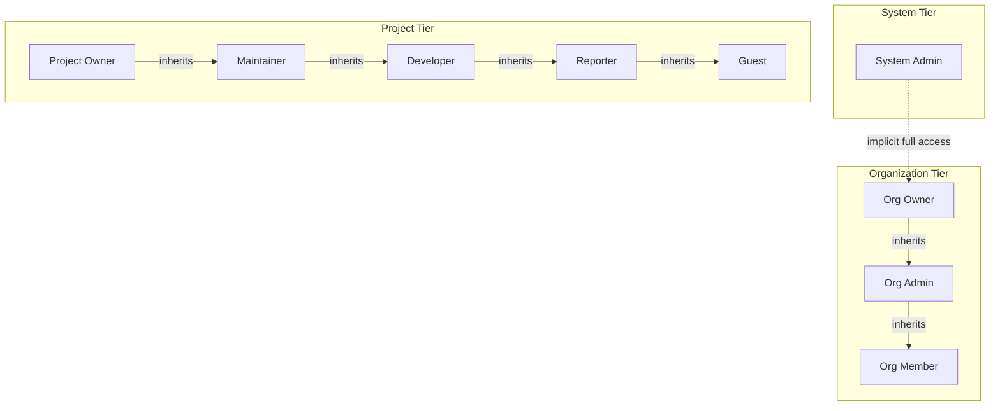
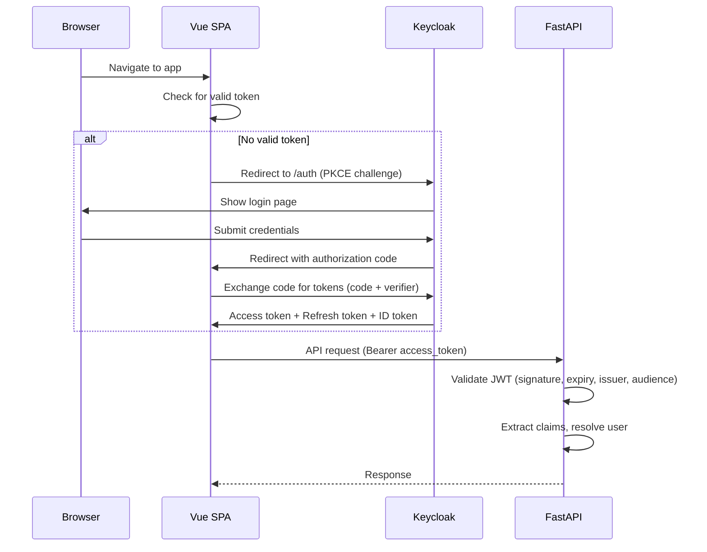

# Role-Based Access Control Design

## Overview

The platform uses a three-tier role hierarchy: **System**, **Organization**, and **Project**. Roles at higher tiers implicitly grant elevated access at lower tiers. Authentication is handled by Keycloak via OIDC; authorization is enforced entirely within the application.

## Role Hierarchy



## Role Definitions

### System Tier

| Role | Description | How Assigned |
|---|---|---|
| **System Admin** | Full platform access. Can manage all organizations, users, and global settings. | `users.is_system_admin = true` set in DB or mapped from Keycloak realm role |

### Organization Tier

| Role | Stored Value | Description |
|---|---|---|
| **Owner** | `owner` | Created the org or transferred ownership. Full org control. Cannot be removed except by another owner or system admin. |
| **Admin** | `admin` | Can manage org settings, members, projects. Cannot delete org or remove owners. |
| **Member** | `member` | Basic org membership. Can view projects with `internal` visibility. Must be explicitly added to `private` projects. |

### Project Tier (GitLab-Style)

| Role | Stored Value | Description |
|---|---|---|
| **Owner** | `owner` | Full project control. Manage settings, members, workflows, delete project. |
| **Maintainer** | `maintainer` | Manage sprints, boards, workflows, custom fields. Cannot change project settings or delete project. |
| **Developer** | `developer` | Full ticket CRUD (any ticket), manage own work. |
| **Reporter** | `reporter` | Create tickets, edit own tickets, add comments. Read-only access to others' tickets. |
| **Guest** | `guest` | Read-only access to all project content. |

## Effective Permission Calculation

A user's effective permission level for a project is the **highest** role they hold across all tiers:

```
effective_role = max(
    system_admin -> treat as project owner,
    org_role -> map org_owner/admin to project owner/maintainer,
    project_role -> direct project membership
)
```

### Org-to-Project Role Mapping

When a user has an org role but no explicit project membership, their org role maps to a minimum project access level:

| Org Role | Implicit Project Access |
|---|---|
| Org Owner | Project Owner (on all org projects) |
| Org Admin | Project Maintainer (on all org projects) |
| Org Member | Guest (on `internal` projects), No Access (on `private` projects without explicit membership) |

### Access Resolution Algorithm

```python
def resolve_effective_role(user, project):
    # 1. System admin bypass
    if user.is_system_admin:
        return ProjectRole.OWNER

    # 2. Check explicit project membership
    project_membership = get_project_membership(user.id, project.id)

    # 3. Check org membership
    org_membership = get_org_membership(user.id, project.organization_id)

    if org_membership is None:
        return None  # No access

    # 4. Map org role to implicit project role
    org_implicit_role = {
        OrgRole.OWNER: ProjectRole.OWNER,
        OrgRole.ADMIN: ProjectRole.MAINTAINER,
        OrgRole.MEMBER: None,  # No implicit project access
    }.get(org_membership.role)

    # 5. For org members, check project visibility
    if org_membership.role == OrgRole.MEMBER:
        if project.visibility == 'internal':
            org_implicit_role = ProjectRole.GUEST
        elif project.visibility == 'private':
            org_implicit_role = None

    # 6. Return highest of explicit and implicit
    explicit_role = project_membership.role if project_membership else None

    roles = [r for r in [explicit_role, org_implicit_role] if r is not None]
    if not roles:
        return None

    return max(roles, key=lambda r: ROLE_HIERARCHY[r])
```

### Role Hierarchy Values (for comparison)

```python
ROLE_HIERARCHY = {
    ProjectRole.GUEST: 10,
    ProjectRole.REPORTER: 20,
    ProjectRole.DEVELOPER: 30,
    ProjectRole.MAINTAINER: 40,
    ProjectRole.OWNER: 50,
}
```

## Permission Matrix

### Organization Permissions

| Action | Org Member | Org Admin | Org Owner | System Admin |
|---|---|---|---|---|
| View organization | Yes | Yes | Yes | Yes |
| View member list | Yes | Yes | Yes | Yes |
| Edit org profile | No | Yes | Yes | Yes |
| Edit org settings | No | Yes | Yes | Yes |
| Invite/add members | No | Yes | Yes | Yes |
| Remove members | No | Yes (not owners) | Yes | Yes |
| Change member roles | No | Yes (not owners) | Yes | Yes |
| Create projects | No | Yes | Yes | Yes |
| Manage org-level webhooks | No | Yes | Yes | Yes |
| Manage org-level workflows | No | Yes | Yes | Yes |
| Transfer ownership | No | No | Yes | Yes |
| Delete organization | No | No | Yes | Yes |

### Project Permissions

| Action | Guest | Reporter | Developer | Maintainer | Owner |
|---|---|---|---|---|---|
| **View** | | | | | |
| View project | Yes | Yes | Yes | Yes | Yes |
| View tickets | Yes | Yes | Yes | Yes | Yes |
| View board | Yes | Yes | Yes | Yes | Yes |
| View backlog | Yes | Yes | Yes | Yes | Yes |
| View sprints | Yes | Yes | Yes | Yes | Yes |
| View epics | Yes | Yes | Yes | Yes | Yes |
| View reports | Yes | Yes | Yes | Yes | Yes |
| View timeline | Yes | Yes | Yes | Yes | Yes |
| View activity log | Yes | Yes | Yes | Yes | Yes |
| **Create** | | | | | |
| Create tickets | No | Yes | Yes | Yes | Yes |
| Create comments | No | Yes | Yes | Yes | Yes |
| Create epics | No | No | Yes | Yes | Yes |
| Upload attachments | No | Yes | Yes | Yes | Yes |
| **Edit** | | | | | |
| Edit own tickets | No | Yes | Yes | Yes | Yes |
| Edit any ticket | No | No | Yes | Yes | Yes |
| Edit own comments | No | Yes | Yes | Yes | Yes |
| Delete own comments | No | Yes | Yes | Yes | Yes |
| Edit any comment | No | No | No | Yes | Yes |
| Delete any comment | No | No | No | Yes | Yes |
| Edit epics | No | No | Yes | Yes | Yes |
| Transition tickets (own) | No | Yes | Yes | Yes | Yes |
| Transition tickets (any) | No | No | Yes | Yes | Yes |
| Log time (own) | No | Yes | Yes | Yes | Yes |
| Log time (any) | No | No | No | Yes | Yes |
| **Manage** | | | | | |
| Manage sprints | No | No | No | Yes | Yes |
| Manage boards | No | No | No | Yes | Yes |
| Manage labels | No | No | Yes | Yes | Yes |
| Manage custom fields | No | No | No | Yes | Yes |
| Configure workflows | No | No | No | Yes | Yes |
| Bulk edit tickets | No | No | Yes | Yes | Yes |
| Delete tickets | No | No | No | Yes | Yes |
| Delete attachments (own) | No | Yes | Yes | Yes | Yes |
| Delete attachments (any) | No | No | No | Yes | Yes |
| **Admin** | | | | | |
| Edit project settings | No | No | No | No | Yes |
| Manage project members | No | No | No | No | Yes |
| Manage project webhooks | No | No | No | No | Yes |
| Archive project | No | No | No | No | Yes |
| Delete project | No | No | No | No | Yes |

### System Admin Permissions

| Action | System Admin |
|---|---|
| View all organizations | Yes |
| Create organizations | Yes |
| Edit any organization | Yes |
| Delete any organization | Yes |
| View all users | Yes |
| Deactivate/activate users | Yes |
| Grant/revoke system admin | Yes |
| Access any project (as owner) | Yes |
| View platform metrics | Yes |

## Keycloak Integration

### OIDC Configuration

The application registers as an OIDC Relying Party (client) in Keycloak. Two clients are configured:

| Client | Type | Flow | Purpose |
|---|---|---|---|
| `projecthub-frontend` | Public | Authorization Code + PKCE | SPA authentication |
| `projecthub-backend` | Confidential | Client Credentials (for service calls) | Backend-to-Keycloak API calls (optional, for user sync) |

### Authentication Flow



### JWT Claims Mapping

The access token from Keycloak contains standard OIDC claims. The backend extracts:

| JWT Claim | Maps To | Usage |
|---|---|---|
| `sub` | `users.oidc_subject` | Unique identity, used for user lookup/creation |
| `email` | `users.email` | Kept in sync on each login |
| `name` or `preferred_username` | `users.display_name` | Kept in sync on each login |
| `realm_access.roles` | Check for `system_admin` role | If Keycloak role `projecthub-admin` present, set `is_system_admin = true` |
| `picture` | `users.avatar_url` | Optional, synced if present |

### User Provisioning (Just-In-Time)

Users are **not** pre-provisioned. On first API request with a valid Keycloak JWT:

1. Backend validates the JWT signature and claims
2. Looks up user by `oidc_subject` in the `users` table
3. If not found, creates a new user record from JWT claims
4. If found, updates `email`, `display_name`, `avatar_url`, `last_login_at` if changed
5. Checks `realm_access.roles` for `projecthub-admin` to set `is_system_admin`

```python
async def get_or_create_user(db: AsyncSession, token_claims: dict) -> User:
    subject = token_claims["sub"]
    user = await db.execute(
        select(User).where(User.oidc_subject == subject)
    )
    user = user.scalar_one_or_none()

    if user is None:
        user = User(
            oidc_subject=subject,
            email=token_claims["email"],
            display_name=token_claims.get("name", token_claims.get("preferred_username", "Unknown")),
            avatar_url=token_claims.get("picture"),
            is_system_admin="projecthub-admin" in token_claims.get("realm_access", {}).get("roles", []),
        )
        db.add(user)
        await db.flush()
    else:
        user.email = token_claims["email"]
        user.display_name = token_claims.get("name", user.display_name)
        user.avatar_url = token_claims.get("picture", user.avatar_url)
        user.is_system_admin = "projecthub-admin" in token_claims.get("realm_access", {}).get("roles", [])
        user.last_login_at = func.now()

    return user
```

### Token Lifecycle

| Token | Lifetime | Storage | Refresh |
|---|---|---|---|
| Access Token | 5-15 minutes (Keycloak config) | Memory (Pinia store) | Via refresh token |
| Refresh Token | 30 minutes - 8 hours (Keycloak config) | Memory (Pinia store) or secure cookie | Silent refresh before expiry |
| ID Token | Same as access token | Memory | Not refreshed independently |

The frontend uses `oidc-client-ts` which handles:
- Automatic silent token renewal before expiry
- Token storage in memory (not localStorage, for security)
- Redirect-based login/logout flows
- PKCE challenge generation

### Keycloak Configuration Requirements

The Keycloak realm must be configured with:

1. **Client `projecthub-frontend`:**
   - Access Type: Public
   - Standard Flow Enabled: Yes
   - Valid Redirect URIs: `http://localhost:3000/*`, `https://app.example.com/*`
   - Web Origins: `http://localhost:3000`, `https://app.example.com`
   - PKCE Code Challenge Method: S256

2. **Realm Role `projecthub-admin`:**
   - Assigned to users who should be system administrators
   - Included in the access token via realm role mapper

3. **Client Scopes:**
   - `email` scope included (for email claim)
   - `profile` scope included (for name, preferred_username, picture)

4. **Token Mappers (if needed):**
   - Ensure `realm_access.roles` is included in the access token
   - Configure `name` or `preferred_username` claim

## Permission Enforcement Architecture

### FastAPI Dependency Injection

Permissions are enforced via FastAPI's dependency injection system. Three layers of dependencies:

```python
# Layer 1: Authentication - extracts and validates JWT
async def get_current_user(
    token: str = Depends(oauth2_scheme),
    db: AsyncSession = Depends(get_db),
) -> User:
    claims = validate_jwt(token)
    return await get_or_create_user(db, claims)

# Layer 2: Organization context - resolves org membership
async def get_org_membership(
    org_id: UUID = Path(...),
    user: User = Depends(get_current_user),
    db: AsyncSession = Depends(get_db),
) -> OrgMembership:
    if user.is_system_admin:
        return OrgMembership(role=OrgRole.OWNER)  # synthetic
    membership = await db.execute(
        select(OrgMembership).where(
            OrgMembership.user_id == user.id,
            OrgMembership.organization_id == org_id,
        )
    )
    membership = membership.scalar_one_or_none()
    if membership is None:
        raise HTTPException(403, "Not a member of this organization")
    return membership

# Layer 3: Project context - resolves effective project role
async def get_project_role(
    project_id: UUID = Path(...),
    user: User = Depends(get_current_user),
    db: AsyncSession = Depends(get_db),
) -> ProjectRole:
    project = await get_project_or_404(db, project_id)
    role = await resolve_effective_role(user, project, db)
    if role is None:
        raise HTTPException(403, "No access to this project")
    return role
```

### Permission Decorators

For granular permission checks, a dependency factory creates permission-checking dependencies:

```python
def require_project_role(minimum_role: ProjectRole):
    """Dependency that enforces a minimum project role."""
    async def check_permission(
        role: ProjectRole = Depends(get_project_role),
    ) -> ProjectRole:
        if ROLE_HIERARCHY[role] < ROLE_HIERARCHY[minimum_role]:
            raise HTTPException(
                403,
                f"Requires {minimum_role.value} role or higher"
            )
        return role
    return Depends(check_permission)

def require_org_role(minimum_role: OrgRole):
    """Dependency that enforces a minimum org role."""
    async def check_permission(
        membership: OrgMembership = Depends(get_org_membership),
    ) -> OrgMembership:
        if ORG_ROLE_HIERARCHY[membership.role] < ORG_ROLE_HIERARCHY[minimum_role]:
            raise HTTPException(
                403,
                f"Requires {minimum_role.value} org role or higher"
            )
        return membership
    return Depends(check_permission)

def require_system_admin():
    """Dependency that enforces system admin."""
    async def check_permission(
        user: User = Depends(get_current_user),
    ) -> User:
        if not user.is_system_admin:
            raise HTTPException(403, "Requires system admin")
        return user
    return Depends(check_permission)
```

### Usage in Endpoints

```python
@router.post("/projects/{project_id}/tickets")
async def create_ticket(
    ticket_in: TicketCreate,
    project_id: UUID,
    role: ProjectRole = require_project_role(ProjectRole.REPORTER),
    user: User = Depends(get_current_user),
    db: AsyncSession = Depends(get_db),
):
    ...

@router.delete("/projects/{project_id}")
async def delete_project(
    project_id: UUID,
    role: ProjectRole = require_project_role(ProjectRole.OWNER),
    db: AsyncSession = Depends(get_db),
):
    ...

@router.post("/organizations")
async def create_organization(
    org_in: OrganizationCreate,
    user: User = Depends(require_system_admin()),
    db: AsyncSession = Depends(get_db),
):
    ...
```

### Ownership Checks

Some actions require checking if the user owns the specific resource (e.g., "edit own ticket" for reporters):

```python
async def check_ticket_access(
    ticket: Ticket,
    user: User,
    role: ProjectRole,
    action: str,
) -> bool:
    if role >= ProjectRole.DEVELOPER:
        return True  # Developers+ can edit any ticket

    if role == ProjectRole.REPORTER:
        if action in ("edit", "transition"):
            return ticket.reporter_id == user.id or ticket.assignee_id == user.id
        if action == "comment":
            return True
        return False  # Reporters can only modify their own tickets

    return False  # Guests have no write access
```

### Frontend Permission Guards

The frontend mirrors permission logic for UI rendering:

```typescript
// composables/usePermissions.ts
export function usePermissions() {
    const authStore = useAuthStore()
    const projectStore = useProjectStore()

    const effectiveRole = computed(() => {
        if (authStore.isSystemAdmin) return 'owner'
        // resolve from org + project memberships
        return projectStore.currentMembership?.role ?? 'guest'
    })

    const can = (action: string): boolean => {
        const role = effectiveRole.value
        return PERMISSION_MAP[action]?.includes(role) ?? false
    }

    return { effectiveRole, can }
}

// Usage in templates:
// <Button v-if="can('manage_sprints')" @click="createSprint">New Sprint</Button>
```

### Permission Caching

To avoid repeated DB queries for permission resolution:

1. On login, the backend returns the user's org memberships and project memberships as part of a `/api/v1/users/me` response
2. The frontend stores these in the Pinia auth store
3. On each API request, the backend caches the resolved role in Redis with a TTL of 5 minutes
4. Cache is invalidated when memberships change (add/remove member, role change)

Redis cache key pattern:
```
permissions:{user_id}:{project_id} -> "developer"
permissions:{user_id}:org:{org_id} -> "admin"
```

## Invitation Flow

### Adding Members to an Organization

1. Org Admin/Owner enters the user's email
2. Backend checks if the user exists (by email in `users` table)
3. If user exists: create `org_memberships` record immediately
4. If user does not exist: the membership is created on the user's first login (JIT) if they match the invited email. Store pending invitations in an `invitations` table with `email`, `org_id`, `role`, `expires_at`.

### Adding Members to a Project

1. Project Owner navigates to project settings > members
2. Selects from org members (autocomplete search)
3. Assigns a project role (guest/reporter/developer/maintainer/owner)
4. Backend creates `project_memberships` record
5. WebSocket notification sent to the added user
6. Webhook event `project.member_added` fired

## Audit Considerations

All permission-related actions are logged in `activity_logs`:

- Member added/removed from org or project
- Role changed for any member
- System admin flag toggled
- Failed access attempts (403 responses) are logged at WARN level in structured logs
