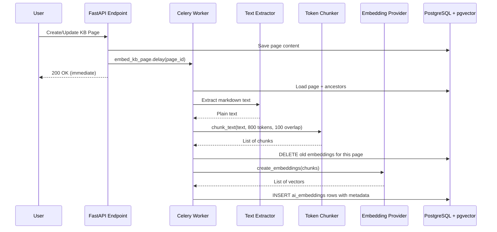
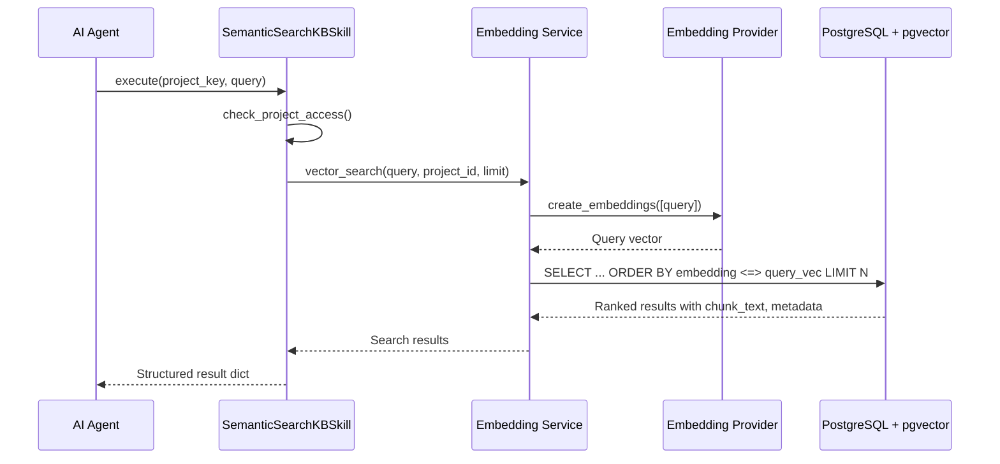

# Phase 10 Architecture

## High-Level Architecture

```
┌──────────────────────────────────────────────────────────────────┐
│                       Frontend (Vue 3)                            │
│                                                                  │
│  ┌──────────────────────────────────────────────────────────┐   │
│  │            KBSpaceListView (Redesigned)                    │   │
│  │                                                          │   │
│  │  ┌─────────────────────────────────────────────┐         │   │
│  │  │  Global Search Bar                          │         │   │
│  │  │  → GET /projects/{id}/kb/search             │         │   │
│  │  └─────────────────────────────────────────────┘         │   │
│  │                                                          │   │
│  │  Recently Updated Pages                                  │   │
│  │  → GET /projects/{id}/kb/recent-pages                    │   │
│  │                                                          │   │
│  │  Space Cards (enriched with stats)                       │   │
│  │  → GET /projects/{id}/kb/spaces                          │   │
│  └──────────────────────────────────────────────────────────┘   │
│                                                                  │
│  ┌──────────────────────────────────────────────────────────┐   │
│  │            ChatFlyout — Tool Display                       │   │
│  │  [Tool] 🔍 Searching knowledge base (semantic)...         │   │
│  └──────────────────────────────────────────────────────────┘   │
└──────────────────────────────────────────────────────────────────┘
                               │ HTTP
┌──────────────────────────────┼──────────────────────────────────┐
│                       Backend (FastAPI)                           │
│                                                                  │
│  ┌──────────────────────────────────────────────────────────┐   │
│  │              KB Endpoints (kb_pages.py, kb_spaces.py)      │   │
│  │  GET  /kb/recent-pages → Recent pages across spaces        │   │
│  │  GET  /kb/spaces → Enriched with last_updated, contribs    │   │
│  │  POST /kb/spaces/{id}/pages → create + dispatch embedding  │   │
│  │  PATCH /kb/pages/{id} → update + dispatch embedding        │   │
│  │  DELETE /kb/pages/{id} → delete + dispatch cleanup         │   │
│  └──────────────┬───────────────────────────────────────────┘   │
│                  │                                                │
│                  ▼                                                │
│  ┌──────────────────────────────────────────────────────────┐   │
│  │              Celery Task Queue (Redis)                      │   │
│  │                                                          │   │
│  │  embed_kb_page ──────────────┐                           │   │
│  │  embed_kb_attachment ────────┤                           │   │
│  │  delete_kb_embeddings ───────┘                           │   │
│  └──────────────┬───────────────────────────────────────────┘   │
│                  │                                                │
│                  ▼                                                │
│  ┌──────────────────────────────────────────────────────────┐   │
│  │              Embedding Pipeline                            │   │
│  │                                                          │   │
│  │  ┌──────────────┐  ┌───────────────┐  ┌──────────────┐  │   │
│  │  │ Text Extract  │→│ Token Chunker  │→│  Embedding    │  │   │
│  │  │ PDF/DOCX/     │  │ ~800 tokens    │  │  Provider     │  │   │
│  │  │ XLSX/PPTX/MD  │  │ 100 overlap    │  │  (OpenAI/     │  │   │
│  │  │               │  │               │  │   Ollama/      │  │   │
│  │  │               │  │               │  │   Azure)       │  │   │
│  │  └──────────────┘  └───────────────┘  └──────┬───────┘  │   │
│  │                                               │          │   │
│  └───────────────────────────────────────────────┼──────────┘   │
│                                                  │               │
│  ┌───────────────────────────────────────────────┼──────────┐   │
│  │              Agent Skills                      │          │   │
│  │                                               ▼          │   │
│  │  ┌──────────────────┐  ┌──────────────────────────────┐  │   │
│  │  │ search_knowledge │  │ semantic_search_kb (NEW)      │  │   │
│  │  │ _base (FTS)      │  │ → vector_search() on         │  │   │
│  │  │ Phase 9          │  │   ai_embeddings via pgvector  │  │   │
│  │  └──────────────────┘  └──────────────────────────────┘  │   │
│  └──────────────────────────────────────────────────────────┘   │
│                                                                  │
│  ┌──────────────────────────────────────────────────────────┐   │
│  │              PostgreSQL + pgvector                          │   │
│  │                                                          │   │
│  │  ai_embeddings                                           │   │
│  │  ├─ id (UUID PK)                                         │   │
│  │  ├─ project_id (FK → projects, indexed)  ← NEW           │   │
│  │  ├─ content_type ('kb_page' | 'kb_attachment')           │   │
│  │  ├─ content_id (UUID)                                    │   │
│  │  ├─ chunk_index (INT)                                    │   │
│  │  ├─ chunk_text (TEXT)                                    │   │
│  │  ├─ embedding (vector(1536))                             │   │
│  │  └─ metadata (JSONB) ← hierarchy, space, breadcrumbs     │   │
│  └──────────────────────────────────────────────────────────┘   │
└──────────────────────────────────────────────────────────────────┘
```

## Embedding Pipeline Flow



## Semantic Search Flow



## Embedding Metadata Schema

Each embedding row stores rich metadata in the JSONB `metadata` column:

```json
{
  "space_id": "uuid",
  "space_name": "Engineering Docs",
  "space_slug": "engineering-docs",
  "page_title": "API Authentication Guide",
  "page_slug": "api-authentication-guide",
  "parent_pages": [
    {"id": "uuid", "title": "Getting Started", "slug": "getting-started"},
    {"id": "uuid", "title": "API Reference", "slug": "api-reference"}
  ],
  "source_type": "page_content",
  "filename": null
}
```

For attachment embeddings:

```json
{
  "space_id": "uuid",
  "space_name": "Engineering Docs",
  "space_slug": "engineering-docs",
  "page_title": "API Authentication Guide",
  "page_slug": "api-authentication-guide",
  "parent_pages": [...],
  "source_type": "attachment",
  "filename": "auth-flow-diagram.pdf",
  "content_type": "application/pdf"
}
```

## Key Design Decisions

1. **Celery for async embedding:** Page saves return immediately; embeddings are generated in the background. This avoids blocking the user on potentially slow LLM API calls.

2. **Sync DB in Celery:** Celery workers are synchronous, so embedding tasks use `psycopg2` + synchronous SQLAlchemy sessions rather than `asyncpg`.

3. **Token-aware chunking:** Uses tiktoken (`cl100k_base`) for accurate token counting, targeting ~800 tokens per chunk with ~100 token overlap for context continuity.

4. **project_id on ai_embeddings:** Denormalized for query performance — avoids joining through kb_pages → kb_spaces → projects on every vector search.

5. **Separate FTS and semantic tools:** Keeps both search strategies available to the agent. FTS is better for exact keyword matches; semantic search is better for conceptual/meaning-based queries.

6. **Graceful degradation:** If embedding provider is not configured, all embedding tasks no-op silently. The semantic search skill returns a helpful message instead of crashing.
