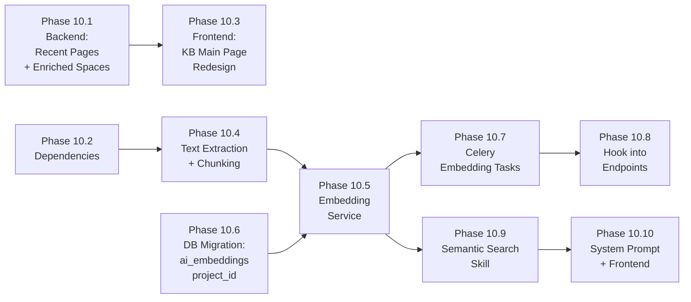

# Phase 10 Implementation Roadmap

## Overview

Phase 10 delivers **KB UI Improvements, an Embedding Pipeline, and Semantic Search** — transforming the knowledge base main page into a rich landing experience, building a Celery-powered pipeline that generates vector embeddings from KB page content and file attachments, and adding a semantic search skill to the AI agent.

Key capabilities:
- **KB Main Page Redesign:** Global search, recently updated pages across all spaces, enriched space cards with last-updated timestamps and contributor counts, modern visual refresh
- **Embedding Pipeline:** Automatic vector embedding generation via Celery when KB pages are created/updated or file attachments are uploaded; supports PDF, DOCX, XLSX, PPTX, and text files
- **Text Extraction:** Pluggable text extraction from common document formats with token-aware chunking and overlap for optimal retrieval
- **Semantic Search Skill:** New `semantic_search_kb` agent tool using pgvector cosine similarity, complementing the existing FTS-based `search_knowledge_base` skill
- **Rich Embedding Metadata:** Embeddings store project scope, space context, page hierarchy breadcrumbs, and source metadata for precise filtering and attribution

Phase 10 builds on Phase 3's Knowledge Base, Phase 8's LLM/embedding provider abstraction and pgvector infrastructure, and Phase 9's agent skill system.

### Dependency Graph

### Parallelization

- **10.1** (Backend API) and **10.2** (Dependencies) and **10.6** (DB Migration) can be built in parallel
- **10.3** (Frontend) depends on 10.1
- **10.4** (Text Extraction) depends on 10.2
- **10.5** (Embedding Service) depends on 10.4 and 10.6
- **10.7** (Celery Tasks) depends on 10.5
- **10.8** (Endpoint Hooks) depends on 10.7
- **10.9** (Semantic Search Skill) depends on 10.5
- **10.10** (System Prompt + Frontend) depends on 10.9

---

## Phase 10.1: Backend — Recent Pages Endpoint + Enriched Spaces

### Description
Add a new API endpoint for recently updated KB pages across all spaces in a project, and enrich the existing space list endpoint with last-updated timestamps and contributor counts.

### Tasks
- [ ] Add `RecentPageRead` schema to `schemas/kb.py`
- [ ] Add `last_updated_at` and `contributor_count` fields to `SpaceRead` schema
- [ ] Create `GET /projects/{project_id}/kb/recent-pages` endpoint
- [ ] Enrich `list_spaces` endpoint with subqueries for last_updated_at and contributor_count

### Files to Modify
- `backend/app/schemas/kb.py`
- `backend/app/api/v1/endpoints/kb_pages.py`
- `backend/app/api/v1/endpoints/kb_spaces.py`

### Acceptance Criteria
- [ ] Recent pages endpoint returns pages sorted by updated_at DESC with space name/slug
- [ ] Space list includes accurate last_updated_at and contributor_count
- [ ] Both endpoints respect project RBAC

---

## Phase 10.2: Python Dependencies

### Description
Add libraries required for text extraction from document files and token-aware chunking.

### Tasks
- [ ] Add `pypdf`, `python-docx`, `openpyxl`, `python-pptx`, `tiktoken`, `psycopg2-binary` to requirements.txt

### Files to Modify
- `backend/requirements.txt`

### Acceptance Criteria
- [ ] All new dependencies install cleanly
- [ ] No version conflicts with existing packages

---

## Phase 10.3: Frontend — KB Main Page Redesign

### Description
Redesign the KB space list view with a global search bar, recently updated pages section, enriched space cards, and a visual refresh.

### Tasks
- [ ] Add `listRecentPages()` function to `api/kb.ts`
- [ ] Redesign `KBSpaceListView.vue` with hero search, recent pages, enriched cards
- [ ] Add i18n keys for new UI elements in `en.json` and `es.json`

### Files to Modify
- `frontend/src/api/kb.ts`
- `frontend/src/views/kb/KBSpaceListView.vue`
- `frontend/src/i18n/locales/en.json`
- `frontend/src/i18n/locales/es.json`

### Acceptance Criteria
- [ ] Global search bar searches across all spaces in the project
- [ ] Recently updated pages section shows last 10 pages with space badge and relative time
- [ ] Space cards display last_updated_at, contributor_count, and page_count
- [ ] Layout is responsive and dark-mode compatible

---

## Phase 10.4: Text Extraction + Chunking

### Description
Create a utility service for extracting text from document files and splitting into token-aware chunks with overlap.

### Tasks
- [ ] Implement `extract_text_from_file()` supporting PDF, DOCX, XLSX, PPTX, and text formats
- [ ] Implement `chunk_text()` with configurable max tokens and overlap using tiktoken

### Files to Create
- `backend/app/services/text_extraction.py`

### Acceptance Criteria
- [ ] PDF text extraction via pypdf
- [ ] DOCX paragraph text extraction via python-docx
- [ ] XLSX cell text extraction via openpyxl
- [ ] PPTX slide text extraction via python-pptx
- [ ] Text files decoded as UTF-8
- [ ] Unsupported types return empty string gracefully
- [ ] Chunks are ~800 tokens with ~100 token overlap

---

## Phase 10.5: Embedding Service

### Description
Core service for generating, storing, deleting, and querying vector embeddings in the ai_embeddings table.

### Tasks
- [ ] Implement `embed_and_store()` — delete old embeddings, chunk text, generate vectors, bulk insert
- [ ] Implement `delete_embeddings()` — remove all embeddings for a given content reference
- [ ] Implement `vector_search()` — generate query embedding, cosine similarity search with project scoping

### Files to Create
- `backend/app/services/embedding_service.py`

### Acceptance Criteria
- [ ] Embeddings are stored with project_id, content_type, content_id, chunk_index, and rich metadata
- [ ] Metadata includes space info, page hierarchy (parent breadcrumbs), titles, and slugs
- [ ] Old embeddings are replaced on re-embedding (idempotent)
- [ ] Vector search filters by project_id and returns ranked results with distance scores

---

## Phase 10.6: Database Migration

### Description
Add a `project_id` column to `ai_embeddings` for efficient project-scoped vector queries.

### Tasks
- [ ] Create Alembic migration adding `project_id` UUID column with FK to `projects`, indexed
- [ ] Update `AIEmbedding` model with the new column

### Files to Create/Modify
- `backend/alembic/versions/xxx_add_project_id_to_ai_embeddings.py` (new)
- `backend/app/models/ai_embedding.py` (modify)

### Acceptance Criteria
- [ ] Migration adds nullable `project_id` column with index
- [ ] Existing rows are unaffected
- [ ] Model reflects the new column

---

## Phase 10.7: Celery Embedding Tasks

### Description
Background tasks that generate embeddings asynchronously when KB content changes.

### Tasks
- [ ] Implement `embed_kb_page` task — loads page content, generates embeddings with hierarchy metadata
- [ ] Implement `embed_kb_attachment` task — downloads file from S3, extracts text, generates embeddings
- [ ] Implement `delete_kb_embeddings` task — removes embeddings for deleted content
- [ ] Tasks no-op gracefully when embedding provider is not configured

### Files to Create
- `backend/app/tasks/embedding_tasks.py`

### Acceptance Criteria
- [ ] Tasks use synchronous DB session (Celery is sync)
- [ ] Page embeddings include full breadcrumb hierarchy in metadata
- [ ] Attachment embeddings include filename, content type, and parent page info
- [ ] Missing embedding config causes graceful skip, not error

---

## Phase 10.8: Hook Embedding Tasks into Endpoints

### Description
Dispatch Celery embedding tasks from KB page and attachment API endpoints.

### Tasks
- [ ] Dispatch `embed_kb_page.delay()` after page create and update
- [ ] Dispatch `embed_kb_attachment.delay()` after attachment confirm
- [ ] Dispatch `delete_kb_embeddings.delay()` after page delete

### Files to Modify
- `backend/app/api/v1/endpoints/kb_pages.py`
- `backend/app/api/v1/endpoints/kb_attachments.py`

### Acceptance Criteria
- [ ] Embedding tasks are dispatched as fire-and-forget
- [ ] Page saves are not slowed down by embedding generation
- [ ] Deletion cascades to embedding cleanup

---

## Phase 10.9: Semantic Search Agent Skill

### Description
Add a new `semantic_search_kb` tool to the AI agent that uses vector similarity for meaning-based KB search.

### Tasks
- [ ] Implement `SemanticSearchKBSkill` in `builtin_skills.py`
- [ ] Register the skill in `agent/__init__.py`

### Files to Modify
- `backend/app/services/agent/builtin_skills.py`
- `backend/app/services/agent/__init__.py`

### Acceptance Criteria
- [ ] Skill accepts project_key and natural language query
- [ ] Returns top-K results with title, space, chunk text, and similarity score
- [ ] Respects user permissions via `check_project_access()`
- [ ] Graceful fallback when embedding provider is not configured

---

## Phase 10.10: System Prompt + Frontend Tool Display

### Description
Update the AI system prompt with guidance on when to use semantic vs keyword search, and add the tool display in the chat UI.

### Tasks
- [ ] Add semantic search guidance to `SYSTEM_PROMPT` in `ai_service.py`
- [ ] Add `semantic_search_kb` to tool display map in `ChatFlyout.vue`
- [ ] Add i18n key `ai.toolSemanticSearchKB` in `en.json` and `es.json`

### Files to Modify
- `backend/app/services/ai_service.py`
- `frontend/src/components/chat/ChatFlyout.vue`
- `frontend/src/i18n/locales/en.json`
- `frontend/src/i18n/locales/es.json`

### Acceptance Criteria
- [ ] System prompt guides the agent to use semantic search for conceptual questions
- [ ] Chat UI shows "Searching knowledge base (semantic)..." during tool execution
- [ ] All strings are internationalized

---

## Effort & Status

| Phase | Name | Est. Effort | Dependencies | Status |
|-------|------|-------------|-------------|--------|
| 10.1 | Backend: Recent Pages + Enriched Spaces | Medium | None | PENDING |
| 10.2 | Python Dependencies | Small | None | PENDING |
| 10.3 | Frontend: KB Main Page Redesign | Large | 10.1 | PENDING |
| 10.4 | Text Extraction + Chunking | Medium | 10.2 | PENDING |
| 10.5 | Embedding Service | Large | 10.4, 10.6 | PENDING |
| 10.6 | DB Migration | Small | None | PENDING |
| 10.7 | Celery Embedding Tasks | Medium | 10.5 | PENDING |
| 10.8 | Hook into Endpoints | Small | 10.7 | PENDING |
| 10.9 | Semantic Search Skill | Medium | 10.5 | PENDING |
| 10.10 | System Prompt + Frontend | Small | 10.9 | PENDING |
