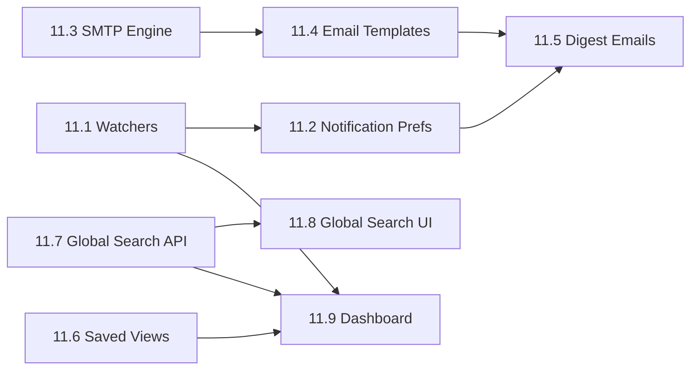

# Phase 11 Implementation Roadmap

## Overview

Phase 11 delivers **User Productivity & Communication** -- the daily-driver features that determine whether users actively engage with the platform. After phases 1-10 established the core project management, knowledge base, and AI foundations, Phase 11 fills critical gaps identified through competitive analysis against Jira, Linear, Asana, and Confluence.

Key capabilities:
- **Ticket Watchers:** Users can follow tickets they care about and receive notifications on all changes
- **Notification Preferences:** Per-user, per-event-type control over in-app and email notification channels
- **Email Notification Engine:** SMTP-based email delivery with branded HTML templates
- **Email Digests:** Celery-powered periodic digest batching to reduce email noise
- **Saved Views / Custom Filters:** Persist and recall filtered ticket list configurations
- **Global Search:** Unified search across tickets, KB pages, and comments with RBAC enforcement
- **Dashboard Redesign:** "My Work" personal dashboard with assigned tickets, overdue tracking, watched items, sprint progress, and activity feed

Phase 11 builds on Phase 1's notification model, Phase 2's real-time WebSocket infrastructure, and Phase 9's Celery task framework.

### Dependency Graph

### Parallelization

- **Track A** (11.1 + 11.2): Watchers + Notification Preferences
- **Track B** (11.3 + 11.4): Email Engine + Templates
- **Track C** (11.6): Saved Views
- **Track D** (11.7 + 11.8): Global Search

Tracks A-D can proceed in parallel. Phase 11.5 (Digest) requires A+B. Phase 11.9 (Dashboard) is the capstone.

---

## Sub-phases

### Phase 11.1 -- Ticket Watchers

**Goal:** Allow users to subscribe to ticket updates via a many-to-many `ticket_watchers` table.

**Deliverables:**
- `TicketWatcher` model and Alembic migration
- API endpoints: POST/DELETE/GET `/tickets/{id}/watchers`
- Auto-add reporter and assignee as watchers on ticket creation
- Auto-add new assignee on assignment change
- Update `notification_service` to notify all watchers on ticket events

### Phase 11.2 -- Notification Preferences

**Goal:** Give users control over which events generate in-app and email notifications.

**Deliverables:**
- `NotificationPreference` model and Alembic migration
- API endpoints: GET/PUT `/users/me/notification-preferences`
- Default preferences seeded on user creation
- Preference check integrated into `notification_service.create_notification()`
- Frontend preferences panel in user profile

### Phase 11.3 -- Email SMTP Engine

**Goal:** Core infrastructure for sending HTML emails via SMTP.

**Deliverables:**
- SMTP configuration settings in `config.py`
- `email_service.py` using `aiosmtplib` + Jinja2
- Docker-compose environment variables for SMTP
- `requirements.txt` updated with `aiosmtplib` and `jinja2`

### Phase 11.4 -- Email Templates

**Goal:** Branded, responsive HTML email templates for each notification type.

**Deliverables:**
- Base email template with header/footer branding
- Per-event templates: ticket_assigned, ticket_commented, ticket_status_changed, mentioned, sprint_started, sprint_completed
- Template rendering integrated into email service

### Phase 11.5 -- Email Digest

**Goal:** Batch unread notifications into periodic digest emails to reduce noise.

**Deliverables:**
- `emailed_at` column on `Notification` model
- Celery beat schedule entry for digest task (every 30 minutes)
- Digest email template aggregating unread notifications
- User preference for instant vs. digest email delivery

### Phase 11.6 -- Saved Views / Custom Filters

**Goal:** Users can save and recall filtered ticket list configurations.

**Deliverables:**
- `SavedView` model and Alembic migration
- CRUD API endpoints under `/projects/{id}/views`
- Frontend filter bar on TicketListView with save/load capability
- Saved views dropdown in the ticket list header

### Phase 11.7 -- Global Search API

**Goal:** Unified search endpoint across tickets, KB pages, and comments.

**Deliverables:**
- `GET /search` endpoint with type filtering and RBAC
- `search_service.py` querying tickets (tsvector), KB pages (FTS), and comments
- Unified result schema with type, title, subtitle, highlight, and URL

### Phase 11.8 -- Global Search UI

**Goal:** Surface global search in the command palette and optionally a dedicated search page.

**Deliverables:**
- Enhanced `CommandPalette.vue` with live search results
- Categorized results (Tickets, Pages, Comments) with highlights
- Keyboard navigation and enter-to-open

### Phase 11.9 -- Dashboard Redesign

**Goal:** Replace the placeholder dashboard with a rich "My Work" view.

**Deliverables:**
- `GET /users/me/dashboard` API endpoint
- Dashboard sections: My Tickets, Watching, Overdue, Sprint Progress, Recent Activity, Quick Stats
- Responsive card-based layout
