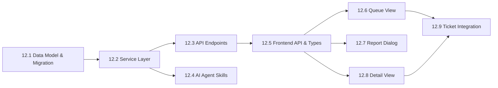

# Phase 12 Implementation Roadmap

## Overview

Phase 12 delivers **Issue Reporting & Triage Queue** -- a structured intake layer that sits in front of tickets. Users submit issue reports describing problems or requests; similar reports are consolidated via FTS and optional semantic search; and curated reports are promoted into formal tickets with full traceability.

Key capabilities:
- **Issue Report Submission:** Any project member can submit an issue report with title, description, and priority
- **Multi-Reporter Consolidation:** Multiple users reporting the same issue are linked to a single report, preserving each reporter's original description
- **Similarity Detection:** FTS-based (always available) and pgvector semantic search (when configured) surface existing reports during submission
- **Triage Queue UI:** Filterable, sortable queue view with bulk selection for ticket creation
- **Ticket Creation from Reports:** Promote one or more issue reports into a ticket with automatic bidirectional linking
- **AI Agent Integration:** Full skill set for the AI agent to search reports, create reports, add reporters, and create tickets from reports

Phase 12 builds on Phase 1's ticket model, Phase 8/9's AI agent skill framework, and Phase 10's embedding infrastructure.

### Dependency Graph

### Parallelization

- **Track A** (12.1 + 12.2 + 12.3): Backend data model, service, and API
- **Track B** (12.4): AI agent skills (after 12.2)
- **Track C** (12.5 + 12.6 + 12.7 + 12.8): Frontend (after 12.3)
- **Track D** (12.9): Ticket detail integration (capstone)

Tracks B and C can proceed in parallel once Track A completes.

---

## Sub-phases

### Phase 12.1 -- Data Model & Migration

**Goal:** Create the `issue_reports`, `issue_report_reporters`, and `issue_report_ticket_links` tables.

**Deliverables:**
- `IssueReport`, `IssueReportReporter`, `IssueReportTicketLink` SQLAlchemy models
- Alembic migration with TSVECTOR + GIN index and auto-update trigger
- Register models in `app/models/__init__.py`

### Phase 12.2 -- Service Layer

**Goal:** Implement business logic for issue report CRUD, similarity search, reporter management, and ticket creation.

**Deliverables:**
- `issue_report_service.py` with create, get, list, update, dismiss functions
- Similarity search using FTS (always) and pgvector (when configured)
- Add-reporter logic with duplicate prevention
- Create-ticket-from-reports with automatic linking and status transition
- Domain events for lifecycle hooks

### Phase 12.3 -- API Endpoints

**Goal:** REST endpoints for all issue report operations.

**Deliverables:**
- CRUD endpoints under `/projects/{project_id}/issue-reports`
- Reporter management endpoints
- `POST /create-ticket` for promoting reports to tickets
- `GET /similar` for similarity search
- RBAC enforcement matching existing patterns

### Phase 12.4 -- AI Agent Skills

**Goal:** Four new skills enabling the AI agent to manage issue reports.

**Deliverables:**
- `search_issue_reports` -- find similar/matching reports
- `create_issue_report` -- submit a new report (with approval gate)
- `add_reporter_to_issue_report` -- add current user to existing report
- `create_ticket_from_issue_reports` -- promote reports to ticket (with approval gate)

### Phase 12.5 -- Frontend API & Types

**Goal:** TypeScript interfaces and API client module.

**Deliverables:**
- `IssueReport`, `IssueReportReporter`, `IssueReportTicketLink` types
- `frontend/src/api/issue-reports.ts` with all API functions

### Phase 12.6 -- Queue View

**Goal:** Triage queue page with filtering, sorting, and bulk actions.

**Deliverables:**
- `IssueReportQueueView.vue` with PrimeVue DataTable
- Status, priority, and FTS filters
- Checkbox selection for bulk ticket creation
- "Report Issue" button launching the dialog

### Phase 12.7 -- Report Issue Dialog

**Goal:** Modal for submitting new issue reports with inline similarity detection.

**Deliverables:**
- `ReportIssueDialog.vue` with title, description (TipTap), priority
- `SimilarReportsPanel.vue` showing matches as the user types
- "This matches my issue" flow to add reporter instead of creating duplicate

### Phase 12.8 -- Detail View

**Goal:** Full detail page for a single issue report.

**Deliverables:**
- `IssueReportDetailView.vue` with metadata, reporters, linked tickets
- Status management (open, reviewing, ticket_created, dismissed)
- Create ticket action from detail view

### Phase 12.9 -- Ticket Detail Integration

**Goal:** Show source issue reports on ticket detail.

**Deliverables:**
- "Source Issue Reports" section in `TicketDetailView.vue`
- Linked report titles, reporter counts, direct navigation links
