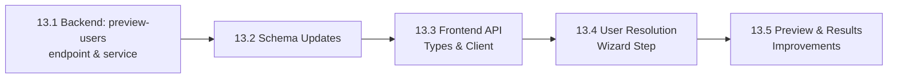

# Phase 13 Implementation Roadmap

## Overview

Phase 13 delivers **Import User Resolution** -- a dedicated wizard step that surfaces assignee and reporter mismatches during ticket import and lets users resolve them before any data is written to the database.

The existing import flow silently records unmatched names in `custom_field_values.import_metadata` (`unmatched_assignee` / `unmatched_reporter`) with no feedback to the user. Resolution is limited to case-insensitive `display_name` matching -- emails, Jira account IDs, and partial names all fail silently. The frontend's value mapping step offers dropdowns only for `ticket_type`, `priority`, and `status`; assignee and reporter strings are never surfaced.

Key capabilities:
- **User Preview Endpoint:** New `POST /projects/{project_id}/import/preview-users` resolves a list of raw names against project members using both `display_name` and `email` matching, returning per-name match quality and the full project member roster for manual overrides
- **User Resolution Wizard Step:** New Step 4 in the import wizard shows a DataTable of every unique assignee/reporter string, color-coded by match quality (exact / email / unmatched), with a project-member dropdown for manual assignment or explicit "Leave unassigned"
- **Override Mechanism:** `user_mappings` field added to the execute request; the service applies UUID overrides before falling back to display-name lookup, respecting explicit `null` as "unassigned"
- **Preview Improvement:** Preview step resolves assignee/reporter columns through the confirmed user mappings, showing display names instead of raw CSV strings
- **Results Improvement:** Results step surfaces an `unresolved_assignees` count so users know exactly how many tickets were imported without an assignee

Phase 13 builds entirely on the existing import infrastructure (Phase 1 ticket model, Phase 5 import service), adding no new database tables.

### Dependency Graph

### Parallelization

- **Track A** (13.1 + 13.2): Backend service and schemas
- **Track B** (13.3 + 13.4 + 13.5): Frontend (after Track A)

Track B begins once Track A's API contract is finalized.

---

## Sub-phases

### Phase 13.1 -- Backend: preview-users Endpoint & Extended User Resolution

**Goal:** Implement `preview_users()` service function and extend `_resolve_users()` and `execute_import()` to support the `user_mappings` override layer.

**Deliverables:**
- `preview_users(db, project_id, names)` in `import_service.py`: queries `project_memberships` joined with `users`, attempts `display_name` exact match and `email` exact match per input name, returns `matches` list and full `project_members` roster
- Extended `_resolve_users(db, display_names, user_mappings)`: applies UUID overrides from `user_mappings` first, explicit `None` marks "leave unassigned", remaining names fall through to the existing display-name DB lookup
- Updated `execute_import()`: accepts and forwards `user_mappings`; tracks `unresolved_assignees` count in the return dict
- New endpoint `POST /projects/{project_id}/import/preview-users` in `import_tickets.py` wired to the service function

### Phase 13.2 -- Schema Updates

**Goal:** Add request/response models for user preview and extend the execute request.

**Deliverables:**
- `UserMatch`: `{ source_name, matched_user_id, matched_display_name, match_type: exact|email|none }`
- `ProjectMemberSummary`: `{ user_id, display_name, email, avatar_url }`
- `UserPreviewRequest`: `{ names: list[str] }`
- `UserPreviewResponse`: `{ matches: list[UserMatch], project_members: list[ProjectMemberSummary] }`
- `ImportExecuteRequest`: new optional field `user_mappings: dict[str, str | None]`
- `ImportResult`: new field `unresolved_assignees: int`

### Phase 13.3 -- Frontend: API Types & Client

**Goal:** TypeScript counterparts to all new schemas and the `previewUsers()` API function.

**Deliverables:**
- `UserMatch`, `ProjectMemberSummary`, `UserPreviewResponse` interfaces in `importTickets.ts`
- `unresolved_assignees` added to `ImportResult` interface
- `user_mappings` added to `executeImport` payload type
- `previewUsers(projectId, names): Promise<UserPreviewResponse>` function

### Phase 13.4 -- Frontend: User Resolution Wizard Step

**Goal:** Insert Step 4 (User Resolution) between Value Mapping and Preview in `ImportTicketsView.vue`.

**Deliverables:**
- Updated `stepLabels` with new `stepUsers` entry; steps Preview and Results renumbered to 4 and 5
- `goToUserResolution()` function: collects unique assignee/reporter names from `analysis.unique_values`, calls `previewUsers()`, initializes `userMappings` from auto-matches; skips directly to Preview if no user-related columns are mapped
- New step template: DataTable with columns Source Name / Match Status / Mapped To; match status badges (green exact, amber email, red unmatched); project-member `Select` dropdown for every row; "Leave unassigned" option
- `userMappings: Record<string, string | null>` reactive state
- `userPreview: UserPreviewResponse | null` reactive state

### Phase 13.5 -- Frontend: Preview & Results Improvements

**Goal:** Surface resolved user names in the preview and unresolved count in the results.

**Deliverables:**
- Preview step resolves assignee/reporter columns through `userMappings` to display names instead of raw CSV strings
- Results step: new "Unresolved Assignees" count card alongside Created / Skipped / Parent Links / Errors
- i18n keys added to `en.json` and `es.json` for all new UI strings
