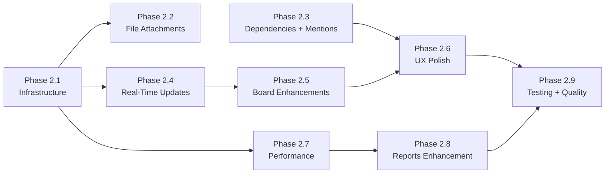

# Phase 2 Implementation Roadmap

## Overview

Phase 2 builds on the completed MVP (Phases 1-14) by implementing all deferred features across 9 sub-phases. These cover core feature gaps, UX enhancements, performance optimizations, and testing/quality infrastructure.

All 179 backend tests pass as of Phase 2 completion (up from 138 at Phase 1). Phase 2 maintains backward compatibility with all existing functionality. All 9 sub-phases (2.1–2.9) are COMPLETE.

### Dependency Graph



### Parallelization

- Phases 2.2 and 2.3 can run in parallel (no shared dependencies beyond 2.1)
- Phase 2.7 can start as soon as 2.1 is done, in parallel with 2.4/2.5

---

## Phase 2.1: Infrastructure Hardening

**Goal:** Foundation for later phases -- MinIO for S3 storage, Celery Beat for scheduled jobs, event bus wiring for real-time, WebSocket activation, and a Redis caching layer.

### Tasks

1. **Add MinIO to docker-compose**
   - `minio` service (latest, ports 9000/9001, volume, health check)
   - `createbuckets` init container to auto-create `projecthub-attachments` bucket
   - Verify S3 env vars in `.env.example` match the new service

2. **Add Celery Beat service**
   - `celery-beat` service in docker-compose: `celery -A app.tasks.celery_app beat --loglevel=info`
   - `beat_schedule` dict in `backend/app/tasks/celery_app.py` (initially empty)

3. **Wire the event bus to domain services**
   - `backend/app/core/events.py` defines events but `publish()` is never called
   - Add `await events.publish()` calls into ticket, comment, and sprint endpoints
   - Create `backend/app/core/event_handlers.py` with subscribers that:
     - Broadcast to WebSocket channels (board, project, ticket) per API_DESIGN.md spec
     - Enqueue webhook delivery for matching webhooks

4. **Activate WebSocket in the frontend**
   - `useWebSocket.ts` exists but `connect()` is never called
   - Call `ws.connect()` in `AppLayout.vue` on mount (when authenticated)
   - Call `ws.disconnect()` on logout

5. **Redis caching service**
   - Create `backend/app/services/cache_service.py` with `get_cached()`, `set_cached()`, `invalidate()`
   - Graceful fallback: bypass cache and hit DB if Redis is unavailable

### Acceptance Criteria

- [ ] `docker compose up` starts MinIO and creates the default bucket
- [ ] Celery Beat process starts without errors
- [ ] Creating/updating a ticket publishes events to the event bus
- [ ] WebSocket connects on page load when authenticated
- [ ] Cache service returns DB data even if Redis is down

### Tests

- Unit test for cache_service (get/set/invalidate, fallback on error)
- Unit test for event_handlers (verify WS broadcast and webhook enqueue)

### Files to Create/Modify

```
docker-compose.yml                           (modify)
.env.example                                 (modify)
backend/app/tasks/celery_app.py              (modify)
backend/app/core/events.py                   (modify)
backend/app/core/event_handlers.py           (create)
backend/app/api/v1/endpoints/tickets.py      (modify)
backend/app/api/v1/endpoints/comments.py     (modify)
backend/app/api/v1/endpoints/sprints.py      (modify)
backend/app/services/cache_service.py        (create)
frontend/src/layouts/AppLayout.vue           (modify)
```

---

## Phase 2.2: File Attachments

**Goal:** Full file upload/download via S3 presigned URLs per the API spec in `docs/phase_1/API_DESIGN.md`.

### Tasks

1. **Attachment model + migration**
   - `backend/app/models/attachment.py`: id, ticket_id (FK), project_id (FK), uploaded_by_id (FK), filename, content_type, size_bytes, s3_key, created_at
   - Register in models/__init__.py, add relationship to Ticket model
   - Generate Alembic migration

2. **Storage service**
   - `backend/app/services/storage_service.py` using `aioboto3` (already in requirements.txt)
   - `generate_presigned_upload(bucket, key, content_type, expires)` -- presigned PUT URL
   - `generate_presigned_download(bucket, key, filename, expires)` -- presigned GET with Content-Disposition
   - `delete_object(bucket, key)`
   - S3 key pattern: `{org_id}/{project_id}/{ticket_id}/{attachment_id}/{filename}`

3. **Attachment API endpoints**
   - `GET /tickets/{ticket_id}/attachments` -- list
   - `POST /tickets/{ticket_id}/attachments/presign` -- generate upload URL
   - `POST /tickets/{ticket_id}/attachments` -- confirm upload (register metadata)
   - `GET /attachments/{attachment_id}/download` -- get download URL
   - `DELETE /attachments/{attachment_id}` -- delete (S3 + DB)
   - File size validation against configurable max (default 50MB)

4. **Frontend attachment UI**
   - `frontend/src/api/attachments.ts` -- API client
   - `frontend/src/components/tickets/TicketAttachments.vue`:
     - File drop zone / file picker (PrimeVue FileUpload in custom mode)
     - Upload flow: presign -> PUT to S3 -> confirm -> refresh list
     - File list with filename, size, date, uploader, download/delete buttons
     - Progress indicator during upload
   - Integrate as Attachments tab in TicketDetailView.vue

### Acceptance Criteria

- [ ] Upload a file via the UI, see it appear in the attachment list
- [ ] Download returns a valid presigned S3 URL
- [ ] Delete removes both the DB record and S3 object
- [ ] File size exceeding 50MB is rejected before upload
- [ ] Attachment count visible on the tab header

### Tests

- Presign generation, confirm upload, list, download URL, delete
- File size validation, authorization (only uploader/maintainer can delete)

### Files to Create/Modify

```
backend/app/models/attachment.py             (create)
backend/app/models/__init__.py               (modify)
backend/app/models/ticket.py                 (modify)
backend/app/schemas/attachment.py            (create)
backend/app/services/storage_service.py      (create)
backend/app/api/v1/endpoints/attachments.py  (create)
backend/app/api/v1/router.py                 (modify)
backend/alembic/versions/XXXX_attachments.py (generate)
frontend/src/api/attachments.ts              (create)
frontend/src/components/tickets/TicketAttachments.vue (create)
frontend/src/views/tickets/TicketDetailView.vue      (modify)
frontend/src/i18n/locales/en.json            (modify)
frontend/src/i18n/locales/es.json            (modify)
```

---

## Phase 2.3: Ticket Dependencies and @Mentions

**Goal:** CRUD API for the existing TicketDependency model, frontend dependency UI, and @mention detection in comments triggering notifications.

### Tasks

1. **Ticket dependency API endpoints**
   - TicketDependency model already exists in `backend/app/models/ticket.py` (blocking_ticket_id, blocked_ticket_id, dependency_type)
   - `backend/app/schemas/dependency.py`: DependencyCreate (target_ticket_id, dependency_type: blocks|is_blocked_by|relates_to|duplicates), DependencyRead
   - `backend/app/services/dependency_service.py`:
     - `add_dependency()` with cycle detection (no transitive self-blocking)
     - `list_dependencies()` returning both "blocks" and "blocked by"
     - `remove_dependency()`
   - `backend/app/api/v1/endpoints/dependencies.py` per API spec

2. **Frontend dependency UI**
   - `frontend/src/components/tickets/TicketDependencies.vue`:
     - Section in ticket detail: "Blocks", "Blocked by", "Related to" lists
     - Each item: clickable ticket key + title link
     - "Add dependency" dialog with ticket search autocomplete + type selector
     - Remove dependency (X button)
   - Integrate into TicketDetailView.vue below description

3. **@mention detection in comments**
   - Backend: parse comment body HTML for `data-mention-id` attributes after create
   - For each mentioned user, call `notification_service.create_notification(event_type="comment.mention")`
   - Frontend: add TipTap `@tiptap/extension-mention` to RichTextEditor.vue
   - Suggestion popup queries user list endpoint
   - Mentions render as styled inline chips with `data-mention-id`

### Acceptance Criteria

- [ ] Can add/remove dependencies between tickets via the UI
- [ ] Cycle detection prevents A blocks B blocks A
- [ ] @mentioning a user in a comment triggers a notification
- [ ] Mention suggestions appear when typing `@` in the editor
- [ ] Mentions render as styled chips in editor and read-only view

### Tests

- Dependency CRUD, cycle detection, duplicate prevention
- Mention extraction from HTML body, notification creation

### Files to Create/Modify

```
backend/app/schemas/dependency.py              (create)
backend/app/services/dependency_service.py     (create)
backend/app/api/v1/endpoints/dependencies.py   (create)
backend/app/api/v1/router.py                   (modify)
backend/app/api/v1/endpoints/comments.py       (modify)
frontend/src/api/dependencies.ts               (create)
frontend/src/components/tickets/TicketDependencies.vue (create)
frontend/src/views/tickets/TicketDetailView.vue (modify)
frontend/src/components/common/RichTextEditor.vue (modify)
frontend/src/i18n/locales/en.json              (modify)
frontend/src/i18n/locales/es.json              (modify)
```

---

## Phase 2.4: Real-Time Live Updates

**Goal:** Cross-browser live updates on boards, ticket detail, and sprint views. Depends on Phase 2.1 event bus wiring.

### Tasks

1. **Board live updates**
   - In BoardView.vue: subscribe to `board:{boardId}` channel on mount
   - Handle `ticket.moved` (move card between columns in-place), `ticket.created`, `ticket.updated`, `ticket.deleted`
   - Unsubscribe on unmount

2. **Ticket detail live updates**
   - Subscribe to `ticket:{ticketId}` channel
   - On `ticket.updated`: refresh sidebar fields
   - On `comment.added`: prepend new comment
   - On `comment.edited`/`comment.deleted`: update in place
   - Subtle toast when another user modifies the ticket

3. **Reconnection UX**
   - Watch `ws.connected` ref in AppLayout.vue
   - Show slim banner: "Connection lost. Reconnecting..." when disconnected
   - Auto-dismiss when reconnected

4. **Redis Pub/Sub bridge (multi-instance support)**
   - In event_handlers.py: publish events to Redis Pub/Sub channel
   - On app startup: subscribe to Redis Pub/Sub and broadcast to local WS connections
   - Ensures events reach all API instances for horizontal scaling

### Acceptance Criteria

- [ ] Moving a ticket on board in browser A updates the board in browser B within 1 second
- [ ] New comments appear on ticket detail in real time
- [ ] Reconnection banner appears/disappears correctly
- [ ] Works across multiple API instances via Redis Pub/Sub

### Files to Create/Modify

```
frontend/src/views/boards/BoardView.vue          (modify)
frontend/src/views/tickets/TicketDetailView.vue   (modify)
frontend/src/layouts/AppLayout.vue                (modify)
backend/app/core/event_handlers.py                (modify)
```

---

## Phase 2.5: Board Enhancements

**Goal:** Scrum board mode, swimlanes, and persistent filters.

### Tasks

1. **Scrum board mode**
   - Detect `board.board_type === 'scrum'`
   - Auto-fetch active sprint (`GET /projects/{id}/sprints?status=active`)
   - Pass `sprint_id` to `getBoardTickets()` (backend already supports this)
   - Sprint header: name, goal, dates, remaining days, progress bar
   - If no active sprint: message with link to sprint management

2. **Swimlanes**
   - "Group by" dropdown: None, Assignee, Priority, Epic
   - Horizontal swimlane sections within each column
   - Header row per lane (e.g., "Assigned to: Jane Doe")
   - "Unassigned" / "No Epic" / "No Priority" fallback lanes

3. **Board filters**
   - Filter bar above board: assignee, priority, type, label (multi-select), search text
   - Client-side filtering on loaded ticket data
   - Filter state in URL query params for shareability

4. **Persistent filter storage**
   - Store filter + grouping preferences in `localStorage` keyed by `board:{boardId}:filters`
   - Restore on board load
   - "Clear filters" button resets and clears storage

### Acceptance Criteria

- [ ] Scrum board shows only active sprint tickets with sprint header
- [ ] Swimlanes correctly group tickets by selected field
- [ ] Filters reduce visible tickets; clearing restores all
- [ ] Filters persist across page navigation and reload
- [ ] Filter state reflected in URL query params

### Files to Create/Modify

```
frontend/src/views/boards/BoardView.vue      (major modify)
frontend/src/api/boards.ts                   (modify)
frontend/src/i18n/locales/en.json            (modify)
frontend/src/i18n/locales/es.json            (modify)
```

---

## Phase 2.6: UX and Interaction Polish

**Goal:** Keyboard shortcuts, bulk operations, inline editing, workflow editor DnD, Gantt interactivity, and CSV export.

### Tasks

1. **Keyboard shortcuts**
   - `frontend/src/composables/useKeyboardShortcuts.ts`:
     - Global: `c` (create ticket), `?` (show help)
     - Ticket list: `j/k` (navigate rows), `Enter` (open), `Esc` (close)
     - Board: arrow keys to navigate cards
     - Disabled when input/textarea/editor focused
   - `frontend/src/components/common/ShortcutHelp.vue`: modal listing all shortcuts
   - Register in AppLayout.vue

2. **Bulk operations**
   - Ticket list: row selection checkboxes (PrimeVue DataTable selection mode)
   - Bulk action bar: set status, assignee, priority, sprint, label, delete
   - `POST /projects/{project_id}/tickets/bulk` endpoint (service function already exists, no route)
   - Bulk soft-delete variant

3. **Inline editing on ticket list**
   - Status column: click shows transition dropdown
   - Assignee column: click shows user search dropdown
   - Priority column: click shows priority selector
   - PrimeVue Select in-cell with @change triggering PATCH

4. **Workflow editor drag-and-drop**
   - Make status cards draggable to reorder
   - On drop, call updateStatus for each with new position values
   - Visual feedback during drag

5. **Gantt bar drag-and-drop + dependency arrows**
   - `.gantt-bar` elements draggable horizontally to change start/end dates
   - Drag bar edges (left/right resize handles) to change duration
   - On drag end, PATCH ticket/epic with new dates
   - SVG dependency arrows between connected ticket bars (finish-to-start)

6. **CSV export**
   - `GET /projects/{project_id}/tickets/export` endpoint
   - Returns CSV: key, title, type, priority, status, assignee, reporter, epic, sprint, story_points, created_at, due_date
   - StreamingResponse for large datasets
   - "Export CSV" button on ticket list view

### Acceptance Criteria

- [ ] `c` opens create ticket dialog, `?` shows shortcut help, `j/k` navigates
- [ ] Multi-select + bulk update status/assignee/priority works
- [ ] Click status/assignee/priority in ticket list for inline change
- [ ] Workflow status cards reorderable by drag
- [ ] Gantt bars draggable to change dates; dependency arrows render
- [ ] CSV export downloads valid file

### Tests

- Bulk update endpoint (multiple tickets, permissions)
- CSV export returns valid CSV with correct columns

### Files to Create/Modify

```
frontend/src/composables/useKeyboardShortcuts.ts    (create)
frontend/src/components/common/ShortcutHelp.vue     (create)
frontend/src/layouts/AppLayout.vue                  (modify)
frontend/src/views/tickets/TicketListView.vue       (modify)
frontend/src/components/workflows/WorkflowEditor.vue (modify)
frontend/src/views/timeline/TimelineView.vue        (modify)
backend/app/api/v1/endpoints/tickets.py             (modify)
frontend/src/i18n/locales/en.json                   (modify)
frontend/src/i18n/locales/es.json                   (modify)
```

---

## Phase 2.7: Performance and Scale

**Goal:** Virtual scrolling, Redis caching, and the daily CFD snapshot job.

### Tasks

1. **Virtual scrolling**
   - TicketListView.vue: PrimeVue DataTable `virtualScrollerOptions` with lazy loading
   - Fetch pages on scroll (load next page when nearing bottom)
   - Apply same pattern to BacklogView.vue

2. **Redis caching for hot data**
   - Using cache_service from Phase 2.1:
     - Cache workflow definitions (TTL 5min) in workflow_service.py
     - Cache project settings (TTL 5min) in project_service.py
     - Invalidate on update/delete
   - Log cache hit/miss via structlog

3. **Daily CFD snapshot (Celery Beat)**
   - `backend/app/tasks/snapshot_tasks.py`: for each active project, count tickets by status category, store as DailySnapshot row
   - `backend/app/models/daily_snapshot.py`: project_id, snapshot_date, data (JSONB)
   - Register in beat_schedule: daily at midnight UTC
   - Modify report_service.py `get_cumulative_flow()` to read from snapshots

### Acceptance Criteria

- [ ] Ticket list with 1000+ items scrolls smoothly
- [ ] Workflow data served from Redis cache on repeat requests
- [ ] Cache invalidates on workflow update
- [ ] Daily snapshot task runs via Celery Beat and populates snapshot table
- [ ] Cumulative flow report uses snapshot data

### Tests

- Cache service hit/miss scenarios
- Daily snapshot task creates correct rows
- CFD report reads from snapshots

### Files to Create/Modify

```
frontend/src/views/tickets/TicketListView.vue    (modify)
frontend/src/views/sprints/BacklogView.vue       (modify)
backend/app/services/workflow_service.py         (modify)
backend/app/services/project_service.py          (modify)
backend/app/tasks/snapshot_tasks.py              (create)
backend/app/models/daily_snapshot.py             (create)
backend/app/models/__init__.py                   (modify)
backend/app/tasks/celery_app.py                  (modify)
backend/app/services/report_service.py           (modify)
backend/alembic/versions/XXXX_daily_snapshots.py (generate)
```

---

## Phase 2.8: Reports and Analytics Enhancement

**Goal:** Interactive charts with Chart.js, sprint report, CSV export, and audit log viewer.

### Tasks

1. **Chart.js integration**
   - Install `chart.js` and `vue-chartjs`
   - Reusable chart components in `frontend/src/components/charts/`:
     - LineChart.vue (burndown/burnup)
     - BarChart.vue (velocity)
     - StackedAreaChart.vue (cumulative flow)
     - ScatterChart.vue (cycle time distribution)
     - PieChart.vue (status/priority breakdown)
   - Hover tooltips, click callbacks for drill-down, responsive, theme-aware

2. **Upgrade ReportsView**
   - Replace CSS progress bars with real Chart.js charts
   - Velocity bar chart with rolling average trend line
   - Status/priority breakdown pie charts
   - Cumulative flow stacked area chart
   - Cycle time scatter plot
   - Date range and ticket type filter controls

3. **Sprint report**
   - Backend: `GET /projects/{project_id}/sprints/{sprint_id}/report`
     - Planned scope, completed tickets, added/removed during sprint, carry-over, story points
   - Frontend: SprintReportView.vue with sprint selector, summary cards, burndown chart, ticket table
   - Route: `/projects/:projectId/sprints/:sprintId/report`

4. **CSV export for reports**
   - Export buttons on each report section
   - Backend returns CSV via `Accept: text/csv` or `?format=csv`
   - Velocity, cycle time, and CFD data exportable

5. **Audit log viewer**
   - Frontend: AuditLogView.vue with DataTable, filters (user, action, entity, date range)
   - Backend: `GET /projects/{project_id}/audit-log` with pagination and filters
   - Route and sub-nav link

### Acceptance Criteria

- [ ] Charts render with hover tooltips
- [ ] Velocity chart shows bars per sprint with trend line
- [ ] Cumulative flow is a proper stacked area chart
- [ ] Sprint report shows planned vs completed with burndown
- [ ] CSV downloads valid files for all report types
- [ ] Audit log shows filterable activity history

### Tests

- Sprint report endpoint (planned/completed/carry-over)
- Audit log endpoint with filters
- CSV response format validation

### Files to Create/Modify

```
frontend/package.json                              (modify)
frontend/src/components/charts/LineChart.vue        (create)
frontend/src/components/charts/BarChart.vue         (create)
frontend/src/components/charts/StackedAreaChart.vue (create)
frontend/src/components/charts/ScatterChart.vue     (create)
frontend/src/components/charts/PieChart.vue         (create)
frontend/src/views/reports/ReportsView.vue          (rewrite)
frontend/src/views/reports/SprintReportView.vue     (create)
frontend/src/views/settings/AuditLogView.vue        (create)
backend/app/api/v1/endpoints/reports.py             (modify)
backend/app/api/v1/endpoints/audit.py               (create)
backend/app/api/v1/router.py                        (modify)
frontend/src/router/index.ts                        (modify)
frontend/src/components/common/ProjectSubNav.vue    (modify)
frontend/src/i18n/locales/en.json                   (modify)
frontend/src/i18n/locales/es.json                   (modify)
```

---

## Phase 2.9: Testing and Quality

**Goal:** Frontend test infrastructure, comprehensive backend RBAC tests, OpenAPI polish, and error handling hardening.

### Tasks

1. **Vitest setup**
   - Install `vitest`, `@vue/test-utils`, `happy-dom`
   - Configure in vite.config.ts
   - Unit tests for: useWebSocket, useKeyboardShortcuts, auth store, API client interceptors, CommandPalette, NotificationBell

2. **Playwright setup**
   - Install `@playwright/test`
   - `frontend/playwright.config.ts` with base URL `http://localhost:3035`
   - E2E tests (moderate coverage):
     - Login flow (dev auth bypass)
     - Organization CRUD
     - Project CRUD
     - Ticket lifecycle (create, view, update, comment, attach file)
     - Board interactions (view, drag ticket)
     - Sprint flow (create, start, add tickets, complete)
     - Backlog management
     - Reports page loads
     - Command palette (Cmd+K)

3. **Backend RBAC permission tests**
   - `backend/tests/api/v1/test_rbac.py` with role x endpoint matrix:
     - System admin: full access
     - Org admin: manage org + projects
     - Org member: view org, cannot create projects
     - Project owner/maintainer/developer/reporter/guest: appropriate access levels
     - Non-member: rejected from private, can view internal
     - Role inheritance (org admin -> maintainer on all projects)

4. **OpenAPI docs polish**
   - Add `description` and `examples` to all Pydantic schemas via `Field()`
   - Add `summary` and `description` to all route decorators
   - Add OpenAPI tags grouping in router.py

5. **Error handling hardening**
   - Backend: wrap Redis calls in try/except (fallback not 500), DB retry on connect (`pool_pre_ping`), S3 user-friendly errors
   - Frontend: global axios interceptor for network errors (toast with retry), graceful 502/503 handling

### Acceptance Criteria

- [ ] `npm run test` passes all Vitest unit tests
- [ ] `npx playwright test` passes all E2E tests
- [ ] RBAC tests cover all role combinations for critical endpoints
- [ ] OpenAPI docs show descriptions and examples for all schemas
- [ ] Application continues working when Redis is temporarily unavailable
- [ ] Network errors show user-friendly toasts

### Files to Create/Modify

```
frontend/package.json                          (modify)
frontend/vite.config.ts                        (modify)
frontend/src/__tests__/*.test.ts               (create - multiple)
frontend/playwright.config.ts                  (create)
frontend/e2e/*.spec.ts                         (create - multiple)
backend/tests/api/v1/test_rbac.py              (create)
backend/app/schemas/*.py                       (modify - multiple)
backend/app/api/v1/endpoints/*.py              (modify - multiple)
backend/app/api/v1/router.py                   (modify)
backend/app/api/deps.py                        (modify)
backend/app/services/storage_service.py        (modify)
frontend/src/api/client.ts                     (modify)
```

---

## Implementation Order and Estimated Effort

| Phase | Name | Est. Effort | Dependencies | Status |
|-------|------|-------------|--------------|--------|
| 2.1 | Infrastructure Hardening | Medium | None | COMPLETE |
| 2.2 | File Attachments | Medium | 2.1 (MinIO) | COMPLETE |
| 2.3 | Dependencies + @Mentions | Medium | None (parallel w/ 2.1, 2.2) | COMPLETE |
| 2.4 | Real-Time Live Updates | Medium | 2.1 (event wiring) | COMPLETE |
| 2.5 | Board Enhancements | Medium | 2.4 (live updates) | COMPLETE |
| 2.6 | UX and Interaction Polish | Large | 2.3 (dep arrows), 2.5 (board) | COMPLETE |
| 2.7 | Performance and Scale | Medium | 2.1 (cache, beat) | COMPLETE |
| 2.8 | Reports Enhancement | Medium-Large | 2.7 (snapshots) | COMPLETE |
| 2.9 | Testing and Quality | Large | All prior phases | COMPLETE |
