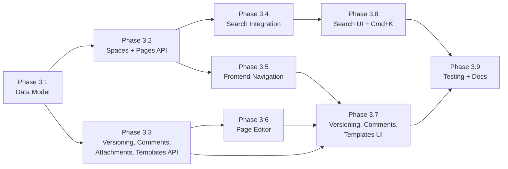

# Phase 3 Implementation Roadmap

## Overview

Phase 3 introduces the **Knowledge Base** feature -- a Confluence-style documentation system integrated into the project management platform. It supports Spaces (top-level containers per project), unlimited nested Pages within each space, full version history with diffs, threaded comments, inline attachments via S3, page templates, a WYSIWYG + Markdown toggle editor, and integration into the existing Cmd+K global search.

Access control reuses the existing project role system: the same role a user has on a project applies to that project's KB spaces. No new permission model is needed.

Phase 3 builds on the completed Phase 1 (MVP) and Phase 2 (feature gaps, UX, performance, quality).

### Dependency Graph



### Parallelization

- Phases 3.2 and 3.3 can run in parallel after 3.1 (no shared dependencies)
- Phase 3.5 can start as soon as 3.2 is done, in parallel with 3.3/3.4
- Phase 3.6 can start as soon as 3.3 is done, in parallel with 3.5

---

## Phase 3.1: Data Model and Migrations

**Goal:** Create all backend SQLAlchemy models and Alembic migrations for the Knowledge Base tables: `kb_spaces`, `kb_pages`, `kb_page_versions`, `kb_page_comments`, `kb_page_attachments`, and `kb_templates`.

### Tasks

1. **Create KB Space model**
   - `backend/app/models/kb_space.py`: id, project_id (FK), name, description, slug (unique per project), icon, position, is_archived, created_by, timestamps
   - Unique constraint on `(project_id, slug)`

2. **Create KB Page model**
   - `backend/app/models/kb_page.py`: id, space_id (FK), parent_page_id (self-referential FK), title, slug (unique per space), content_markdown, content_html, position, is_published, is_deleted, created_by, last_edited_by, timestamps
   - GIN index on `tsvector` for full-text search
   - Self-referential relationship for nested page tree

3. **Create KB Page Version model**
   - `backend/app/models/kb_page_version.py`: id, page_id (FK), version_number, title, content_markdown, content_html, change_summary, created_by, created_at
   - Unique constraint on `(page_id, version_number)`

4. **Create KB Page Comment model**
   - `backend/app/models/kb_comment.py`: id, page_id (FK), parent_comment_id (self-referential FK), author_id (FK), body (HTML), is_deleted, timestamps
   - Self-referential relationship for threaded comments

5. **Create KB Page Attachment model**
   - `backend/app/models/kb_attachment.py`: id, page_id (FK), filename, content_type, size_bytes, s3_key, created_by, created_at
   - S3 key pattern: `projects/{project_id}/kb/{space_id}/{page_id}/{uuid}_{filename}`

6. **Create KB Template model**
   - `backend/app/models/kb_template.py`: id, project_id (FK, nullable for built-ins), name, description, content_markdown, content_html, icon, is_builtin, created_by, timestamps

7. **Register models and generate migration**
   - Export all new models from `backend/app/models/__init__.py`
   - Generate Alembic migration for all 6 tables

### Acceptance Criteria

- [ ] All 6 models follow existing patterns (UUIDPrimaryKeyMixin, TimestampMixin, Base)
- [ ] Alembic migration creates all tables with correct indexes and constraints
- [ ] `alembic upgrade head` succeeds without errors
- [ ] Self-referential relationships work for page tree and threaded comments

### Files to Create/Modify

```
backend/app/models/kb_space.py           (create)
backend/app/models/kb_page.py            (create)
backend/app/models/kb_page_version.py    (create)
backend/app/models/kb_comment.py         (create)
backend/app/models/kb_attachment.py       (create)
backend/app/models/kb_template.py        (create)
backend/app/models/__init__.py           (modify)
backend/alembic/versions/XXXX_kb_tables.py (generate)
```

---

## Phase 3.2: Backend API -- Spaces and Page CRUD

**Goal:** REST endpoints for KB space management and page CRUD, including tree operations (move, reorder, get children, get ancestors for breadcrumbs).

### Tasks

1. **Pydantic schemas**
   - `backend/app/schemas/kb.py`: SpaceCreate, SpaceUpdate, SpaceRead, PageCreate, PageUpdate, PageRead, PageTreeNode, PageMoveRequest

2. **KB service layer**
   - `backend/app/services/kb_service.py`:
     - Space CRUD with slug generation/validation
     - Page CRUD with automatic slug generation from title
     - `get_page_tree()` -- recursive tree of pages for a space
     - `get_page_ancestors()` -- for breadcrumb navigation
     - `move_page()` -- reparent and/or reorder within siblings
     - Auto-create first version on page create

3. **Space endpoints**
   - `GET /projects/{pid}/kb/spaces` -- list spaces (ordered by position)
   - `POST /projects/{pid}/kb/spaces` -- create space (min role: Maintainer)
   - `GET /projects/{pid}/kb/spaces/{slug}` -- get space detail (min role: Guest)
   - `PATCH /projects/{pid}/kb/spaces/{slug}` -- update space (min role: Maintainer)
   - `DELETE /projects/{pid}/kb/spaces/{slug}` -- archive space (min role: Owner)

4. **Page endpoints**
   - `GET /kb/spaces/{spaceId}/pages` -- list root pages as tree
   - `POST /kb/spaces/{spaceId}/pages` -- create page (min role: Developer)
   - `GET /kb/pages/{pageId}` -- get page with content
   - `PATCH /kb/pages/{pageId}` -- update page, creates new version (min role: Developer)
   - `DELETE /kb/pages/{pageId}` -- soft-delete page (min role: Maintainer)
   - `POST /kb/pages/{pageId}/move` -- reparent/reorder (min role: Developer)
   - `GET /kb/pages/{pageId}/children` -- get child pages

5. **Register routers**
   - Add KB routers to `backend/app/api/v1/router.py`

### Acceptance Criteria

- [ ] Space CRUD works with slug-based URLs
- [ ] Pages support unlimited nesting via parent_page_id
- [ ] Creating/updating a page auto-generates a version record
- [ ] Page tree endpoint returns nested structure
- [ ] Move page correctly updates parent_page_id and position
- [ ] Permission checks reuse existing `require_project_role`

### Tests

- Space CRUD, slug uniqueness, archive
- Page CRUD, nesting, tree retrieval
- Move page (reparent, reorder)
- Permission checks (guest can read, developer can write, etc.)

### Files to Create/Modify

```
backend/app/schemas/kb.py                     (create)
backend/app/services/kb_service.py            (create)
backend/app/api/v1/endpoints/kb_spaces.py     (create)
backend/app/api/v1/endpoints/kb_pages.py      (create)
backend/app/api/v1/router.py                  (modify)
backend/tests/api/v1/test_kb_spaces.py        (create)
backend/tests/api/v1/test_kb_pages.py         (create)
```

---

## Phase 3.3: Backend API -- Versioning, Comments, Attachments, Templates

**Goal:** Page version history with diff computation, threaded comments, inline attachment upload via presigned S3 URLs, and template CRUD with built-in seed templates.

### Tasks

1. **Version history endpoints**
   - `GET /kb/pages/{pageId}/versions` -- paginated version list
   - `GET /kb/pages/{pageId}/versions/{versionId}` -- specific version content
   - `POST /kb/pages/{pageId}/versions/{versionId}/restore` -- restore version (creates new version with old content)
   - `GET /kb/pages/{pageId}/versions/{v1}/diff/{v2}` -- compute and return unified diff of markdown content
   - Backend diff service using Python `difflib` (unified diff of markdown lines)

2. **Threaded comment endpoints**
   - `GET /kb/pages/{pageId}/comments` -- list comments with nested thread structure
   - `POST /kb/pages/{pageId}/comments` -- add comment (optional parent_comment_id for reply)
   - `PATCH /kb/comments/{commentId}` -- edit own comment
   - `DELETE /kb/comments/{commentId}` -- soft-delete (own: Developer, any: Maintainer)

3. **Inline attachment endpoints**
   - `POST /kb/pages/{pageId}/attachments` -- create record + presigned upload URL
   - `GET /kb/attachments/{attachmentId}/download` -- presigned download URL
   - `DELETE /kb/attachments/{attachmentId}` -- delete (S3 + DB)
   - Reuse existing `storage_service.py` for S3 operations
   - S3 key pattern: `projects/{project_id}/kb/{space_id}/{page_id}/{uuid}_{filename}`

4. **Template endpoints**
   - `GET /projects/{pid}/kb/templates` -- list built-in + project templates
   - `POST /projects/{pid}/kb/templates` -- create custom template (min role: Maintainer)
   - `PATCH /kb/templates/{templateId}` -- update custom template
   - `DELETE /kb/templates/{templateId}` -- delete custom template (cannot delete built-ins)

5. **Seed built-in templates**
   - Create 5 built-in templates on first space creation (or via seed endpoint):
     - Blank Page, Meeting Notes, Decision Record, How-To Guide, API Documentation
   - `is_builtin = True`, `project_id = NULL`

### Acceptance Criteria

- [ ] Version list shows chronological history with version numbers
- [ ] Diff endpoint returns line-by-line unified diff
- [ ] Restoring a version creates a new version (non-destructive)
- [ ] Threaded comments support replies nested to any depth
- [ ] Attachment upload/download uses presigned S3 URLs (same pattern as ticket attachments)
- [ ] Built-in templates are available for all projects
- [ ] Custom templates are scoped to their project

### Tests

- Version creation on page update, list, restore, diff
- Comment CRUD, threading, soft-delete
- Attachment presign, download URL, delete
- Template CRUD, built-in protection

### Files to Create/Modify

```
backend/app/services/kb_version_service.py       (create)
backend/app/services/kb_comment_service.py        (create)
backend/app/services/kb_attachment_service.py     (create)
backend/app/services/kb_template_service.py       (create)
backend/app/api/v1/endpoints/kb_versions.py       (create)
backend/app/api/v1/endpoints/kb_comments.py       (create)
backend/app/api/v1/endpoints/kb_attachments.py    (create)
backend/app/api/v1/endpoints/kb_templates.py      (create)
backend/app/api/v1/router.py                      (modify)
backend/tests/api/v1/test_kb_versions.py          (create)
backend/tests/api/v1/test_kb_comments.py          (create)
backend/tests/api/v1/test_kb_attachments.py       (create)
backend/tests/api/v1/test_kb_templates.py         (create)
```

---

## Phase 3.4: Backend -- Search Integration

**Goal:** Add KB pages to PostgreSQL full-text search and expose through the existing search infrastructure so they appear in Cmd+K results.

### Tasks

1. **FTS index on kb_pages**
   - Add a `search_vector` `tsvector` column to `kb_pages` (generated from title + content_markdown)
   - GIN index on `search_vector`
   - Trigger to auto-update on INSERT/UPDATE
   - Alembic migration for the column and trigger

2. **KB search endpoint**
   - `GET /projects/{pid}/kb/search?q=...&limit=10` -- returns matching pages with highlighted snippets
   - Uses `ts_query` and `ts_headline` for relevance ranking and snippet generation
   - Response includes page title, space name, breadcrumb path, snippet

3. **Global search integration**
   - Add a new search endpoint or extend existing ticket search to include KB pages
   - Return results with `type: 'kb_page'` for the frontend to distinguish

### Acceptance Criteria

- [ ] Full-text search matches page titles and content
- [ ] Results include highlighted snippets showing match context
- [ ] Search respects project access permissions
- [ ] Results include enough metadata for navigation (space slug, page slug, breadcrumb)

### Files to Create/Modify

```
backend/app/services/kb_search_service.py         (create)
backend/app/api/v1/endpoints/kb_pages.py          (modify)
backend/alembic/versions/XXXX_kb_search_vector.py (generate)
backend/tests/api/v1/test_kb_search.py            (create)
```

---

## Phase 3.5: Frontend -- Navigation, Space and Page Tree

**Goal:** Frontend routing, space list view, page tree sidebar with lazy-loading, breadcrumb navigation, and project sub-nav integration.

### Tasks

1. **Routing**
   - Add routes under AppLayout (following existing pattern):
     - `/projects/:projectId/kb` -- space list
     - `/projects/:projectId/kb/:spaceSlug` -- space with page tree
     - `/projects/:projectId/kb/:spaceSlug/:pageSlug` -- page view/edit
     - `/projects/:projectId/kb/:spaceSlug/:pageSlug/history` -- version history

2. **KB API module**
   - `frontend/src/api/kb.ts` -- TypeScript interfaces and API functions for all KB endpoints

3. **Space list view**
   - `frontend/src/views/kb/KBSpaceListView.vue`:
     - Grid of space cards showing name, description, icon, page count
     - Create space dialog (name, description, icon picker)
     - Edit/archive actions for maintainers

4. **Page tree sidebar**
   - `frontend/src/components/kb/PageTreeSidebar.vue`:
     - Recursive tree component with expand/collapse
     - Lazy-load children on expand
     - Active page highlighting
     - "New page" and "New child page" context actions
     - Drag-and-drop reordering (optional, can be deferred)

5. **Space view layout**
   - `frontend/src/views/kb/KBSpaceView.vue`:
     - Left sidebar: page tree
     - Right content: router-view for page content
     - Breadcrumb trail: Space > Parent Page > ... > Current Page

6. **Project sub-nav integration**
   - Add "Knowledge Base" link to `ProjectSubNav.vue`

7. **i18n keys**
   - Add all KB-related translation keys to `en.json` and `es.json`

### Acceptance Criteria

- [ ] KB link visible in project sub-navigation
- [ ] Space list shows all spaces for the project
- [ ] Page tree loads and displays nested hierarchy
- [ ] Clicking a page in the tree navigates to it
- [ ] Breadcrumbs show full path from space to current page
- [ ] URLs use human-readable slugs

### Files to Create/Modify

```
frontend/src/api/kb.ts                              (create)
frontend/src/views/kb/KBSpaceListView.vue           (create)
frontend/src/views/kb/KBSpaceView.vue               (create)
frontend/src/views/kb/KBPageView.vue                (create)
frontend/src/components/kb/PageTreeSidebar.vue       (create)
frontend/src/router/index.ts                        (modify)
frontend/src/components/common/ProjectSubNav.vue    (modify)
frontend/src/i18n/locales/en.json                   (modify)
frontend/src/i18n/locales/es.json                   (modify)
```

---

## Phase 3.6: Frontend -- Page Editor (WYSIWYG + Markdown)

**Goal:** Enhanced TipTap editor with markdown source toggle, inline image upload, tables, callout blocks, and a slash command menu.

### Tasks

1. **Enhanced KB editor component**
   - `frontend/src/components/editor/KBRichTextEditor.vue`:
     - Extends the base RichTextEditor with additional extensions
     - Toggle button to switch between WYSIWYG and raw Markdown source
     - Enhanced toolbar with table, image, callout, and code block controls

2. **TipTap extensions**
   - `@tiptap/extension-image` -- inline images
   - `@tiptap/extension-table`, `@tiptap/extension-table-row`, `@tiptap/extension-table-cell`, `@tiptap/extension-table-header` -- rich tables
   - Custom `InlineImageUpload.ts` extension:
     - Drag-and-drop image onto editor -> presign S3 upload -> insert image node with S3 URL
     - Paste image from clipboard -> same flow
     - Upload progress indicator inline
   - Custom `SlashCommands.ts` extension:
     - Type `/` to open a floating menu with block options: heading, bullet list, numbered list, task list, code block, blockquote, callout, table, image, horizontal rule
     - Filter options by typing after `/`
   - Custom `CalloutNode.ts` extension:
     - Block node with variants: info, warning, tip, danger
     - Styled with appropriate icons and background colors

3. **Markdown source editor**
   - `frontend/src/components/kb/MarkdownSourceEditor.vue`:
     - Textarea or CodeMirror-based raw markdown editor
     - Syntax highlighting for markdown
     - Syncs with TipTap content on toggle (serialize TipTap JSON -> markdown, parse markdown -> TipTap JSON)
   - Use `@tiptap/pm` prosemirror utilities and a markdown serializer/parser (e.g., `prosemirror-markdown` or `turndown` + `marked`)

4. **Page editor view**
   - `frontend/src/views/kb/KBPageEditor.vue`:
     - Title input field
     - KBRichTextEditor for content
     - Save button with optional change summary input
     - Auto-save draft to localStorage
     - "Discard changes" option

5. **Install new dependencies**
   - `@tiptap/extension-image`, `@tiptap/extension-table`, `@tiptap/extension-table-row`, `@tiptap/extension-table-cell`, `@tiptap/extension-table-header`
   - `turndown` (HTML to markdown) and `marked` (markdown to HTML) for toggle sync

### Acceptance Criteria

- [ ] WYSIWYG editor renders rich content (headings, lists, tables, code blocks, images)
- [ ] Markdown toggle shows raw markdown source and syncs back on switch
- [ ] Drag-drop or paste image uploads to S3 and inserts inline
- [ ] Slash command menu appears on `/` keystroke with filterable options
- [ ] Callout blocks render with correct styling in editor and read view
- [ ] Tables are insertable and editable (add/remove rows/columns)

### Files to Create/Modify

```
frontend/package.json                                    (modify)
frontend/src/components/editor/KBRichTextEditor.vue      (create)
frontend/src/components/editor/extensions/InlineImageUpload.ts (create)
frontend/src/components/editor/extensions/SlashCommands.ts     (create)
frontend/src/components/editor/extensions/CalloutNode.ts       (create)
frontend/src/components/kb/MarkdownSourceEditor.vue      (create)
frontend/src/views/kb/KBPageEditor.vue                   (create)
```

---

## Phase 3.7: Frontend -- Versioning, Comments, Templates UI

**Goal:** Version history panel with diff viewer, threaded comment UI, and template picker for new pages.

### Tasks

1. **Version history panel**
   - `frontend/src/components/kb/VersionHistoryPanel.vue`:
     - Paginated list of versions with version number, author, date, change summary
     - Click a version to view its content
     - Compare button to select two versions for diff
   - `frontend/src/views/kb/KBVersionHistoryView.vue`:
     - Full-page version history with side-by-side or unified diff view
     - Restore button (creates new version with old content)
   - Use `diff` npm package for computing line diffs of markdown content
   - Render diffs with addition/deletion highlighting (green/red)

2. **Threaded comments**
   - `frontend/src/components/kb/ThreadedComments.vue`:
     - Comment list with nested replies (indented, collapsible)
     - Rich text editor for new comments (reuse base RichTextEditor)
     - "Reply" action on each comment to add child comment
     - Edit/delete own comments
     - Author avatar, name, relative timestamp

3. **Template picker**
   - `frontend/src/components/kb/TemplatePicker.vue`:
     - Dialog/overlay shown when creating a new page
     - Grid of template cards: icon, name, description, preview snippet
     - "Blank Page" as the default option
     - Selecting a template populates the editor with template content
   - Template manager (for maintainers):
     - List project templates with edit/delete
     - Create custom template from current page content

4. **Integrate into page view**
   - Page view shows: rendered content, comments section below, version history in sidebar or separate tab
   - Edit button opens editor view
   - "Created by" and "Last edited by" metadata

### Acceptance Criteria

- [ ] Version list shows all versions with metadata
- [ ] Diff view highlights additions (green) and deletions (red)
- [ ] Restoring a version creates a new latest version
- [ ] Comments support threaded replies with nesting
- [ ] Template picker shows built-in and custom templates
- [ ] Creating a page from template pre-fills content

### Files to Create/Modify

```
frontend/package.json                                    (modify - add diff)
frontend/src/components/kb/VersionHistoryPanel.vue       (create)
frontend/src/views/kb/KBVersionHistoryView.vue           (create)
frontend/src/components/kb/ThreadedComments.vue           (create)
frontend/src/components/kb/TemplatePicker.vue             (create)
frontend/src/views/kb/KBPageView.vue                     (modify)
frontend/src/views/kb/KBSpaceView.vue                    (modify)
frontend/src/i18n/locales/en.json                        (modify)
frontend/src/i18n/locales/es.json                        (modify)
```

---

## Phase 3.8: Frontend -- Search Integration and Cmd+K

**Goal:** Add KB pages to the existing CommandPalette global search results alongside tickets and projects.

### Tasks

1. **Extend CommandPalette search**
   - In `CommandPalette.vue`, add a KB page search query alongside existing ticket/project queries
   - Call `GET /projects/{pid}/kb/search?q=...` for each project the user has access to (or a global KB search endpoint)
   - KB results show: page title, space name, breadcrumb snippet
   - Result icon: `pi pi-book` (or similar) to distinguish from tickets/projects
   - Clicking a KB result navigates to `/projects/{pid}/kb/{spaceSlug}/{pageSlug}`

2. **KB-specific search within space view**
   - Search input in the page tree sidebar
   - Filters the tree to show only matching pages (or shows flat search results)
   - Uses the project-scoped KB search endpoint

3. **Result type badges**
   - Add type labels/icons in CommandPalette results to differentiate:
     - Tickets: `pi pi-ticket`
     - Projects: `pi pi-folder`
     - KB Pages: `pi pi-book`

### Acceptance Criteria

- [ ] Cmd+K results include KB pages alongside tickets and projects
- [ ] KB results show page title, space, and breadcrumb context
- [ ] Clicking a KB result navigates to the correct page
- [ ] KB search within space view filters/searches pages

### Files to Create/Modify

```
frontend/src/components/common/CommandPalette.vue    (modify)
frontend/src/components/kb/PageTreeSidebar.vue       (modify)
```

---

## Phase 3.9: Testing and Documentation

**Goal:** Backend API tests for all KB endpoints, frontend unit tests for key components, and updated phase documentation.

### Tasks

1. **Backend tests**
   - Complete test coverage for all KB endpoints:
     - Space CRUD, slug collision handling, archival
     - Page CRUD, nesting, tree retrieval, move operations
     - Version creation, list, restore, diff
     - Comment CRUD, threading, soft-delete, permissions
     - Attachment presign, download, delete
     - Template CRUD, built-in protection
     - Search (FTS query, snippet generation, access control)
     - Permission matrix (guest read, developer write, maintainer manage)

2. **Frontend unit tests**
   - PageTreeSidebar: tree rendering, expand/collapse, active highlighting
   - TemplatePicker: template selection, content population
   - ThreadedComments: comment rendering, reply nesting

3. **Documentation**
   - Finalize `docs/phase_3/PHASES.md` with completion status
   - Verify `docs/phase_3/DATA_MODEL.md` matches implementation
   - Verify `docs/phase_3/API_DESIGN.md` matches implementation
   - Verify `docs/phase_3/ARCHITECTURE.md` matches implementation

### Acceptance Criteria

- [x] All backend KB tests pass (54 tests in test_kb.py, 233 total)
- [x] Frontend type-checks pass (vue-tsc --noEmit)
- [x] All 4 phase documentation files are accurate and up to date

### Files to Create/Modify

```
backend/tests/api/v1/test_kb_spaces.py        (create/verify)
backend/tests/api/v1/test_kb_pages.py         (create/verify)
backend/tests/api/v1/test_kb_versions.py      (create/verify)
backend/tests/api/v1/test_kb_comments.py      (create/verify)
backend/tests/api/v1/test_kb_attachments.py   (create/verify)
backend/tests/api/v1/test_kb_templates.py     (create/verify)
backend/tests/api/v1/test_kb_search.py        (create/verify)
frontend/src/components/kb/__tests__/PageTreeSidebar.test.ts  (create)
frontend/src/components/kb/__tests__/TemplatePicker.test.ts   (create)
frontend/src/components/kb/__tests__/ThreadedComments.test.ts (create)
docs/phase_3/PHASES.md                        (modify)
docs/phase_3/DATA_MODEL.md                    (verify)
docs/phase_3/API_DESIGN.md                    (verify)
docs/phase_3/ARCHITECTURE.md                  (verify)
```

---

## Implementation Order and Estimated Effort

| Phase | Name | Est. Effort | Dependencies | Status |
|-------|------|-------------|--------------|--------|
| 3.1 | Data Model + Migrations | Medium | None | COMPLETED |
| 3.2 | Spaces + Pages API | Medium | 3.1 | COMPLETED |
| 3.3 | Versioning, Comments, Attachments, Templates API | Large | 3.1 | COMPLETED |
| 3.4 | Search Integration | Medium | 3.2 | COMPLETED |
| 3.5 | Frontend Navigation + Tree | Medium | 3.2 | COMPLETED |
| 3.6 | Page Editor (WYSIWYG + Markdown) | Large | 3.3 | COMPLETED |
| 3.7 | Versioning, Comments, Templates UI | Large | 3.3, 3.5, 3.6 | COMPLETED |
| 3.8 | Search UI + Cmd+K | Small | 3.4 | COMPLETED |
| 3.9 | Testing + Documentation | Medium | All prior phases | COMPLETED |
