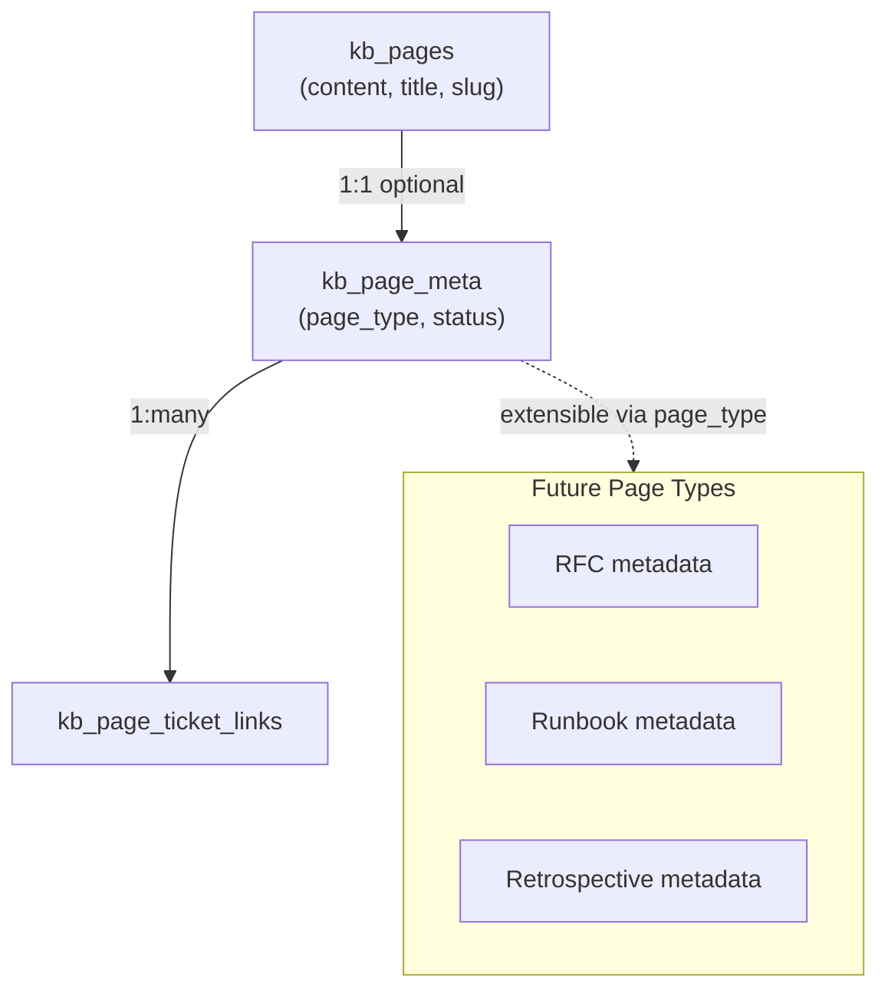
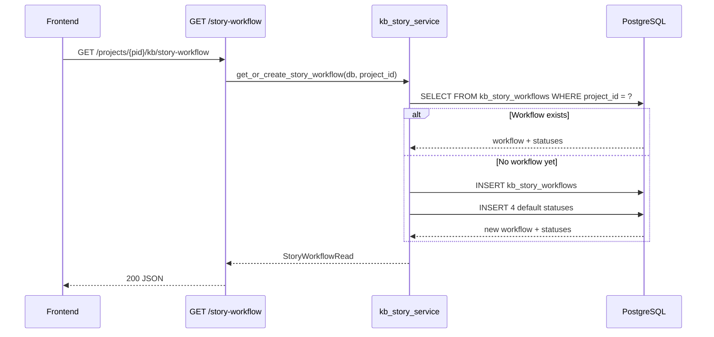
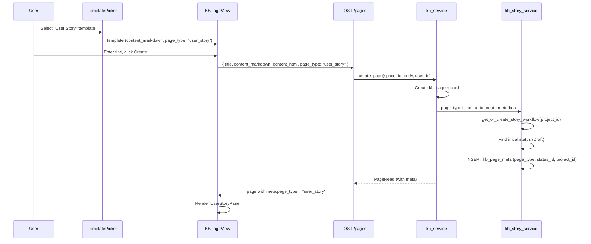
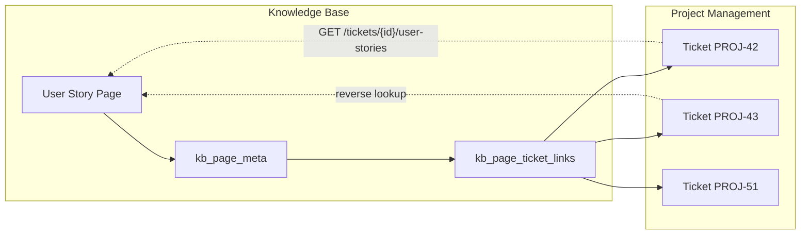

# Phase 4 Architecture

## Overview

Phase 4 extends the Knowledge Base with a **page type system** and implements the first concrete type: **User Story**. This document covers the architectural decisions, extensibility model, component design, and integration patterns.

For the base architecture, see `docs/phase_1/ARCHITECTURE.md`. For Phase 2 additions, see `docs/phase_2/ARCHITECTURE.md`. For Phase 3 KB architecture, see `docs/phase_3/ARCHITECTURE.md`.

---

## High-Level Architecture

```
┌──────────────────────────────────────────────────────────────────┐
│                        Frontend (Vue.js)                         │
│                                                                  │
│  ┌─────────────────┐  ┌──────────────────┐  ┌────────────────┐  │
│  │ KBPageView      │  │ UserStoryPanel   │  │ TicketDetail   │  │
│  │ (renders typed  │  │ (status badge,   │  │ (User Stories  │  │
│  │  pages)         │  │  ticket links)   │  │  sidebar card) │  │
│  └─────────────────┘  └──────────────────┘  └────────────────┘  │
│  ┌─────────────────┐  ┌──────────────────┐  ┌────────────────┐  │
│  │ LinkedTickets   │  │ LinkTicket       │  │ StoryWorkflow  │  │
│  │ Table           │  │ Dialog           │  │ Settings       │  │
│  └─────────────────┘  └──────────────────┘  └────────────────┘  │
└────────────────────────────┬─────────────────────────────────────┘
                             │ REST API
                             ▼
┌──────────────────────────────────────────────────────────────────┐
│                       Backend (FastAPI)                           │
│                                                                  │
│  ┌──────────────────┐  ┌──────────────────┐  ┌───────────────┐  │
│  │ Story Workflow   │  │ Page Meta        │  │ Ticket Links  │  │
│  │ Router           │  │ Router           │  │ (in Meta Rtr) │  │
│  └────────┬─────────┘  └────────┬─────────┘  └──────┬────────┘  │
│           │                     │                    │           │
│  ┌────────┴─────────────────────┴────────────────────┴────────┐  │
│  │                  KB Story Service Layer                     │  │
│  │  get_or_create_workflow, transition_status,                 │  │
│  │  add_ticket_link, get_stories_for_ticket                   │  │
│  └────────┬─────────────────────┬────────────────────┬────────┘  │
│           │                     │                    │           │
│  ┌────────▼────────┐  ┌────────▼────────┐  ┌────────▼────────┐  │
│  │ PostgreSQL      │  │ Existing KB     │  │ Permissions     │  │
│  │ (4 new tables)  │  │ Tables          │  │ (reuse existing)│  │
│  └─────────────────┘  └─────────────────┘  └─────────────────┘  │
└──────────────────────────────────────────────────────────────────┘
```

---

## Page Type Extensibility Model

The design separates **content** (in `kb_pages`) from **metadata** (in `kb_page_meta`). This allows any KB page to optionally become "typed" without modifying the core page table.



### How page types work

1. **Template declares type:** The `KBTemplate.page_type` column stores the type (e.g., `"user_story"`, null for generic templates)
2. **Page creation triggers metadata:** When `PageCreate.page_type` is set, the backend auto-creates `kb_page_meta` with the type and initial workflow status
3. **Frontend renders type-specific UI:** `KBPageView` checks `page.meta.page_type` and conditionally renders the appropriate panel component
4. **Type-specific behavior is isolated:** Each page type has its own panel component, service functions, and API endpoints

### Adding a new page type in the future

1. Define the type string (e.g., `"rfc"`)
2. Add any type-specific columns to `kb_page_meta` (or create a separate extension table with FK to `kb_page_meta`)
3. Create a template with `page_type = "rfc"`
4. Create a frontend panel component (e.g., `RFCPanel.vue`)
5. Register the panel in `KBPageView`'s conditional rendering

---

## Story Workflow vs Ticket Workflow

The platform has two distinct workflow systems serving different purposes:

| Aspect | Ticket Workflow | Story Workflow |
|--------|----------------|----------------|
| **Domain** | Work execution | Documentation lifecycle |
| **Scope** | Organization-level, shared across projects | Per-project, isolated |
| **Complexity** | Statuses + transitions + conditions | Flat status list only |
| **Transitions** | Constrained (must follow defined transitions) | Free (can move to any status) |
| **Categories** | `to_do`, `in_progress`, `done` | `draft`, `review`, `ready`, `ticketed` (custom) |
| **Table** | `workflows`, `workflow_statuses`, `workflow_transitions` | `kb_story_workflows`, `kb_story_workflow_statuses` |
| **Used by** | Tickets | KB User Story pages |

The story workflow is intentionally simpler -- no transition constraints, no conditions. User Stories follow a less rigid lifecycle than development tickets.

---

## Auto-seeding Behavior

The story workflow uses a **lazy seed** pattern rather than eagerly creating workflows for all projects:



Benefits:
- No migration needed to seed existing projects
- No startup overhead -- workflows are created on demand
- Works seamlessly with new projects created after Phase 4

---

## Template-aware Page Creation Flow



---

## Frontend Component Structure

### KBPageView Integration

The existing `KBPageView.vue` gains conditional rendering based on page type:

```
KBPageView
├── Page Header (title, breadcrumbs, edit button)
├── [if meta.page_type === 'user_story']
│   └── UserStoryPanel
│       ├── Status Badge + Transition Dropdown
│       ├── LinkedTicketsTable
│       │   └── rows: ticket key, title, priority, status, assignee, [remove]
│       └── Link Ticket Button → LinkTicketDialog
├── Page Content (WYSIWYG / Markdown / Read-only HTML)
├── Tabs: Version History | Comments
└── Page Meta Footer (updated at)
```

### UserStoryPanel Component

Renders above the page content for User Story pages:

```
UserStoryPanel
├── Props: pageId, pageMeta, projectId
├── State: storyWorkflow (statuses list), ticketLinks[]
├── Sections:
│   ├── Status Row
│   │   ├── Current status Tag (colored)
│   │   └── Select dropdown (all statuses) → PATCH /meta
│   ├── Linked Tickets
│   │   ├── LinkedTicketsTable (read-only table)
│   │   ├── "Link Ticket" Button → opens LinkTicketDialog
│   │   └── Empty state: "No tickets linked yet"
│   └── Summary Stats (ticket count, status breakdown)
└── Emits: status-changed, link-added, link-removed
```

### LinkTicketDialog Component

Modal for searching and linking existing project tickets:

```
LinkTicketDialog
├── Props: projectId, pageMetaId, existingTicketIds[]
├── Search Input (debounced, queries GET /tickets with search param)
├── Results List
│   └── rows: ticket key, title, status tag, priority tag
│       └── [disabled if already linked]
├── Optional Note Input
└── "Link" Button → POST /ticket-links → emits linked
```

### UserStoriesCard Component (Ticket Detail Sidebar)

New sidebar card in `TicketDetailView.vue`:

```
UserStoriesCard
├── Props: ticketId
├── Data: userStories[] (from GET /tickets/{id}/user-stories)
├── List Items:
│   └── Story title (link to KB page), status badge, space name
└── Hidden when userStories is empty
```

### StoryWorkflowSettings Component

Project settings section for workflow customization:

```
StoryWorkflowSettings
├── Props: projectId
├── Data: workflow (from GET /story-workflow)
├── Status List (ordered by position):
│   └── rows: color swatch, name (editable), category, position arrows, delete button
├── "Add Status" Button → inline form
└── Validation: cannot delete in-use status, at least one status required
```

---

## Access Control

All Phase 4 endpoints reuse the existing project-level RBAC system.

| Action | Minimum Role | Notes |
|--------|-------------|-------|
| View story workflow, page meta, ticket links | Guest | Read-only access |
| Transition story status | Developer | Content authoring |
| Link/unlink tickets | Developer | Content authoring |
| Add/update workflow statuses | Maintainer | Workflow administration |
| Delete workflow statuses | Owner | Destructive action |

The permission check resolves the project from the page's space (for page meta endpoints) or directly from the URL (for story workflow endpoints), using the same `require_project_role()` / `resolve_effective_project_role()` pattern as Phase 3.

---

## Data Flow: Bidirectional Ticket Linking



The bidirectional link is stored once (in `kb_page_ticket_links`) and queried from both directions:
- **Forward (Story -> Tickets):** `GET /kb/pages/{id}/ticket-links` joins through `page_meta_id`
- **Reverse (Ticket -> Stories):** `GET /tickets/{id}/user-stories` queries `kb_page_ticket_links` by `ticket_id` and joins to `kb_page_meta` + `kb_pages` + `kb_spaces`

---

## Migration Strategy

Phase 4 is purely additive -- no existing tables are modified except `kb_templates` (new nullable `page_type` column). This means:

1. All existing KB pages continue to work unchanged (no metadata = no type-specific UI)
2. The story workflow is lazily created per-project on first access
3. The `page_type` column on `kb_templates` defaults to null, so existing templates are unaffected
4. Rolling back the migration drops only the new tables and the `page_type` column

Two Alembic migrations:
1. `XXXX_kb_user_story_tables.py` -- creates the 4 new tables
2. `XXXX_template_page_type.py` -- adds `page_type` column to `kb_templates`
