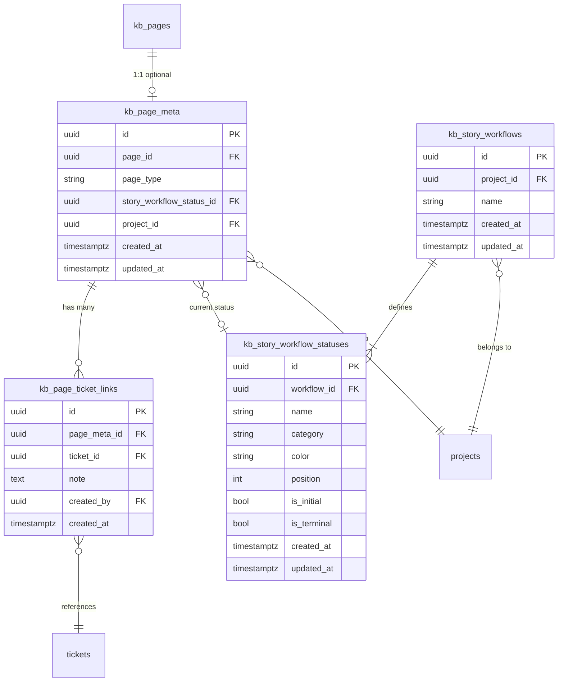

# Phase 4 Data Model

## Overview

Phase 4 introduces four new database tables to support typed KB pages with structured metadata, customizable story workflows, and bidirectional ticket linking. One existing table (`kb_templates`) gains a new column. No other existing tables are modified.

For the base data model, see `docs/phase_1/DATA_MODEL.md`. For Phase 2 additions, see `docs/phase_2/DATA_MODEL.md`. For Phase 3 KB tables, see `docs/phase_3/DATA_MODEL.md`.

---

## Entity Relationship Diagram



---

## New Tables

### `kb_story_workflows`

Per-project workflow definition for User Story pages. Each project has at most one story workflow, auto-seeded with defaults on first access.

```sql
CREATE TABLE kb_story_workflows (
    id           UUID PRIMARY KEY DEFAULT gen_random_uuid(),
    project_id   UUID NOT NULL REFERENCES projects(id) ON DELETE CASCADE,
    name         VARCHAR(255) NOT NULL DEFAULT 'User Story Workflow',
    created_at   TIMESTAMPTZ NOT NULL DEFAULT now(),
    updated_at   TIMESTAMPTZ NOT NULL DEFAULT now(),

    CONSTRAINT uq_kb_story_workflows_project
        UNIQUE (project_id)
);

CREATE INDEX ix_kb_story_workflows_project_id ON kb_story_workflows(project_id);
```

**Notes:**
- One workflow per project, enforced by the unique constraint on `project_id`
- `name` defaults to "User Story Workflow" but can be customized
- Deleting a project cascades to its story workflow and all related statuses

**SQLAlchemy Model:**

```python
class KBStoryWorkflow(UUIDPrimaryKeyMixin, TimestampMixin, Base):
    __tablename__ = "kb_story_workflows"
    __table_args__ = (
        UniqueConstraint("project_id", name="uq_kb_story_workflows_project"),
    )

    project_id: Mapped[uuid.UUID] = mapped_column(
        UUID(as_uuid=True), ForeignKey("projects.id", ondelete="CASCADE"),
        nullable=False, index=True,
    )
    name: Mapped[str] = mapped_column(
        String(255), nullable=False, default="User Story Workflow",
    )

    statuses: Mapped[list["KBStoryWorkflowStatus"]] = relationship(
        back_populates="workflow", cascade="all, delete-orphan",
        order_by="KBStoryWorkflowStatus.position",
    )
```

---

### `kb_story_workflow_statuses`

Individual statuses within a story workflow. Customizable by project admins.

```sql
CREATE TABLE kb_story_workflow_statuses (
    id           UUID PRIMARY KEY DEFAULT gen_random_uuid(),
    workflow_id  UUID NOT NULL REFERENCES kb_story_workflows(id) ON DELETE CASCADE,
    name         VARCHAR(100) NOT NULL,
    category     VARCHAR(20) NOT NULL DEFAULT 'draft',
    color        VARCHAR(7) NOT NULL DEFAULT '#6B7280',
    position     INTEGER NOT NULL DEFAULT 0,
    is_initial   BOOLEAN NOT NULL DEFAULT false,
    is_terminal  BOOLEAN NOT NULL DEFAULT false,
    created_at   TIMESTAMPTZ NOT NULL DEFAULT now(),
    updated_at   TIMESTAMPTZ NOT NULL DEFAULT now(),

    CONSTRAINT uq_kb_story_wf_status_name
        UNIQUE (workflow_id, name)
);

CREATE INDEX ix_kb_story_wf_statuses_workflow_id ON kb_story_workflow_statuses(workflow_id);
```

**Notes:**
- `category` is a hint for UI grouping/styling: `draft`, `review`, `ready`, `ticketed`, or any custom string
- `color` is a hex color code for the status badge
- `position` determines display order; 0-indexed
- `is_initial` marks the default status for new User Story pages (exactly one per workflow)
- `is_terminal` marks statuses that indicate completion
- Unique constraint on `(workflow_id, name)` prevents duplicate status names

**Default seed statuses:**

| Name | Category | Color | Position | Initial | Terminal |
|------|----------|-------|----------|---------|----------|
| Draft | draft | #6B7280 | 0 | true | false |
| Pending Review | review | #F59E0B | 1 | false | false |
| Ready for Ticketing | ready | #3B82F6 | 2 | false | false |
| Ticketed | ticketed | #10B981 | 3 | false | true |

**SQLAlchemy Model:**

```python
class KBStoryWorkflowStatus(UUIDPrimaryKeyMixin, TimestampMixin, Base):
    __tablename__ = "kb_story_workflow_statuses"
    __table_args__ = (
        UniqueConstraint("workflow_id", "name", name="uq_kb_story_wf_status_name"),
    )

    workflow_id: Mapped[uuid.UUID] = mapped_column(
        UUID(as_uuid=True), ForeignKey("kb_story_workflows.id", ondelete="CASCADE"),
        nullable=False, index=True,
    )
    name: Mapped[str] = mapped_column(String(100), nullable=False)
    category: Mapped[str] = mapped_column(String(20), nullable=False, default="draft")
    color: Mapped[str] = mapped_column(String(7), nullable=False, default="#6B7280")
    position: Mapped[int] = mapped_column(Integer, nullable=False, default=0)
    is_initial: Mapped[bool] = mapped_column(Boolean, nullable=False, default=False)
    is_terminal: Mapped[bool] = mapped_column(Boolean, nullable=False, default=False)

    workflow: Mapped["KBStoryWorkflow"] = relationship(back_populates="statuses")
```

---

### `kb_page_meta`

Optional structured metadata for KB pages. Enables typed pages (starting with `user_story`) with type-specific behavior. Uses a 1:1 relationship with `kb_pages`.

```sql
CREATE TABLE kb_page_meta (
    id                          UUID PRIMARY KEY DEFAULT gen_random_uuid(),
    page_id                     UUID NOT NULL REFERENCES kb_pages(id) ON DELETE CASCADE,
    page_type                   VARCHAR(50) NOT NULL,
    story_workflow_status_id    UUID REFERENCES kb_story_workflow_statuses(id) ON DELETE SET NULL,
    project_id                  UUID NOT NULL REFERENCES projects(id) ON DELETE CASCADE,
    created_at                  TIMESTAMPTZ NOT NULL DEFAULT now(),
    updated_at                  TIMESTAMPTZ NOT NULL DEFAULT now(),

    CONSTRAINT uq_kb_page_meta_page_id
        UNIQUE (page_id)
);

CREATE INDEX ix_kb_page_meta_page_id ON kb_page_meta(page_id);
CREATE INDEX ix_kb_page_meta_project_id ON kb_page_meta(project_id);
CREATE INDEX ix_kb_page_meta_page_type ON kb_page_meta(page_type);
```

**Notes:**
- `page_id` is unique, enforcing a 1:1 relationship with `kb_pages`
- `page_type` stores the type identifier (e.g., `"user_story"`); extensible for future types
- `story_workflow_status_id` is nullable -- only relevant for `user_story` type pages; SET NULL on status deletion so pages aren't lost
- `project_id` is denormalized (could be derived from page -> space -> project) for efficient queries like "all user stories in a project"
- Deleting a page cascades to its metadata

**SQLAlchemy Model:**

```python
class KBPageMeta(UUIDPrimaryKeyMixin, TimestampMixin, Base):
    __tablename__ = "kb_page_meta"
    __table_args__ = (
        UniqueConstraint("page_id", name="uq_kb_page_meta_page_id"),
    )

    page_id: Mapped[uuid.UUID] = mapped_column(
        UUID(as_uuid=True), ForeignKey("kb_pages.id", ondelete="CASCADE"),
        nullable=False, index=True,
    )
    page_type: Mapped[str] = mapped_column(String(50), nullable=False)
    story_workflow_status_id: Mapped[Optional[uuid.UUID]] = mapped_column(
        UUID(as_uuid=True),
        ForeignKey("kb_story_workflow_statuses.id", ondelete="SET NULL"),
        nullable=True,
    )
    project_id: Mapped[uuid.UUID] = mapped_column(
        UUID(as_uuid=True), ForeignKey("projects.id", ondelete="CASCADE"),
        nullable=False, index=True,
    )

    page: Mapped["KBPage"] = relationship(backref="meta", uselist=False)
    story_status: Mapped[Optional["KBStoryWorkflowStatus"]] = relationship()
    ticket_links: Mapped[list["KBPageTicketLink"]] = relationship(
        back_populates="page_meta", cascade="all, delete-orphan",
    )
```

---

### `kb_page_ticket_links`

Links between a typed KB page and project tickets. Supports many-to-many: a User Story can link to multiple tickets, and a ticket can be linked from multiple User Stories.

```sql
CREATE TABLE kb_page_ticket_links (
    id             UUID PRIMARY KEY DEFAULT gen_random_uuid(),
    page_meta_id   UUID NOT NULL REFERENCES kb_page_meta(id) ON DELETE CASCADE,
    ticket_id      UUID NOT NULL REFERENCES tickets(id) ON DELETE CASCADE,
    note           TEXT,
    created_by     UUID REFERENCES users(id) ON DELETE SET NULL,
    created_at     TIMESTAMPTZ NOT NULL DEFAULT now(),

    CONSTRAINT uq_kb_page_ticket_link
        UNIQUE (page_meta_id, ticket_id)
);

CREATE INDEX ix_kb_page_ticket_links_page_meta_id ON kb_page_ticket_links(page_meta_id);
CREATE INDEX ix_kb_page_ticket_links_ticket_id ON kb_page_ticket_links(ticket_id);
```

**Notes:**
- Unique constraint on `(page_meta_id, ticket_id)` prevents duplicate links
- `note` is optional free-text (e.g., "Covers the API endpoint")
- `created_by` tracks who created the link
- Index on `ticket_id` supports efficient reverse lookups (ticket -> user stories)
- Deleting a page_meta cascades to all its ticket links
- Deleting a ticket cascades to remove it from all page links

**SQLAlchemy Model:**

```python
class KBPageTicketLink(UUIDPrimaryKeyMixin, Base):
    __tablename__ = "kb_page_ticket_links"
    __table_args__ = (
        UniqueConstraint("page_meta_id", "ticket_id", name="uq_kb_page_ticket_link"),
    )

    page_meta_id: Mapped[uuid.UUID] = mapped_column(
        UUID(as_uuid=True), ForeignKey("kb_page_meta.id", ondelete="CASCADE"),
        nullable=False, index=True,
    )
    ticket_id: Mapped[uuid.UUID] = mapped_column(
        UUID(as_uuid=True), ForeignKey("tickets.id", ondelete="CASCADE"),
        nullable=False, index=True,
    )
    note: Mapped[Optional[str]] = mapped_column(Text, nullable=True)
    created_by: Mapped[Optional[uuid.UUID]] = mapped_column(
        UUID(as_uuid=True), ForeignKey("users.id", ondelete="SET NULL"),
        nullable=True,
    )
    created_at: Mapped[datetime] = mapped_column(
        DateTime(timezone=True), nullable=False, server_default=func.now(),
    )

    page_meta: Mapped["KBPageMeta"] = relationship(back_populates="ticket_links")
    ticket: Mapped["Ticket"] = relationship()
```

---

## Modified Tables

### `kb_templates` (existing)

Add a new nullable column to support template-to-page-type mapping:

```sql
ALTER TABLE kb_templates ADD COLUMN page_type VARCHAR(50);
```

**Notes:**
- `page_type` is null for generic templates (Blank Page, Meeting Notes, etc.)
- Set to `"user_story"` for the User Story template
- When a page is created from a template with a non-null `page_type`, the backend auto-creates `kb_page_meta` with that type

---

## Design Decisions

### Why a separate `kb_page_meta` table instead of adding columns to `kb_pages`?

1. **Extensibility:** Future page types (RFC, Runbook, Retrospective) can add their own metadata without bloating the core page table
2. **Optionality:** Most KB pages are plain documents; metadata is the exception, not the rule
3. **Clean separation:** The core KB system remains simple; typed page behavior is layered on top

### Why not reuse the existing ticket workflow system?

1. **Different domain:** Ticket workflows track work execution; story workflows track documentation lifecycle
2. **Different scope:** Ticket workflows are org-level and shared across projects; story workflows are per-project and simpler
3. **Different complexity:** Story workflows are flat status lists; ticket workflows support transitions with conditions
4. **Independence:** Changing ticket workflows should not affect KB story tracking, and vice versa

### Why denormalize `project_id` on `kb_page_meta`?

The canonical path is `kb_page_meta.page_id -> kb_pages.space_id -> kb_spaces.project_id`, which requires 2 joins. Denormalizing `project_id` on `kb_page_meta` enables direct queries like "all user stories in project X" and efficient filtering in the story workflow admin.
