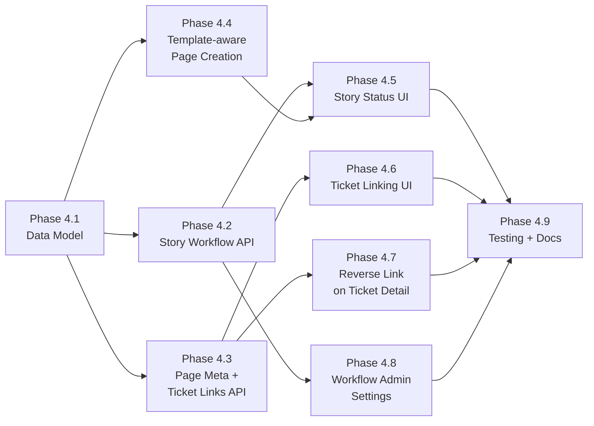

# Phase 4 Implementation Roadmap

## Overview

Phase 4 introduces **User Story page types** with structured metadata, ticket linking, and customizable workflows to the Knowledge Base. This extends the KB from a pure documentation system into a requirements management tool where User Story pages can track their lifecycle (Draft, Pending Review, Ready for Ticketing, Ticketed) and link to the tickets that implement them.

The feature is designed to be extensible -- the page metadata layer supports future page types (e.g., RFC, Runbook, Retrospective) without modifying the core `kb_pages` table.

Key capabilities:
- **Page types:** KB pages can optionally be typed (starting with `user_story`), enabling type-specific UI and behavior
- **Story workflows:** Per-project customizable workflow with admin-configurable statuses, seeded with sensible defaults
- **Ticket linking:** Bidirectional linking between User Story pages and project tickets
- **Reverse lookup:** Tickets show which User Stories they belong to in their detail sidebar

Phase 4 builds on the completed Phase 3 (Knowledge Base).

### Dependency Graph



### Parallelization

- Phases 4.2, 4.3, and 4.4 can run in parallel after 4.1 (no shared dependencies)
- Phase 4.5 requires 4.2 and 4.4
- Phases 4.6 and 4.7 can run in parallel after 4.3
- Phase 4.8 requires only 4.2

---

## Phase 4.1: Data Model and Migrations

**Goal:** Create all backend SQLAlchemy models and Alembic migration for the 4 new tables: `kb_story_workflows`, `kb_story_workflow_statuses`, `kb_page_meta`, `kb_page_ticket_links`.

### Tasks

1. **Create Story Workflow model**
   - `backend/app/models/kb_story_workflow.py`: `KBStoryWorkflow` (id, project_id FK, name, timestamps) and `KBStoryWorkflowStatus` (id, workflow_id FK, name, category, color, position, is_initial, is_terminal, timestamps)
   - Unique constraint on `(workflow_id, name)` for statuses
   - One workflow per project (unique constraint on project_id)

2. **Create Page Meta model**
   - `backend/app/models/kb_page_meta.py`: `KBPageMeta` (id, page_id FK unique, page_type string, story_workflow_status_id FK nullable, project_id FK, timestamps)
   - 1:1 relationship with `kb_pages` via unique `page_id`
   - `page_type` values: `"user_story"` (extensible to others later)

3. **Create Page Ticket Link model**
   - In same file or separate: `KBPageTicketLink` (id, page_meta_id FK, ticket_id FK, note text nullable, created_by FK, created_at)
   - Unique constraint on `(page_meta_id, ticket_id)` to prevent duplicate links

4. **Register models and generate migration**
   - Export all new models from `backend/app/models/__init__.py`
   - Generate Alembic migration for all 4 tables

### Acceptance Criteria

- [ ] All models follow existing patterns (UUIDPrimaryKeyMixin, TimestampMixin, Base)
- [ ] Alembic migration creates all tables with correct indexes and constraints
- [ ] `alembic upgrade head` succeeds without errors
- [ ] Foreign key cascades are correct (deleting a page cascades to page_meta, deleting page_meta cascades to ticket_links)

### Files to Create/Modify

```
backend/app/models/kb_story_workflow.py      (create)
backend/app/models/kb_page_meta.py           (create)
backend/app/models/__init__.py               (modify)
backend/alembic/versions/XXXX_kb_user_story_tables.py (generate)
```

---

## Phase 4.2: Backend API -- Story Workflows

**Goal:** REST endpoints for per-project story workflow CRUD, including auto-seeding default statuses when a project's story workflow is first accessed.

### Tasks

1. **Pydantic schemas**
   - `backend/app/schemas/kb_story.py`: StoryWorkflowRead, StoryWorkflowStatusCreate, StoryWorkflowStatusUpdate, StoryWorkflowStatusRead

2. **Story workflow service**
   - `backend/app/services/kb_story_service.py`:
     - `get_or_create_story_workflow(db, project_id)` -- returns existing workflow or seeds defaults (Draft, Pending Review, Ready for Ticketing, Ticketed)
     - Status CRUD with position management

3. **Story workflow endpoints**
   - `backend/app/api/v1/endpoints/kb_story_workflows.py`:
     - `GET /projects/{project_id}/kb/story-workflow` -- get workflow with statuses (auto-seeds if none exist)
     - `POST /projects/{project_id}/kb/story-workflow/statuses` -- add status (min role: Maintainer)
     - `PATCH /projects/{project_id}/kb/story-workflow/statuses/{status_id}` -- update status (min role: Maintainer)
     - `DELETE /projects/{project_id}/kb/story-workflow/statuses/{status_id}` -- remove status (min role: Owner)

4. **Register router**
   - Add to `backend/app/api/v1/router.py`

### Default Seed Statuses

| Name | Category | Color | Position | Initial | Terminal |
|------|----------|-------|----------|---------|----------|
| Draft | draft | #6B7280 | 0 | Yes | No |
| Pending Review | review | #F59E0B | 1 | No | No |
| Ready for Ticketing | ready | #3B82F6 | 2 | No | No |
| Ticketed | ticketed | #10B981 | 3 | No | Yes |

### Acceptance Criteria

- [ ] Workflow is auto-created with 4 default statuses on first access
- [ ] Subsequent GET returns existing workflow (no duplication)
- [ ] Status CRUD respects position ordering
- [ ] Cannot delete a status that is in use by a page
- [ ] RBAC enforced (Maintainer for create/update, Owner for delete)

### Files to Create/Modify

```
backend/app/schemas/kb_story.py                          (create)
backend/app/services/kb_story_service.py                 (create)
backend/app/api/v1/endpoints/kb_story_workflows.py       (create)
backend/app/api/v1/router.py                             (modify)
```

---

## Phase 4.3: Backend API -- Page Metadata and Ticket Linking

**Goal:** Endpoints for managing page metadata (type, story status) and bidirectional ticket linking, including a reverse lookup from tickets to user stories.

### Tasks

1. **Pydantic schemas**
   - Add to `backend/app/schemas/kb_story.py`:
     - PageMetaRead, PageMetaUpdate (story_workflow_status_id)
     - PageTicketLinkCreate (ticket_id, note), PageTicketLinkRead (includes ticket key, title, status name, priority, assignee name)
     - UserStoryForTicketRead (page title, slug, space name, space slug, story status name, story status color)

2. **Page meta service**
   - Add to `backend/app/services/kb_story_service.py`:
     - `get_page_meta(db, page_id)` -- returns meta or None
     - `upsert_page_meta(db, page_id, project_id, page_type, status_id)` -- create or update
     - `transition_story_status(db, page_meta_id, new_status_id)` -- update status
     - `list_ticket_links(db, page_meta_id)` -- with joined ticket data
     - `add_ticket_link(db, page_meta_id, ticket_id, note, user_id)`
     - `remove_ticket_link(db, link_id)`
     - `get_user_stories_for_ticket(db, ticket_id)` -- reverse lookup

3. **Page meta endpoints**
   - `backend/app/api/v1/endpoints/kb_page_meta.py`:
     - `GET /kb/pages/{page_id}/meta` -- get page metadata (min role: Guest)
     - `PATCH /kb/pages/{page_id}/meta` -- update metadata / transition status (min role: Developer)
     - `GET /kb/pages/{page_id}/ticket-links` -- list linked tickets (min role: Guest)
     - `POST /kb/pages/{page_id}/ticket-links` -- link a ticket (min role: Developer)
     - `DELETE /kb/pages/{page_id}/ticket-links/{link_id}` -- unlink (min role: Developer)

4. **Reverse lookup endpoint**
   - `GET /tickets/{ticket_id}/user-stories` -- returns user story pages linked to this ticket (min role: Guest)
   - Added to existing tickets endpoint file or new dedicated file

5. **Extend PageRead**
   - Add optional `meta: PageMetaRead | None` to `PageRead` schema so the page view gets type info without an extra call

6. **Register router**
   - Add to `backend/app/api/v1/router.py`

### Acceptance Criteria

- [ ] Page meta is optional -- pages without meta continue to work unchanged
- [ ] Linking a ticket that doesn't exist in the same project returns 404
- [ ] Duplicate links are rejected (409 Conflict)
- [ ] Reverse lookup returns correct story pages with status info
- [ ] Deleting a page cascades to page_meta and ticket_links
- [ ] PageRead includes meta when present

### Files to Create/Modify

```
backend/app/schemas/kb_story.py                      (modify)
backend/app/services/kb_story_service.py             (modify)
backend/app/api/v1/endpoints/kb_page_meta.py         (create)
backend/app/api/v1/endpoints/tickets.py              (modify -- add user-stories endpoint)
backend/app/schemas/kb.py                            (modify -- extend PageRead)
backend/app/api/v1/router.py                         (modify)
```

---

## Phase 4.4: Backend -- Template-aware Page Creation

**Goal:** Extend the template and page creation system so that creating a page from the "User Story" template automatically sets up page metadata with the correct type and initial workflow status.

### Tasks

1. **Add `page_type` to KBTemplate model**
   - New nullable `page_type` column on `kb_templates` (e.g., `"user_story"`, null for generic templates)
   - Alembic migration to add column
   - Update seed function to set `page_type="user_story"` on the User Story template

2. **Extend page creation flow**
   - Update `kb_service.create_page()`: if `PageCreate.page_type` is provided, auto-create `KBPageMeta` with the given type and the project's initial story workflow status
   - The frontend will pass `page_type` when a typed template is selected

3. **Update schemas**
   - Add optional `page_type` to `PageCreate`
   - Add `page_type` to `TemplateRead`

### Acceptance Criteria

- [ ] Creating a page with `page_type="user_story"` auto-creates metadata and sets initial status
- [ ] Creating a page without `page_type` works as before (no metadata created)
- [ ] Template picker shows the template's type (for future filtering)
- [ ] User Story template has `page_type="user_story"` in seed data

### Files to Create/Modify

```
backend/app/models/kb_template.py                    (modify -- add page_type column)
backend/app/schemas/kb.py                            (modify -- PageCreate, TemplateRead)
backend/app/services/kb_service.py                   (modify -- create_page)
backend/app/api/v1/endpoints/kb_templates.py         (modify -- seed function)
backend/alembic/versions/XXXX_template_page_type.py  (generate)
```

---

## Phase 4.5: Frontend -- Story Workflow Status UI on KB Pages

**Goal:** When viewing a User Story page, display a status badge and transition dropdown above the page content.

### Tasks

1. **Extend KB API client**
   - `frontend/src/api/kb.ts`: add interfaces and functions for story workflow, page meta, and status transitions

2. **Create UserStoryPanel component**
   - `frontend/src/components/kb/UserStoryPanel.vue`:
     - Colored status badge showing current story workflow status
     - Dropdown to transition to other available statuses
     - Calls `PATCH /kb/pages/{page_id}/meta` on status change

3. **Integrate into KBPageView**
   - `frontend/src/views/kb/KBPageView.vue`:
     - Load page meta alongside page data
     - Conditionally render `UserStoryPanel` when `meta.page_type === 'user_story'`
     - Load story workflow statuses for the dropdown

4. **i18n keys**
   - Add keys for status labels, transition actions, section headers in `en.json` and `es.json`

### Acceptance Criteria

- [ ] Status badge renders with correct color from workflow status
- [ ] Dropdown shows all available statuses
- [ ] Status transitions persist immediately via API
- [ ] Non-user-story pages show no extra UI
- [ ] Status change updates the badge without page reload

### Files to Create/Modify

```
frontend/src/api/kb.ts                               (modify)
frontend/src/components/kb/UserStoryPanel.vue         (create)
frontend/src/views/kb/KBPageView.vue                  (modify)
frontend/src/i18n/locales/en.json                     (modify)
frontend/src/i18n/locales/es.json                     (modify)
```

---

## Phase 4.6: Frontend -- Ticket Linking UI

**Goal:** Add a "Linked Tickets" section to the UserStoryPanel that displays linked tickets and allows searching/linking existing project tickets.

### Tasks

1. **Extend KB API client**
   - Add functions for listing, creating, and deleting ticket links

2. **Create LinkedTicketsTable component**
   - `frontend/src/components/kb/LinkedTicketsTable.vue`:
     - Table showing linked tickets: ticket key, title, priority tag, status tag, assignee avatar+name
     - Each row links to the ticket detail view
     - Remove link button per row (with confirmation)

3. **Create LinkTicketDialog component**
   - `frontend/src/components/kb/LinkTicketDialog.vue`:
     - Search input that queries project tickets (reuse existing ticket list API with search)
     - Shows results in a selectable list with ticket key, title, status
     - Optional note field
     - "Link" button creates the link and closes dialog

4. **Integrate into UserStoryPanel**
   - "Link Ticket" button opens the LinkTicketDialog
   - LinkedTicketsTable renders below the status section

### Acceptance Criteria

- [ ] Linked tickets display with correct info (key, title, priority, status, assignee)
- [ ] Clicking a ticket row navigates to ticket detail
- [ ] Search works with debounce and filters by project
- [ ] Duplicate links show an error toast
- [ ] Removing a link updates the table immediately

### Files to Create/Modify

```
frontend/src/api/kb.ts                               (modify)
frontend/src/components/kb/LinkedTicketsTable.vue     (create)
frontend/src/components/kb/LinkTicketDialog.vue       (create)
frontend/src/components/kb/UserStoryPanel.vue         (modify)
```

---

## Phase 4.7: Frontend -- Reverse Link on Ticket Detail

**Goal:** Show a "User Stories" sidebar card on the ticket detail view, listing all User Story pages that link to this ticket.

### Tasks

1. **Extend ticket API client**
   - Add `getUserStoriesForTicket(ticketId)` function

2. **Create UserStoriesCard component**
   - `frontend/src/components/tickets/UserStoriesCard.vue`:
     - Sidebar card listing user story pages linked to this ticket
     - Each row shows: page title, space name, story status badge (with color)
     - Each row links to the KB page view

3. **Integrate into TicketDetailView**
   - `frontend/src/views/tickets/TicketDetailView.vue`:
     - Load user stories on ticket load
     - Render UserStoriesCard in sidebar (after Dependencies section)
     - Only show section if there are linked stories

### Acceptance Criteria

- [ ] User stories card appears in ticket sidebar when links exist
- [ ] Card is hidden when no user stories are linked
- [ ] Clicking a story navigates to the KB page
- [ ] Story status badge shows correct color and label

### Files to Create/Modify

```
frontend/src/api/tickets.ts or kb.ts                 (modify)
frontend/src/components/tickets/UserStoriesCard.vue   (create)
frontend/src/views/tickets/TicketDetailView.vue       (modify)
```

---

## Phase 4.8: Frontend -- Story Workflow Admin Settings

**Goal:** Add a project settings section where Maintainers/Owners can customize the story workflow statuses.

### Tasks

1. **Create StoryWorkflowSettings component**
   - `frontend/src/components/kb/StoryWorkflowSettings.vue`:
     - List of current statuses with name, color swatch, category, position
     - Inline editing for name and color
     - Add new status button
     - Drag-to-reorder (or up/down arrows) for position
     - Delete button (disabled if status is in use)

2. **Integrate into project settings**
   - Add a "Story Workflow" tab or section in the project settings area
   - Guard behind Maintainer role check

3. **i18n keys**
   - Add keys for settings labels in `en.json` and `es.json`

### Acceptance Criteria

- [ ] Admins can add, rename, recolor, reorder, and delete statuses
- [ ] Cannot delete a status that is currently assigned to a page
- [ ] Changes persist immediately via API
- [ ] New statuses appear in the status dropdown on User Story pages
- [ ] Only Maintainers and above see the settings section

### Files to Create/Modify

```
frontend/src/components/kb/StoryWorkflowSettings.vue  (create)
frontend/src/views/projects/ProjectSettingsView.vue    (modify or create)
frontend/src/router/index.ts                           (modify if new route needed)
frontend/src/i18n/locales/en.json                      (modify)
frontend/src/i18n/locales/es.json                      (modify)
```

---

## Phase 4.9: Testing and Documentation

**Goal:** Backend tests for all new endpoints, frontend type-check, and documentation verification.

### Tasks

1. **Backend tests**
   - Story workflow CRUD tests (auto-seed, status CRUD, delete-in-use guard)
   - Page meta tests (create with type, transition status, get meta)
   - Ticket linking tests (link, duplicate rejection, unlink, reverse lookup)
   - Template page_type tests (create from typed template auto-creates meta)
   - RBAC tests for all new endpoints

2. **Frontend verification**
   - `npx vue-tsc --noEmit` passes
   - Manual verification of all UI flows

3. **Documentation**
   - Verify `docs/phase_4/PHASES.md` with completion status
   - Verify `docs/phase_4/DATA_MODEL.md` matches implementation
   - Verify `docs/phase_4/API_DESIGN.md` matches implementation
   - Verify `docs/phase_4/ARCHITECTURE.md` matches implementation

### Acceptance Criteria

- [ ] All backend tests pass
- [ ] Frontend type-checks pass (vue-tsc --noEmit)
- [ ] All 4 phase documentation files are accurate and up to date

### Files to Create/Modify

```
backend/tests/api/v1/test_kb_story_workflow.py       (create)
backend/tests/api/v1/test_kb_page_meta.py            (create)
backend/tests/api/v1/test_kb_ticket_links.py         (create)
docs/phase_4/PHASES.md                               (modify)
docs/phase_4/DATA_MODEL.md                           (verify)
docs/phase_4/API_DESIGN.md                           (verify)
docs/phase_4/ARCHITECTURE.md                         (verify)
```

---

## Implementation Order and Estimated Effort

| Phase | Name | Est. Effort | Dependencies | Status |
|-------|------|-------------|--------------|--------|
| 4.1 | Data Model + Migrations | Medium | None | COMPLETED |
| 4.2 | Story Workflow API | Medium | 4.1 | COMPLETED |
| 4.3 | Page Meta + Ticket Links API | Medium | 4.1 | COMPLETED |
| 4.4 | Template-aware Page Creation | Small | 4.1 | COMPLETED |
| 4.5 | Story Status UI | Medium | 4.2, 4.4 | COMPLETED |
| 4.6 | Ticket Linking UI | Medium | 4.3 | COMPLETED |
| 4.7 | Reverse Link on Ticket Detail | Small | 4.3 | COMPLETED |
| 4.8 | Story Workflow Admin Settings | Medium | 4.2 | COMPLETED |
| 4.9 | Testing + Documentation | Medium | All prior phases | COMPLETED |
