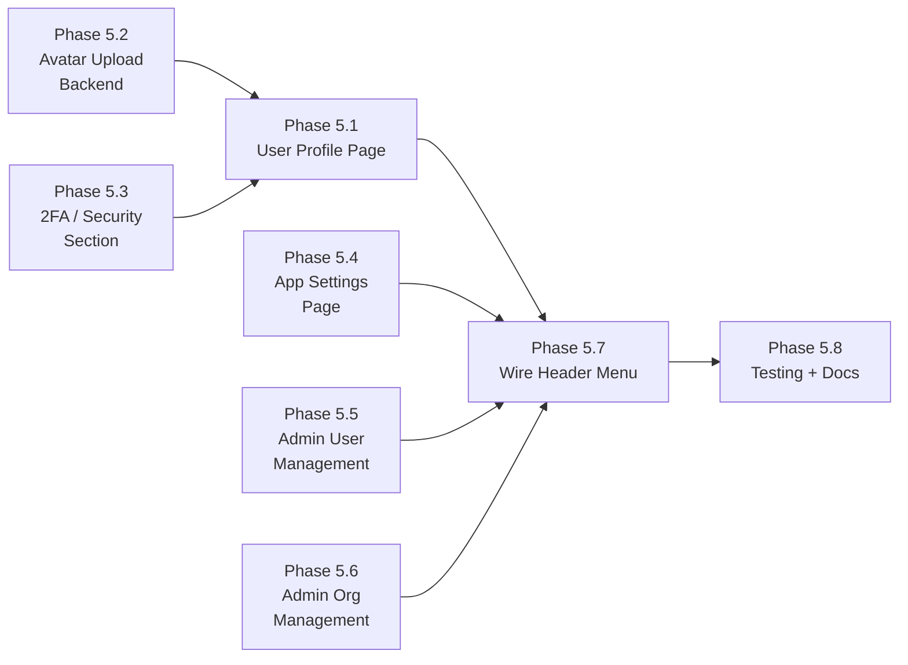

# Phase 5 Implementation Roadmap

## Overview

Phase 5 delivers **User Profile**, **System Admin**, and **App Settings** features. Currently the header dropdown contains "Profile" and "Settings" links that are no-ops. This phase wires them up and builds the full pages behind them, along with a system admin dashboard for user and organization management.

Key capabilities:
- **User Profile:** View and edit display name, upload avatar via S3, link to Keycloak for 2FA/account security
- **Avatar Upload:** Dedicated S3 presigned-URL flow for user profile pictures
- **App Settings:** Language persistence (server-side via user preferences), dark mode toggle, notification preferences
- **System Admin Dashboard:** User management (list, search, activate/deactivate, grant/revoke admin), organization management (list all orgs, manage members)
- **Two-Factor Authentication:** Redirect to Keycloak account console for 2FA setup (Keycloak owns auth; we surface the link and show enrollment status where possible)

Phase 5 builds on the completed Phases 1–4.

### Dependency Graph

### Parallelization

- **5.2** (Avatar Upload Backend) and **5.3** (2FA Section) can be built in parallel
- **5.1** (Profile Page) depends on 5.2 and 5.3 being available
- **5.4** (App Settings), **5.5** (Admin Users), **5.6** (Admin Orgs) are independent of each other
- **5.7** (Wire Header) depends on all pages existing
- **5.8** (Testing) is last

---

## Phase 5.1: User Profile Page

### Description
Create a dedicated profile page at `/profile` where users can view their account information and edit their display name and avatar.

### Tasks
- [ ] Create `frontend/src/views/profile/UserProfileView.vue`
- [ ] Display read-only fields: email, OIDC subject, member since, last login
- [ ] Editable fields: display name (inline edit with save)
- [ ] Avatar section: current avatar display, upload button (uses 5.2), remove avatar
- [ ] Security section: 2FA status badge, link to Keycloak account console (uses 5.3)
- [ ] Active sessions info (if available from Keycloak)
- [ ] Org and project membership summary cards
- [ ] Add route `/profile` to router
- [ ] Add i18n keys for EN and ES

### Files to Create/Modify
- `frontend/src/views/profile/UserProfileView.vue` (new)
- `frontend/src/router/index.ts` (add route)
- `frontend/src/i18n/locales/en.json` (add `profile` section)
- `frontend/src/i18n/locales/es.json` (add `profile` section)

### Acceptance Criteria
- [ ] User can view all their account information
- [ ] User can edit display name with immediate save
- [ ] User can upload, change, and remove avatar
- [ ] Security section shows 2FA status and links to Keycloak
- [ ] Page is responsive and styled consistently

---

## Phase 5.2: Avatar Upload Backend

### Description
Add a dedicated endpoint for uploading user profile avatars via S3 presigned URLs, similar to the existing attachment upload pattern.

### Tasks
- [ ] Add `POST /api/v1/users/me/avatar` endpoint — generates presigned PUT URL for S3
- [ ] Add `DELETE /api/v1/users/me/avatar` endpoint — removes avatar from S3 and clears `avatar_url`
- [ ] S3 key pattern: `users/{user_id}/avatar/{filename}`
- [ ] On successful upload confirmation, update `user.avatar_url` with the S3 object URL
- [ ] Add `POST /api/v1/users/me/avatar/confirm` endpoint to finalize (set the URL after client upload)
- [ ] Add frontend API functions in `frontend/src/api/users.ts`
- [ ] Add avatar upload component `AvatarUpload.vue`

### Files to Create/Modify
- `backend/app/api/v1/endpoints/users.py` (add avatar endpoints)
- `backend/app/services/storage_service.py` (add user avatar key generation)
- `frontend/src/api/users.ts` (add avatar API functions)
- `frontend/src/components/profile/AvatarUpload.vue` (new)

### Acceptance Criteria
- [ ] Presigned URL is generated for the authenticated user only
- [ ] Avatar URL is stored on the user record after upload confirmation
- [ ] Deleting avatar clears the URL and removes the S3 object
- [ ] Frontend component shows upload progress and preview
- [ ] Only image MIME types (jpeg, png, gif, webp) are accepted

---

## Phase 5.3: Two-Factor Authentication / Security Section

### Description
Since authentication is handled by Keycloak, 2FA setup happens in the Keycloak account console. We surface a link to Keycloak's account management page and display 2FA enrollment status where possible.

### Tasks
- [ ] Add `GET /api/v1/auth/account-url` backend endpoint that returns the Keycloak account console URL (derived from `OIDC_ISSUER_URL`)
- [ ] Parse OIDC token claims for `acr` (Authentication Context Class Reference) to detect if 2FA was used in current session
- [ ] Add security section in profile page: 2FA status indicator, "Manage Security" button linking to Keycloak
- [ ] Show password change link (Keycloak account console)
- [ ] Show active sessions link (Keycloak account console)
- [ ] Add i18n keys for security section

### Files to Create/Modify
- `backend/app/api/v1/endpoints/auth.py` (add account-url endpoint)
- `frontend/src/views/profile/UserProfileView.vue` (security section)
- `frontend/src/i18n/locales/en.json` (security keys)
- `frontend/src/i18n/locales/es.json` (security keys)

### Acceptance Criteria
- [ ] "Manage Security" button opens Keycloak account console in new tab
- [ ] 2FA status badge shows based on available token claims
- [ ] Links work correctly with the configured Keycloak realm

---

## Phase 5.4: App Settings Page

### Description
Create an app settings page at `/settings` where users can configure their personal application preferences.

### Tasks
- [ ] Create `frontend/src/views/settings/AppSettingsView.vue`
- [ ] Language preference: dropdown (EN/ES), persisted to both `localStorage` and `user.preferences.locale` via `PATCH /users/me`
- [ ] Dark mode toggle: wire existing `useUiStore().toggleDarkMode()`, persist to `user.preferences.darkMode`
- [ ] Notification preferences: email notifications on/off, in-app notification sounds (persisted to `user.preferences`)
- [ ] Load preferences from `currentUser.preferences` on mount, save on change
- [ ] Remove language selector from header (move to settings page; keep a small icon-only toggle in header as shortcut)
- [ ] Add route `/settings` to router
- [ ] Add i18n keys

### Files to Create/Modify
- `frontend/src/views/settings/AppSettingsView.vue` (new)
- `frontend/src/router/index.ts` (add route)
- `frontend/src/layouts/AppLayout.vue` (simplify header language selector)
- `frontend/src/stores/ui.ts` (persist dark mode preference)
- `frontend/src/i18n/locales/en.json` (add `settings` section)
- `frontend/src/i18n/locales/es.json` (add `settings` section)

### Acceptance Criteria
- [ ] Language changes apply immediately and persist across sessions (server + local)
- [ ] Dark mode toggle works and persists
- [ ] Notification preferences save to backend
- [ ] Settings load correctly on page mount from user preferences
- [ ] Page is cleanly organized with section cards

---

## Phase 5.5: System Admin — User Management

### Description
Create an admin dashboard for system administrators to manage users across the platform.

### Tasks
- [ ] Create `frontend/src/views/admin/AdminUsersView.vue`
- [ ] User list with DataTable: display name, email, avatar, system admin badge, active status, last login, member since
- [ ] Search/filter users by name or email
- [ ] Inline actions: activate/deactivate user, grant/revoke system admin
- [ ] User detail drawer/dialog: view full profile, org/project memberships, edit admin fields
- [ ] Confirmation dialogs for destructive actions (deactivate, revoke admin)
- [ ] Guard route with `isSystemAdmin` check
- [ ] Add route `/admin/users` to router
- [ ] Add i18n keys for admin section

### Files to Create/Modify
- `frontend/src/views/admin/AdminUsersView.vue` (new)
- `frontend/src/router/index.ts` (add admin routes with guard)
- `frontend/src/i18n/locales/en.json` (add `admin` section)
- `frontend/src/i18n/locales/es.json` (add `admin` section)

### Acceptance Criteria
- [ ] Only system admins can access the page (403 redirect for non-admins)
- [ ] User list loads with pagination and search
- [ ] Admin can activate/deactivate users
- [ ] Admin can grant/revoke system admin role
- [ ] All actions show confirmation and success/error toasts
- [ ] Non-admin users never see admin navigation

---

## Phase 5.6: System Admin — Organization Management

### Description
Add an admin view for managing all organizations on the platform.

### Tasks
- [ ] Create `frontend/src/views/admin/AdminOrgsView.vue`
- [ ] Organization list with DataTable: name, slug, member count, project count, created date
- [ ] Create organization dialog (currently only backend endpoint exists)
- [ ] Org detail drawer: member list, add/remove members, change member roles
- [ ] Search/filter organizations
- [ ] Guard route with `isSystemAdmin` check
- [ ] Add route `/admin/organizations` to router

### Files to Create/Modify
- `frontend/src/views/admin/AdminOrgsView.vue` (new)
- `frontend/src/router/index.ts` (add route)
- `frontend/src/api/organizations.ts` (add any missing admin API functions)
- `frontend/src/i18n/locales/en.json` (admin org keys)
- `frontend/src/i18n/locales/es.json` (admin org keys)

### Acceptance Criteria
- [ ] Only system admins can access the page
- [ ] Full CRUD for organizations from the admin panel
- [ ] Member management within each org (add, remove, change role)
- [ ] Search and pagination work correctly

---

## Phase 5.7: Wire Header Menu + Admin Nav

### Description
Connect the existing Profile and Settings menu items in the header to the new routes, and add admin navigation for system administrators.

### Tasks
- [ ] Wire "Profile" menu item → `/profile`
- [ ] Wire "Settings" menu item → `/settings`
- [ ] Add "Admin" menu item (visible only to system admins) → `/admin/users`
- [ ] Add admin sub-navigation component (Users | Organizations tabs)
- [ ] Add sidebar or top-level "Admin" link in main navigation for system admins
- [ ] Ensure active states are correct for all new routes

### Files to Create/Modify
- `frontend/src/layouts/AppLayout.vue` (wire menu commands, add admin link)
- `frontend/src/components/common/AdminSubNav.vue` (new — tabs for admin pages)
- `frontend/src/router/index.ts` (add navigation guard for admin routes)

### Acceptance Criteria
- [ ] Profile link navigates to `/profile`
- [ ] Settings link navigates to `/settings`
- [ ] Admin link appears only for system admins
- [ ] Admin pages have sub-navigation between Users and Organizations
- [ ] All header menu items work correctly

---

## Phase 5.8: Testing + Documentation

### Tasks
- [ ] Backend tests: avatar upload/delete, account-url endpoint, user preferences update
- [ ] Backend tests: admin user management (list, activate/deactivate, grant/revoke)
- [ ] Frontend: verify all new routes load and render
- [ ] Verify admin route guards block non-admins
- [ ] Update Phase 5 documentation with COMPLETED status
- [ ] Run full test suite to ensure no regressions

### Files to Create/Modify
- `backend/tests/api/v1/test_user_profile.py` (new)
- `backend/tests/api/v1/test_admin.py` (new or extend existing)
- `docs/phase_5/PHASES.md` (update statuses)

### Acceptance Criteria
- [ ] All new endpoints have test coverage
- [ ] Admin RBAC is verified in tests
- [ ] Full test suite passes (no regressions)

---

## Effort & Status

| Phase | Name | Est. Effort | Dependencies | Status |
|-------|------|-------------|-------------|--------|
| 5.1 | User Profile Page | Medium | 5.2, 5.3 | COMPLETED |
| 5.2 | Avatar Upload Backend | Small | None | COMPLETED |
| 5.3 | 2FA / Security Section | Small | None | COMPLETED |
| 5.4 | App Settings Page | Medium | None | COMPLETED |
| 5.5 | Admin User Management | Medium | None | COMPLETED |
| 5.6 | Admin Org Management | Medium | None | COMPLETED |
| 5.7 | Wire Header Menu + Admin Nav | Small | 5.1, 5.4, 5.5, 5.6 | COMPLETED |
| 5.8 | Testing + Documentation | Medium | All prior phases | COMPLETED |
| 5.9 | Full Dark Mode Support | Medium | 5.4 | COMPLETED |

---

## Phase 5.9: Full Dark Mode Support

### Description
Add comprehensive dark mode support across all application components by defining a proper dark color scheme in the PrimeVue preset, centralizing shadow/overlay CSS variables, and removing all hardcoded colors from component styles.

### Changes Made
- Added `colorScheme.dark.surface` to PrimeVue preset using `zinc` palette (dark grays)
- Created centralized CSS custom properties in `main.css`: `--shadow-color`, `--shadow-md`, `--shadow-lg`, `--overlay-bg`, `--diff-add-bg`, `--diff-add-color`, `--diff-remove-bg`, `--diff-remove-color`
- `.dark-mode` class overrides increase shadow opacity and adjust diff/overlay colors
- Replaced all hardcoded `rgba(0,0,0,...)` shadows in 7+ components with `var(--shadow-color)`
- Replaced hardcoded diff colors in KBVersionHistory with CSS variables
- Updated auth store to apply user preferences (dark mode, locale) on login
- Added smooth color transition on `html` element for pleasant mode switching
- Dark mode persists to `localStorage` and syncs with server-side `user.preferences`

### Files Modified
- `frontend/src/main.ts` (dark color scheme in preset)
- `frontend/src/assets/styles/main.css` (CSS variables, dark mode overrides)
- `frontend/src/stores/auth.ts` (apply preferences on login)
- `frontend/src/stores/ui.ts` (persist dark mode, `setDarkMode()`)
- `frontend/src/layouts/AppLayout.vue` (use `--shadow-md`)
- `frontend/src/views/settings/AppSettingsView.vue` (use `setDarkMode`)
- `frontend/src/components/profile/AvatarUpload.vue` (use `--overlay-bg`)
- `frontend/src/components/common/AdminSubNav.vue` (use `--shadow-md`)
- `frontend/src/components/common/WsStatusIndicator.vue` (use theme tokens)
- `frontend/src/components/kb/KBVersionHistory.vue` (use diff CSS vars)
- `frontend/src/components/kb/KBTemplatePicker.vue` (use `--shadow-color`)
- `frontend/src/views/kb/KBSpaceListView.vue` (use `--shadow-color`)
- `frontend/src/views/boards/BoardView.vue` (use `--shadow-color`)
- `frontend/src/components/workflows/WorkflowEditor.vue` (use `--shadow-color`)

### Notes on Two-Factor Authentication

Since Keycloak handles all authentication, 2FA is configured at the Keycloak realm level:
- **OTP (TOTP/HOTP):** Keycloak natively supports Google Authenticator, FreeOTP, etc.
- **WebAuthn:** Keycloak supports FIDO2/WebAuthn security keys
- **Our role:** Surface the Keycloak account management URL so users can enroll in 2FA from within our app. We show enrollment status based on OIDC token claims (`acr`, `amr`) when available.
- **Future:** If deeper integration is needed (e.g., requiring 2FA for specific actions), Keycloak's conditional authentication flows can enforce this at the IdP level.

### Notes on Existing Infrastructure

| Component | Current State | Phase 5 Usage |
|-----------|--------------|---------------|
| `User.preferences` (JSONB) | Exists but unused | Store locale, darkMode, notification prefs |
| `User.avatar_url` | Set from OIDC `picture` claim | Also settable via S3 upload |
| `useUiStore.darkMode` | Store exists, not wired | Wire to settings page + preferences |
| Header menu items | Profile/Settings are no-ops | Wire to new routes |
| `UserUpdate` schema | Allows display_name, avatar_url, preferences | Used by profile + settings |
| `UserAdminUpdate` schema | Allows is_active, is_system_admin | Used by admin user management |
| Admin endpoints | `GET/PATCH /users/{id}` exist | Frontend admin pages consume them |
| Org endpoints | Full CRUD exists | Admin org page consumes them |
