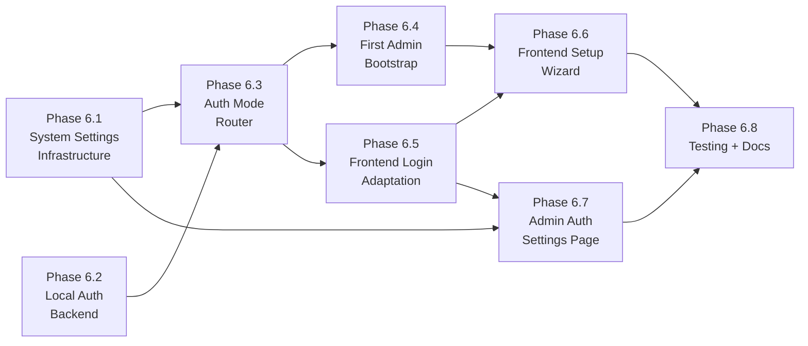

# Phase 6 Implementation Roadmap

## Overview

Phase 6 delivers **Authentication Configuration** — a dual-mode auth system supporting both **local credentials** and **OIDC (Keycloak)**, configurable through admin UI and environment variables. It also includes a **first-run setup wizard** for bootstrapping the initial system administrator and **JIT provisioning controls** for OIDC users.

Key capabilities:
- **Local Auth:** Username/password authentication with bcrypt hashing and self-issued HS256 JWTs as a standalone mode (no OIDC dependency required)
- **OIDC Auth:** Existing Keycloak/OIDC flow with new admin-configurable provisioning controls (auto-provision toggle, email domain whitelist, default org assignment)
- **Auth Mode Switching:** Single `auth_mode` setting (`local` or `oidc`) determines login experience; frontend adapts automatically
- **System Settings:** New key-value `system_settings` table for runtime configuration, merged with env var defaults
- **Setup Wizard:** First-run experience when no system admin exists — creates the initial admin account
- **Admin Auth UI:** System admin page to configure auth mode, OIDC connection, and provisioning policies
- **Env Var Bootstrap:** `INITIAL_ADMIN_EMAIL` env var auto-promotes matching users to system admin

Phase 6 builds on the completed Phases 1–5.

### Dependency Graph

### Parallelization

- **6.1** (System Settings) and **6.2** (Local Auth Backend) can be built in parallel
- **6.3** (Auth Mode Router) depends on both 6.1 and 6.2
- **6.4** (First Admin Bootstrap) and **6.5** (Frontend Login) depend on 6.3
- **6.6** (Setup Wizard) depends on 6.4 and 6.5
- **6.7** (Admin Auth Settings) depends on 6.1 and 6.5
- **6.8** (Testing) is last

---

## Phase 6.1: System Settings Infrastructure

### Description
Create a key-value `system_settings` database table and service layer that merges runtime DB values with environment variable defaults. This provides a foundation for admin-configurable settings with env var safety overrides.

### Tasks
- [ ] Create `backend/app/models/system_setting.py` with `SystemSetting` model (key, value JSONB, updated_by, updated_at)
- [ ] Create Alembic migration for `system_settings` table
- [ ] Create `backend/app/services/system_settings_service.py` with CRUD operations and env var merge logic
- [ ] Create `backend/app/api/v1/endpoints/system_settings.py` with admin-only endpoints
- [ ] Register router in main app
- [ ] Implement `get_effective_auth_settings()` that returns merged config with source annotations

### Settings Keys

| Key | Type | Env Var | Default | Description |
|-----|------|---------|---------|-------------|
| `auth_mode` | `"local" \| "oidc"` | `AUTH_MODE` | `"local"` | Primary auth method |
| `local_registration_enabled` | bool | `LOCAL_REGISTRATION_ENABLED` | `false` | Allow self-registration in local mode |
| `oidc_issuer_url` | string | `OIDC_ISSUER_URL` | — | OIDC discovery URL |
| `oidc_client_id` | string | `OIDC_CLIENT_ID` | — | OIDC client ID |
| `oidc_client_secret` | string | `OIDC_CLIENT_SECRET` | — | OIDC client secret (encrypted in DB) |
| `oidc_auto_provision` | bool | `OIDC_AUTO_PROVISION` | `true` | Auto-create users on first OIDC login |
| `oidc_allowed_domains` | string[] | `OIDC_ALLOWED_DOMAINS` | `[]` | Restrict provisioning to email domains |
| `oidc_default_org_id` | UUID? | `OIDC_DEFAULT_ORG_ID` | `null` | Auto-assign new OIDC users to this org |
| `oidc_admin_claim` | string | `OIDC_ADMIN_CLAIM` | `"projecthub-admin"` | Realm role granting system admin |

### Priority Rule
If an env var is explicitly set (non-empty), it takes precedence over the DB value. This prevents lockout — you can always override `AUTH_MODE=local` via env var and restart.

### Files to Create/Modify
- `backend/app/models/system_setting.py` (new)
- `backend/app/services/system_settings_service.py` (new)
- `backend/app/api/v1/endpoints/system_settings.py` (new)
- `backend/alembic/versions/xxxx_add_system_settings.py` (new migration)
- `backend/app/core/config.py` (add new env var fields)
- `backend/app/main.py` (register router)

### Acceptance Criteria
- [ ] System settings table exists with proper schema
- [ ] Service correctly merges env vars with DB values (env wins when set)
- [ ] Admin-only GET/PUT endpoints work for auth settings
- [ ] Response includes `source` field per setting ("env" vs "database")
- [ ] Non-admin users receive 403

---

## Phase 6.2: Local Auth Backend

### Description
Implement password-based authentication with bcrypt hashing and self-issued HS256 JWTs as an alternative to OIDC.

### Tasks
- [ ] Add `password_hash` nullable column to `users` table via migration
- [ ] Create `backend/app/core/password.py` with bcrypt hash/verify using `passlib`
- [ ] Create `backend/app/core/local_jwt.py` for HS256 JWT creation/validation (issuer: `"projecthub"`)
- [ ] Add `POST /auth/login` endpoint — validates email/password, returns JWT
- [ ] Add `POST /auth/register` endpoint — creates user with password (only when registration enabled)
- [ ] Add `POST /auth/change-password` endpoint — authenticated password change
- [ ] Add `passlib[bcrypt]` to `requirements.txt`
- [ ] Password validation rules: min 8 chars, at least one uppercase, one lowercase, one digit

### Files to Create/Modify
- `backend/app/models/user.py` (add `password_hash` field)
- `backend/app/core/password.py` (new)
- `backend/app/core/local_jwt.py` (new)
- `backend/app/api/v1/endpoints/auth.py` (add login/register/change-password)
- `backend/alembic/versions/xxxx_add_password_hash.py` (new migration)
- `backend/requirements.txt` (add `passlib[bcrypt]`)

### Acceptance Criteria
- [ ] Passwords are hashed with bcrypt, never stored in plaintext
- [ ] Login endpoint returns a valid JWT with `iss: "projecthub"`
- [ ] Registration is gated by `local_registration_enabled` setting
- [ ] Password change requires current password verification
- [ ] Invalid credentials return 401 with generic message (no user enumeration)
- [ ] JWT tokens expire after configurable duration (default 60 min)

---

## Phase 6.3: Auth Mode Router

### Description
Modify `get_current_user` to transparently handle both local JWTs and OIDC JWTs based on token issuer. Add a public config endpoint so the frontend knows which login method to render.

### Tasks
- [ ] Modify `backend/app/api/deps.py` to inspect token `iss` claim and route validation
- [ ] Local tokens (`iss == "projecthub"`): validate with `decode_local_token()`
- [ ] OIDC tokens (external issuer): validate with existing `validate_token()` + `get_or_create_user()`
- [ ] Add `GET /auth/config` public endpoint (no auth required) returning `{auth_mode, needs_setup, local_registration_enabled, oidc_issuer_url, oidc_client_id}`
- [ ] Modify `get_or_create_user()` to respect JIT provisioning settings (auto-provision, domain whitelist, default org)

### Files to Create/Modify
- `backend/app/api/deps.py` (modify `get_current_user`)
- `backend/app/api/v1/endpoints/auth.py` (add `/auth/config` endpoint)
- `backend/app/services/user_service.py` (modify `get_or_create_user` for provisioning controls)

### Acceptance Criteria
- [ ] Both local and OIDC tokens are accepted by `get_current_user`
- [ ] Token type is discriminated by `iss` claim (no ambiguity)
- [ ] `/auth/config` is accessible without authentication
- [ ] JIT provisioning respects `oidc_auto_provision` and `oidc_allowed_domains` settings
- [ ] Domain whitelist enforced on OIDC user creation (empty = allow all)
- [ ] New OIDC users auto-added to default org when configured

---

## Phase 6.4: First Admin Bootstrap & Setup Wizard Backend

### Description
Ensure the first system administrator can always be created, either via env var or a one-time setup endpoint.

### Tasks
- [ ] Add `INITIAL_ADMIN_EMAIL` to `Settings` in `config.py`
- [ ] Create `backend/app/api/v1/endpoints/setup.py` with setup endpoints
- [ ] `GET /setup/status` (public, no auth) — returns `{needs_setup, auth_mode}`
- [ ] `POST /setup/initialize` (public, no auth, one-time) — creates first admin user with password, returns JWT
- [ ] In `get_or_create_user()`, auto-promote user to system admin if email matches `INITIAL_ADMIN_EMAIL`
- [ ] `POST /setup/initialize` returns 409 if any system admin already exists
- [ ] Register setup router in main app

### Files to Create/Modify
- `backend/app/core/config.py` (add `INITIAL_ADMIN_EMAIL`)
- `backend/app/api/v1/endpoints/setup.py` (new)
- `backend/app/services/user_service.py` (auto-promote logic for `INITIAL_ADMIN_EMAIL`)
- `backend/app/main.py` (register setup router)

### Acceptance Criteria
- [ ] `GET /setup/status` returns `needs_setup: true` when no system admin exists and no `INITIAL_ADMIN_EMAIL` is set
- [ ] `POST /setup/initialize` creates admin and returns access token (only works once)
- [ ] Subsequent calls to `/setup/initialize` return 409 Conflict
- [ ] `INITIAL_ADMIN_EMAIL` auto-promotes matching user on first OIDC or local login
- [ ] Setup endpoints require no authentication

---

## Phase 6.5: Frontend — Auth Config Detection & Adaptive Login

### Description
The frontend fetches auth configuration on load and renders the appropriate login experience — local login form or OIDC redirect.

### Tasks
- [ ] Create `frontend/src/api/authConfig.ts` for `GET /auth/config` (no auth header)
- [ ] Modify `frontend/src/stores/auth.ts` to fetch and expose `authConfig` (auth_mode, needs_setup, etc.)
- [ ] Modify `frontend/src/composables/useAuth.ts` — make OIDC skip dynamic based on auth_mode (not just env vars)
- [ ] Modify `frontend/src/views/auth/LoginView.vue` — adaptive login:
  - `auth_mode === "local"`: email + password form, optional "Create Account" link
  - `auth_mode === "oidc"`: SSO redirect button (existing behavior)
- [ ] Modify `frontend/src/router/guards.ts` — redirect to `/setup` when `needs_setup` is true
- [ ] Modify `frontend/src/api/client.ts` — support local JWT in sessionStorage for Bearer header
- [ ] Add i18n keys for login form fields, registration, and error messages (en + es)

### Files to Create/Modify
- `frontend/src/api/authConfig.ts` (new)
- `frontend/src/stores/auth.ts` (modify)
- `frontend/src/composables/useAuth.ts` (modify)
- `frontend/src/views/auth/LoginView.vue` (modify)
- `frontend/src/router/guards.ts` (modify)
- `frontend/src/api/client.ts` (modify)
- `frontend/src/i18n/locales/en.json` (add keys)
- `frontend/src/i18n/locales/es.json` (add keys)

### Acceptance Criteria
- [ ] Frontend correctly detects auth mode from backend config
- [ ] Local mode shows email/password form with validation
- [ ] OIDC mode shows SSO button (no local form visible)
- [ ] Registration link only visible when `local_registration_enabled` is true
- [ ] Login errors show user-friendly messages via toast
- [ ] Session tokens are stored and sent correctly for both auth modes

---

## Phase 6.6: Frontend — Setup Wizard

### Description
A clean first-run experience when no system admin exists, guiding the user through creating the initial administrator account.

### Tasks
- [ ] Create `frontend/src/views/setup/SetupWizardView.vue` with multi-step form:
  - Step 1: Welcome + explanation
  - Step 2: Admin account creation (email, password, confirm password, display name)
  - Step 3: Success — auto-login with returned token
- [ ] Add `/setup` route under `AuthLayout`
- [ ] Auto-redirect to `/setup` when `needs_setup` is true (via router guard)
- [ ] Auto-redirect away from `/setup` when setup is not needed
- [ ] Add i18n keys for setup wizard (en + es)

### Files to Create/Modify
- `frontend/src/views/setup/SetupWizardView.vue` (new)
- `frontend/src/router/index.ts` (add route)
- `frontend/src/i18n/locales/en.json` (add `setup` section)
- `frontend/src/i18n/locales/es.json` (add `setup` section)

### Acceptance Criteria
- [ ] Setup wizard only accessible when no system admin exists
- [ ] Form validates password requirements (8+ chars, upper, lower, digit)
- [ ] Successful setup auto-logs in and redirects to dashboard
- [ ] Wizard is styled consistently with AuthLayout
- [ ] Navigating to `/setup` when setup is complete redirects to login

---

## Phase 6.7: Frontend — Admin Auth Settings Page

### Description
A system admin page to configure authentication mode, OIDC connection details, and JIT provisioning policies.

### Tasks
- [ ] Create `frontend/src/views/admin/AdminAuthView.vue` with sections:
  - Auth Mode toggle (Local vs OIDC) with env var lock indicator
  - Local Auth settings (registration toggle) — visible when auth_mode is "local"
  - OIDC settings (issuer URL, client ID, client secret, test connection) — visible when auth_mode is "oidc"
  - JIT Provisioning (auto-provision toggle, domain whitelist, default org) — visible when auth_mode is "oidc"
  - Status indicators showing value source (env var vs database)
- [ ] Add `admin/auth` route to router
- [ ] Add "Authentication" link to `AdminSubNav.vue`
- [ ] Add i18n keys for auth settings (en + es)

### Files to Create/Modify
- `frontend/src/views/admin/AdminAuthView.vue` (new)
- `frontend/src/components/common/AdminSubNav.vue` (add auth link)
- `frontend/src/router/index.ts` (add route)
- `frontend/src/i18n/locales/en.json` (add `admin.auth` section)
- `frontend/src/i18n/locales/es.json` (add `admin.auth` section)

### Acceptance Criteria
- [ ] Only system admins can access the page
- [ ] Auth mode toggle shows current effective value and source
- [ ] Env-var-locked fields show lock icon and "Set by environment variable" badge
- [ ] OIDC "Test Connection" verifies discovery endpoint accessibility
- [ ] Domain whitelist uses tag input for adding/removing domains
- [ ] Saving settings shows success toast and updates effective config
- [ ] Switching auth mode shows confirmation warning

---

## Phase 6.8: Testing & Documentation

### Tasks
- [ ] Backend tests: local login (valid/invalid credentials, inactive user)
- [ ] Backend tests: registration (enabled/disabled, duplicate email, password validation)
- [ ] Backend tests: password change (valid/invalid current password)
- [ ] Backend tests: setup wizard (`GET /setup/status`, `POST /setup/initialize`, idempotency)
- [ ] Backend tests: auth mode router (local JWT accepted, OIDC JWT accepted)
- [ ] Backend tests: JIT provisioning controls (auto-provision off, domain whitelist)
- [ ] Backend tests: system settings CRUD (admin only, env var precedence)
- [ ] Frontend: add i18n keys for all new strings (en + es)
- [ ] Verify all new routes load and render
- [ ] Run full test suite — no regressions
- [ ] Update Phase 6 documentation statuses

### Files to Create/Modify
- `backend/tests/api/v1/test_auth_local.py` (new)
- `backend/tests/api/v1/test_setup.py` (new)
- `backend/tests/api/v1/test_system_settings.py` (new)
- `docs/phase_6/PHASES.md` (update statuses)

### Acceptance Criteria
- [ ] All new endpoints have test coverage
- [ ] Auth mode switching is verified in tests
- [ ] Setup wizard one-time semantics verified
- [ ] Full test suite passes with no regressions

---

## Effort & Status

| Phase | Name | Est. Effort | Dependencies | Status |
|-------|------|-------------|-------------|--------|
| 6.1 | System Settings Infrastructure | Medium | None | COMPLETED |
| 6.2 | Local Auth Backend | Medium | None | COMPLETED |
| 6.3 | Auth Mode Router | Medium | 6.1, 6.2 | COMPLETED |
| 6.4 | First Admin Bootstrap | Small | 6.3 | COMPLETED |
| 6.5 | Frontend Login Adaptation | Medium | 6.3 | COMPLETED |
| 6.6 | Frontend Setup Wizard | Small | 6.4, 6.5 | COMPLETED |
| 6.7 | Admin Auth Settings Page | Medium | 6.1, 6.5 | COMPLETED |
| 6.8 | Testing + Documentation | Medium | All prior phases | COMPLETED |
