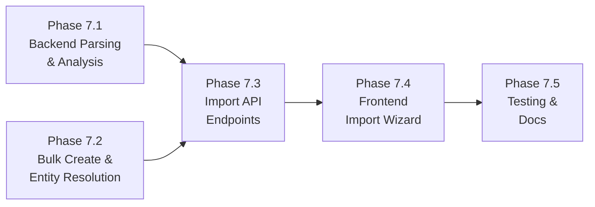

# Phase 7 Implementation Roadmap

## Overview

Phase 7 delivers **Ticket Import (CSV / JSON)** — a feature that allows users to import tickets from external tools (primarily Jira) via CSV or JSON file upload or raw text paste. The system auto-detects column mappings, lets users review and adjust them, then bulk-creates tickets with resolved labels, sprints, statuses, and parent-child relationships.

Key capabilities:
- **CSV & JSON Parsing:** Robust parsing that handles multiline quoted fields, duplicate column headers (e.g. multiple "Labels" columns merged), and various date formats
- **Auto-Mapping:** Intelligent column detection using a known-name dictionary for Jira and common project management tools
- **Value Mapping:** Configurable mapping of source values to platform values (e.g. Jira "Sub-task" → our "subtask", Jira statuses → workflow statuses)
- **Entity Resolution:** Find-or-create for labels; match sprints and users by name; resolve parent-child ticket relationships by external key
- **Bulk Creation:** Efficient batch ticket insertion with pre-allocated ticket numbers
- **Import Wizard UI:** Multi-step frontend wizard: upload → column mapping → value mapping → preview → execute with results summary

Phase 7 builds on the completed Phases 1–6.

### Dependency Graph

### Parallelization

- **7.1** (Backend Parsing) and **7.2** (Bulk Create & Entity Resolution) can be built in parallel
- **7.3** (Import API Endpoints) depends on both 7.1 and 7.2
- **7.4** (Frontend Import Wizard) depends on 7.3
- **7.5** (Testing) is last

---

## Phase 7.1: Backend Parsing & Analysis

### Description
Create the import service with CSV/JSON parsing, auto-column-mapping via a known-name dictionary, and Redis-based session caching for parsed data between the analyze and execute steps.

### Tasks
- [ ] Create `backend/app/services/import_service.py` with CSV parsing (Python `csv.DictReader` with multiline support)
- [ ] Handle duplicate column headers by merging values into lists (e.g. multiple "Labels" columns)
- [ ] Add JSON parsing (expects array of objects)
- [ ] Implement auto-mapping algorithm with known Jira field name dictionary
- [ ] Extract unique values per mapped column for the value-mapping step
- [ ] Cache parsed rows in Redis with 30-minute TTL under key `import:{session_id}`
- [ ] Basic Jira wiki markup → Markdown conversion for descriptions

---

## Phase 7.2: Bulk Create & Entity Resolution

### Description
Add bulk ticket creation capability and helper functions for resolving external references (users, labels, sprints, statuses, parent tickets) during import.

### Tasks
- [ ] Add `bulk_create_tickets()` to `ticket_service.py` — batch ticket number allocation, single initial status lookup, batch insert
- [ ] Implement `find_or_create_labels()` — query existing labels by name, create missing ones, return `{name: label_id}` map
- [ ] Implement `resolve_users()` — query users by display_name, return matched and unmatched sets
- [ ] Implement `resolve_statuses()` — match source status names to workflow statuses by case-insensitive name
- [ ] Implement `resolve_parent_tickets()` — update `parent_ticket_id` based on external key mapping after all tickets created
- [ ] Store external key and import metadata in `custom_field_values` JSONB column

---

## Phase 7.3: Import API Endpoints

### Description
Create the REST API endpoints for the two-step import flow (analyze then execute).

### Tasks
- [ ] Create `backend/app/schemas/import_tickets.py` with request/response models
- [ ] Create `backend/app/api/v1/endpoints/import_tickets.py` with two endpoints:
  - `POST /projects/{project_id}/import/analyze` — parse content, return columns/mappings/samples
  - `POST /projects/{project_id}/import/execute` — apply mappings, create tickets, return results
- [ ] Register import router in `backend/app/api/v1/router.py`
- [ ] Require MAINTAINER project role for both endpoints
- [ ] Enforce 10 MB max on content field

---

## Phase 7.4: Frontend Import Wizard

### Description
Build the multi-step import wizard UI with file upload, column mapping, value mapping, preview, and execution steps.

### Tasks
- [ ] Create `frontend/src/api/importTickets.ts` API client
- [ ] Create `frontend/src/views/tickets/ImportTicketsView.vue` wizard component with 5 steps:
  1. Upload (file input + raw text paste)
  2. Column Mapping (auto-filled dropdowns)
  3. Value Mapping (type, priority, status value mapping)
  4. Preview (first 10 transformed tickets)
  5. Execute & Results (progress + summary)
- [ ] Add route `/projects/:projectId/import` in router
- [ ] Add "Import" button to TicketListView header
- [ ] Add i18n keys for en.json and es.json

---

## Phase 7.5: Testing & Documentation

### Description
End-to-end testing with the real Jira export and documentation.

### Tasks
- [ ] Test with `docs/jira_export/Jira Export.csv` (~929 tickets)
- [ ] Verify multiline description parsing
- [ ] Verify duplicate column merging (Labels, Sprint)
- [ ] Verify parent-child ticket resolution
- [ ] Verify Jira wiki markup → Markdown conversion
- [ ] Verify user matching and unmatched metadata storage
- [ ] Complete Phase 7 documentation (API_DESIGN.md, ARCHITECTURE.md, DATA_MODEL.md)
