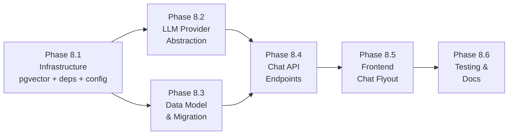

# Phase 8 Implementation Roadmap

## Overview

Phase 8 delivers the **AI Agent Foundation** — a multi-provider LLM abstraction layer, pgvector-backed embedding storage, and an interactive chat flyout UI with Server-Sent Events (SSE) streaming. This phase establishes the core AI infrastructure that Phase 9 will extend with tool use and agentic capabilities.

Key capabilities:
- **Multi-Provider LLM Abstraction:** Direct SDK integration with OpenAI, Azure OpenAI, Ollama (local and cloud), and Anthropic using the `openai` and `anthropic` Python packages
- **Unified Provider Interface:** Abstract base classes for chat completion (streaming and non-streaming) and embedding creation, with a factory pattern for provider selection
- **pgvector Embeddings:** PostgreSQL vector extension for storing and querying embeddings, with configurable dimensions and content-type indexing
- **Chat Persistence:** Conversation and message storage with per-user isolation and token usage tracking
- **SSE Streaming:** Server-Sent Events for real-time token-by-token LLM response delivery to the frontend
- **Chat Flyout UI:** A slide-in panel integrated into the main layout with conversation history, markdown rendering, and streaming display
- **Environment Configuration:** All provider settings configurable via environment variables with sensible defaults

Phase 8 builds on the completed Phases 1–7.

### Dependency Graph



### Parallelization

- **8.1** (Infrastructure) is the prerequisite for all other sub-phases
- **8.2** (LLM Provider Abstraction) and **8.3** (Data Model) can be built in parallel after 8.1
- **8.4** (Chat API) depends on both 8.2 and 8.3
- **8.5** (Frontend Chat Flyout) depends on 8.4
- **8.6** (Testing) is last

---

## Phase 8.1: Infrastructure Setup

### Description
Prepare the development environment for AI capabilities: switch the PostgreSQL Docker image to include pgvector, add Python SDK dependencies, and add LLM configuration settings.

### Tasks
- [ ] Change `postgres` service image in `docker-compose.yml` from `postgres:16-alpine` to `pgvector/pgvector:pg16`
- [ ] Add `openai` package to `backend/requirements.txt`
- [ ] Add `anthropic` package to `backend/requirements.txt`
- [ ] Add `pgvector` package to `backend/requirements.txt`
- [ ] Add LLM provider settings to `backend/app/core/config.py` (`LLM_PROVIDER`, `LLM_MODEL`, `LLM_API_KEY`, `LLM_BASE_URL`, `LLM_MAX_TOKENS`, `LLM_TEMPERATURE`)
- [ ] Add Azure-specific settings (`AZURE_OPENAI_ENDPOINT`, `AZURE_OPENAI_API_VERSION`, `AZURE_OPENAI_DEPLOYMENT`)
- [ ] Add embedding settings (`EMBEDDING_PROVIDER`, `EMBEDDING_MODEL`, `EMBEDDING_API_KEY`, `EMBEDDING_BASE_URL`, `EMBEDDING_DIMENSIONS`)
- [ ] Wire all new env vars through `docker-compose.yml` for the `api` and `celery-worker` services

### Configuration Settings

| Setting | Type | Default | Description |
|---------|------|---------|-------------|
| `LLM_PROVIDER` | string | `""` | Provider name: `"openai"`, `"azure_openai"`, `"ollama"`, `"anthropic"` |
| `LLM_MODEL` | string | `""` | Model identifier (e.g., `"kimi-k2.5"`, `"gpt-4o"`, `"claude-sonnet-4-20250514"`) |
| `LLM_API_KEY` | string | `""` | API key for the provider (not needed for local Ollama) |
| `LLM_BASE_URL` | string | `""` | Base URL override (required for Ollama, optional for OpenAI) |
| `LLM_MAX_TOKENS` | int | `4096` | Maximum tokens in LLM response |
| `LLM_TEMPERATURE` | float | `0.7` | Sampling temperature |
| `AZURE_OPENAI_ENDPOINT` | string | `""` | Azure OpenAI resource endpoint URL |
| `AZURE_OPENAI_API_VERSION` | string | `"2024-06-01"` | Azure OpenAI API version |
| `AZURE_OPENAI_DEPLOYMENT` | string | `""` | Azure OpenAI deployment name |
| `EMBEDDING_PROVIDER` | string | `""` | Embedding provider (defaults to `LLM_PROVIDER` if empty) |
| `EMBEDDING_MODEL` | string | `""` | Embedding model name |
| `EMBEDDING_API_KEY` | string | `""` | Embedding API key (defaults to `LLM_API_KEY` if empty) |
| `EMBEDDING_BASE_URL` | string | `""` | Embedding API base URL |
| `EMBEDDING_DIMENSIONS` | int | `1536` | Vector dimensions for embedding storage |

### Files to Create/Modify
- `docker-compose.yml` (modify — change postgres image, add env vars)
- `backend/requirements.txt` (modify — add `openai`, `anthropic`, `pgvector`)
- `backend/app/core/config.py` (modify — add LLM/embedding settings)

### Acceptance Criteria
- [ ] PostgreSQL container starts with pgvector extension available (`SELECT * FROM pg_available_extensions WHERE name = 'vector'` returns a row)
- [ ] Python packages install successfully in the API container
- [ ] Settings load from environment variables with correct defaults
- [ ] Existing services (API, frontend, Celery, etc.) continue to function after the Postgres image change

---

## Phase 8.2: LLM Provider Abstraction

### Description
Create the multi-provider LLM abstraction layer using raw SDKs. The `openai` package handles OpenAI, Azure OpenAI, and Ollama (all OpenAI-compatible). The `anthropic` package handles Anthropic. A factory function selects the correct provider based on configuration.

### Tasks
- [ ] Create `backend/app/services/llm/__init__.py` exporting public API (`get_llm_provider`, `get_embedding_provider`, `is_llm_configured`)
- [ ] Create `backend/app/services/llm/base.py` with `BaseLLMProvider` and `BaseEmbeddingProvider` abstract classes
- [ ] Create `backend/app/services/llm/openai_provider.py` with `OpenAIProvider` (standard OpenAI API)
- [ ] Create `backend/app/services/llm/ollama_provider.py` with `OllamaProvider` extending `OpenAIProvider` (sets `base_url`, no API key required for local)
- [ ] Create `backend/app/services/llm/azure_provider.py` with `AzureOpenAIProvider` (uses `AsyncAzureOpenAI` client)
- [ ] Create `backend/app/services/llm/anthropic_provider.py` with `AnthropicProvider` (converts message format, handles separate `system` parameter)
- [ ] Create `backend/app/services/llm/factory.py` with provider factory functions
- [ ] Implement streaming support in all providers via `async for` / `AsyncIterator[str]`
- [ ] Implement embedding support for OpenAI-compatible providers (`OpenAIEmbeddingProvider`)
- [ ] Handle provider-specific error mapping to a common exception hierarchy

### Provider Matrix

| Provider | SDK Client | Chat | Stream | Embeddings |
|----------|-----------|------|--------|------------|
| OpenAI | `AsyncOpenAI` | Yes | Yes | Yes |
| Ollama | `AsyncOpenAI(base_url=...)` | Yes | Yes | Yes |
| Azure OpenAI | `AsyncAzureOpenAI` | Yes | Yes | Yes |
| Anthropic | `AsyncAnthropic` | Yes | Yes | No (use separate embedding provider) |

### Files to Create
- `backend/app/services/llm/__init__.py`
- `backend/app/services/llm/base.py`
- `backend/app/services/llm/openai_provider.py`
- `backend/app/services/llm/ollama_provider.py`
- `backend/app/services/llm/azure_provider.py`
- `backend/app/services/llm/anthropic_provider.py`
- `backend/app/services/llm/factory.py`

### Acceptance Criteria
- [ ] Factory returns correct provider based on `LLM_PROVIDER` setting
- [ ] `is_llm_configured()` returns `False` when `LLM_PROVIDER` or `LLM_MODEL` is empty
- [ ] OpenAI provider completes chat and returns structured `ChatResponse`
- [ ] Ollama provider connects via custom `base_url` and streams tokens
- [ ] Azure provider uses `AsyncAzureOpenAI` with `azure_endpoint` and `api_version`
- [ ] Anthropic provider converts messages to Anthropic format (separate `system` param)
- [ ] All providers yield individual tokens via `chat_completion_stream()`
- [ ] Embedding provider returns vector lists with correct dimensions
- [ ] Provider errors are caught and raised as `LLMError` with descriptive messages
- [ ] Invalid provider name raises `LLMConfigError`

---

## Phase 8.3: Data Model & Migration

### Description
Create the database models for AI conversations, messages, and embeddings. Enable the pgvector extension and create all tables in a single Alembic migration.

### Tasks
- [ ] Create `backend/app/models/ai_conversation.py` with `AIConversation` model
- [ ] Create `backend/app/models/ai_message.py` with `AIMessage` model
- [ ] Create `backend/app/models/ai_embedding.py` with `AIEmbedding` model using pgvector `Vector` column
- [ ] Register new models in `backend/app/models/__init__.py`
- [ ] Create Alembic migration: enable `vector` extension + create `ai_conversations`, `ai_messages`, `ai_embeddings` tables
- [ ] Add composite index on `ai_embeddings(content_type, content_id)` for lookup queries

### Files to Create/Modify
- `backend/app/models/ai_conversation.py` (new)
- `backend/app/models/ai_message.py` (new)
- `backend/app/models/ai_embedding.py` (new)
- `backend/app/models/__init__.py` (modify — add imports)
- `backend/alembic/versions/xxxx_ai_tables_and_pgvector.py` (new migration)

### Acceptance Criteria
- [ ] Migration runs successfully: `alembic upgrade head` creates all three tables
- [ ] pgvector extension is enabled (`CREATE EXTENSION IF NOT EXISTS vector`)
- [ ] `ai_conversations` table has FK to `users`, indexes on `user_id`
- [ ] `ai_messages` table has FK to `ai_conversations` with `CASCADE` delete
- [ ] `ai_embeddings` table has `Vector` column with configurable dimensions
- [ ] Migration is reversible (`alembic downgrade` drops tables and extension)
- [ ] Existing tables and data are unaffected by the migration

---

## Phase 8.4: Chat API Endpoints

### Description
Create the REST API endpoints for AI chat with SSE streaming, conversation management, and an AI configuration status endpoint.

### Tasks
- [ ] Create `backend/app/schemas/ai.py` with Pydantic request/response models
- [ ] Create `backend/app/services/ai_service.py` with business logic for conversation management and message handling
- [ ] Create `backend/app/api/v1/endpoints/ai.py` with endpoints:
  - `POST /ai/chat` — SSE streaming chat (creates conversation if none specified)
  - `GET /ai/conversations` — list user's conversations (paginated)
  - `GET /ai/conversations/{id}` — get conversation with messages
  - `DELETE /ai/conversations/{id}` — delete conversation
  - `GET /ai/config` — public AI configuration status
- [ ] Register `ai` router in `backend/app/api/v1/router.py`
- [ ] Add `"ai"` tag to OpenAPI tags in `backend/app/main.py`
- [ ] Implement SSE streaming using `StreamingResponse(media_type="text/event-stream")`
- [ ] Auto-generate conversation title from first user message (simple truncation, or optional LLM call)
- [ ] Track token usage (prompt + completion tokens) per assistant message

### SSE Event Format

```
data: {"type": "conversation", "conversation_id": "uuid"}

data: {"type": "chunk", "content": "Hello"}
data: {"type": "chunk", "content": " there"}
data: {"type": "chunk", "content": "!"}

data: {"type": "done", "message_id": "uuid", "model": "kimi-k2.5", "prompt_tokens": 150, "completion_tokens": 42}
```

### Files to Create/Modify
- `backend/app/schemas/ai.py` (new)
- `backend/app/services/ai_service.py` (new)
- `backend/app/api/v1/endpoints/ai.py` (new)
- `backend/app/api/v1/router.py` (modify — add ai router)
- `backend/app/main.py` (modify — add ai OpenAPI tag)

### Acceptance Criteria
- [ ] `POST /ai/chat` streams SSE events with individual tokens
- [ ] New conversation is auto-created when `conversation_id` is null in the request
- [ ] Conversation title is auto-generated from first user message
- [ ] Messages are persisted in the database after streaming completes
- [ ] Token usage is tracked on assistant messages
- [ ] Full conversation history is sent as context to the LLM
- [ ] `GET /ai/conversations` returns paginated list sorted by `updated_at` descending
- [ ] `GET /ai/conversations/{id}` returns conversation with all messages
- [ ] `DELETE /ai/conversations/{id}` cascades to messages
- [ ] Users can only access their own conversations (404 for others)
- [ ] `GET /ai/config` returns provider status without exposing API keys
- [ ] All chat endpoints return 503 when LLM is not configured
- [ ] SSE stream includes proper `Cache-Control` and `Connection` headers

---

## Phase 8.5: Frontend Chat Flyout

### Description
Build the chat flyout UI integrated into the main application layout. The flyout is a slide-in panel from the right side with conversation management, streaming message display, and markdown rendering.

### Tasks
- [ ] Create `frontend/src/api/ai.ts` API module with:
  - `fetchAIConfig()` — GET `/ai/config`
  - `listConversations(offset, limit)` — GET `/ai/conversations`
  - `getConversation(id)` — GET `/ai/conversations/{id}`
  - `deleteConversation(id)` — DELETE `/ai/conversations/{id}`
  - `sendChatMessage(conversationId, message, onChunk)` — POST `/ai/chat` using `fetch()` with streaming `ReadableStream` reader (not axios, which doesn't support SSE)
- [ ] Create `frontend/src/stores/chat.ts` Pinia store with state, actions, and streaming orchestration
- [ ] Create `frontend/src/components/chat/ChatFlyout.vue` — main flyout panel using PrimeVue `Drawer`
- [ ] Create `frontend/src/components/chat/ChatMessage.vue` — individual message bubble with markdown rendering
- [ ] Create `frontend/src/components/chat/ChatInput.vue` — auto-resizing textarea with send button
- [ ] Integrate chat flyout into `frontend/src/layouts/AppLayout.vue`:
  - Add chat toggle button (pi-comment icon) to header right section
  - Only show when AI is configured
  - Place `<ChatFlyout />` at the template root
- [ ] Add i18n keys for all AI chat strings in `en.json` and `es.json`

### UI Specifications

**Chat Button:**
- Positioned in the app header, between NotificationBell and user name
- Icon: `pi pi-comment`
- Toggles the flyout open/closed
- Hidden when AI is not configured

**Flyout Panel:**
- PrimeVue `Drawer` positioned on the right, approximately 420px wide
- Two views: conversation list and active chat
- Header shows "AI Assistant" title with back/new-conversation controls

**Conversation List View:**
- Sorted by most recent
- Each item shows title, model badge, and relative timestamp
- Click to open, swipe/button to delete
- "New Conversation" button at top

**Active Chat View:**
- Message list with role-based alignment (user: right, assistant: left)
- Assistant messages render markdown using the `marked` library (already a project dependency)
- Auto-scroll to bottom on new content
- Streaming indicator (animated dots) while response is in progress
- Input area at the bottom with Ctrl+Enter to send

### Files to Create/Modify
- `frontend/src/api/ai.ts` (new)
- `frontend/src/stores/chat.ts` (new)
- `frontend/src/components/chat/ChatFlyout.vue` (new)
- `frontend/src/components/chat/ChatMessage.vue` (new)
- `frontend/src/components/chat/ChatInput.vue` (new)
- `frontend/src/layouts/AppLayout.vue` (modify — add chat button and flyout)
- `frontend/src/i18n/locales/en.json` (modify — add `ai` keys)
- `frontend/src/i18n/locales/es.json` (modify — add `ai` keys)

### Acceptance Criteria
- [ ] Chat button appears in header only when AI is configured
- [ ] Clicking chat button opens the flyout panel from the right
- [ ] Conversation list loads and displays existing conversations
- [ ] Creating a new conversation opens an empty chat view
- [ ] Sending a message shows the user message immediately
- [ ] SSE stream renders token-by-token in the assistant message bubble
- [ ] Markdown in assistant messages renders correctly (code blocks, lists, bold, etc.)
- [ ] Chat auto-scrolls to the latest message during streaming
- [ ] Streaming indicator displays while waiting for/receiving response
- [ ] Ctrl+Enter sends the message, Enter creates a newline
- [ ] Conversations can be deleted from the list view
- [ ] Navigating back to the list preserves the conversation state
- [ ] Flyout state persists across route navigation (doesn't close on page change)
- [ ] All strings are internationalized (en + es)

---

## Phase 8.6: Testing & Documentation

### Description
Write backend tests for the LLM provider abstraction and chat API, perform end-to-end testing with Kimi K2.5 on Ollama cloud, and finalize Phase 8 documentation.

### Tasks
- [ ] Backend tests: LLM provider factory (correct provider selection, invalid provider error, unconfigured state)
- [ ] Backend tests: OpenAI provider (mocked `AsyncOpenAI` — chat completion, streaming, embeddings)
- [ ] Backend tests: Anthropic provider (mocked `AsyncAnthropic` — message format conversion, streaming)
- [ ] Backend tests: AI service (conversation CRUD, message persistence, token tracking)
- [ ] Backend tests: Chat API endpoints (SSE format validation, auth enforcement, conversation isolation)
- [ ] Backend tests: Embedding creation and storage
- [ ] Manual end-to-end test: Configure Ollama cloud with Kimi K2.5, verify streaming chat through flyout UI
- [ ] Run full test suite — no regressions
- [ ] Finalize Phase 8 documentation (PHASES.md, ARCHITECTURE.md, API_DESIGN.md, DATA_MODEL.md)

### Test Configuration for Kimi K2.5

```env
LLM_PROVIDER=ollama
LLM_MODEL=kimi-k2.5
LLM_BASE_URL=https://api.ollama.com/v1
```

### Files to Create/Modify
- `backend/tests/services/test_llm_factory.py` (new)
- `backend/tests/services/test_llm_providers.py` (new)
- `backend/tests/api/v1/test_ai.py` (new)
- `backend/tests/services/test_ai_service.py` (new)

### Acceptance Criteria
- [ ] All LLM provider unit tests pass with mocked SDK clients
- [ ] Chat API integration tests pass (SSE format, conversation lifecycle, auth)
- [ ] Kimi K2.5 on Ollama cloud returns streamed responses through the flyout UI
- [ ] Full backend test suite passes with no regressions
- [ ] Phase 8 documentation is complete and consistent

---

## Effort & Status

| Phase | Name | Est. Effort | Dependencies | Status |
|-------|------|-------------|-------------|--------|
| 8.1 | Infrastructure Setup | Small | None | PENDING |
| 8.2 | LLM Provider Abstraction | Large | 8.1 | PENDING |
| 8.3 | Data Model & Migration | Small | 8.1 | PENDING |
| 8.4 | Chat API Endpoints | Large | 8.2, 8.3 | PENDING |
| 8.5 | Frontend Chat Flyout | Large | 8.4 | PENDING |
| 8.6 | Testing & Documentation | Medium | All prior phases | PENDING |
