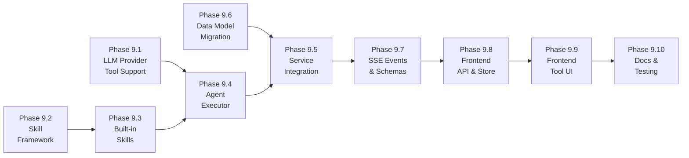

# Phase 9 Implementation Roadmap

## Overview

Phase 9 delivers the **AI Agent Skill System** — a pluggable tool-calling framework that allows the AI assistant to query project data on behalf of the user. The agent uses standard OpenAI-style function calling to invoke skills, with all execution scoped to the current user's permissions via the existing RBAC system.

Key capabilities:
- **Skill Framework:** Abstract base class, central registry, and permission-aware execution context for defining agent skills
- **OpenAI Function Calling:** Skills are exposed as OpenAI-format tool schemas passed via the `tools` parameter, compatible with Ollama, OpenAI, Azure OpenAI, and Anthropic
- **ReAct-Style Agent Loop:** Non-streaming tool-selection rounds followed by a streaming final response, supporting multi-step reasoning with up to 6 tool calls per turn
- **Permission Scoping:** Every skill checks the user's effective project role before executing, using `resolve_effective_project_role` from Phase 1's RBAC system — the agent only sees data the user can access
- **5 Built-in Skills:** List projects, search tickets, get ticket details, get sprint status, and search knowledge base
- **Tool Activity UI:** Real-time display of tool calls in the chat flyout with inline status indicators

Phase 9 builds on Phase 8's LLM abstraction, chat persistence, and SSE streaming infrastructure.

### Dependency Graph

### Parallelization

- **9.1** (LLM Tool Support) and **9.2** (Skill Framework) and **9.6** (Data Model) can be built in parallel
- **9.3** (Built-in Skills) depends on 9.2
- **9.4** (Agent Executor) depends on 9.1 and 9.3
- **9.5** (Service Integration) depends on 9.4 and 9.6
- **9.7** (SSE Events) depends on 9.5
- **9.8** and **9.9** (Frontend) are sequential after 9.7
- **9.10** (Docs & Testing) is last

---

## Phase 9.1: LLM Provider Tool Support

### Description
Extend the LLM provider abstraction to support function calling via the `tools` parameter. The `chat_completion` method gains an optional `tools` parameter, and the `ChatResponse` gains `tool_calls` and `finish_reason` fields.

### Tasks
- [ ] Add `tool_calls: list[dict] | None` and `finish_reason: str | None` to `ChatResponse` in `base.py`
- [ ] Add `tools: list[dict] | None = None` parameter to `BaseLLMProvider.chat_completion()`
- [ ] Update `OpenAIProvider.chat_completion()` to pass `tools` to the SDK and extract `choice.message.tool_calls`
- [ ] Update `AnthropicProvider.chat_completion()` to convert OpenAI tool schemas to Anthropic format, handle `stop_reason: "tool_use"` and `tool_use` content blocks
- [ ] `OllamaProvider` and `AzureOpenAIProvider` inherit tool support from `OpenAIProvider` — verify no changes needed

### Files to Modify
- `backend/app/services/llm/base.py`
- `backend/app/services/llm/openai_provider.py`
- `backend/app/services/llm/anthropic_provider.py`

### Acceptance Criteria
- [ ] `chat_completion(messages, tools=[...])` returns `tool_calls` when the model selects tools
- [ ] `finish_reason` is `"tool_calls"` when tools are requested, `"stop"` otherwise
- [ ] `tool_calls` contains `id`, `function.name`, and `function.arguments` (JSON string)
- [ ] Providers that don't receive tool calls return `tool_calls=None, finish_reason="stop"`
- [ ] Anthropic provider correctly converts tool schemas and parses `tool_use` blocks

---

## Phase 9.2: Skill Framework

### Description
Create the abstract skill base class, skill registry, and permission-aware execution context.

### Tasks
- [ ] Create `backend/app/services/agent/__init__.py`
- [ ] Create `backend/app/services/agent/skills.py` with `BaseSkill`, `SkillContext`, `SkillRegistry`, and `SkillPermissionError`
- [ ] Implement `SkillRegistry.to_openai_tools()` to convert all skills to OpenAI function-calling format
- [ ] Implement `check_project_access()` helper that resolves a project by key and verifies user role

### Files to Create
- `backend/app/services/agent/__init__.py`
- `backend/app/services/agent/skills.py`

### Acceptance Criteria
- [ ] `BaseSkill` declares `name`, `description`, `parameters_schema`, `category`
- [ ] `SkillContext` carries `db`, `user`, `params` for skill execution
- [ ] `SkillRegistry` supports `register()`, `get()`, `list_all()`, `to_openai_tools()`
- [ ] `check_project_access()` returns the `Project` or raises `SkillPermissionError`
- [ ] Global `registry` instance is importable from `agent.__init__`

---

## Phase 9.3: Built-in Skills

### Description
Implement 5 read-only skills that use existing service-layer functions with permission enforcement.

### Tasks
- [ ] Implement `ListMyProjectsSkill` — lists projects the user can access across their orgs
- [ ] Implement `SearchTicketsSkill` — search tickets in a project by keyword, type, priority, assignee
- [ ] Implement `GetTicketDetailsSkill` — get full ticket details by project key + ticket number
- [ ] Implement `GetSprintStatusSkill` — get the active sprint and its completion stats
- [ ] Implement `SearchKnowledgeBaseSkill` — full-text search across published KB pages
- [ ] Register all skills in the global registry

### Skill Parameters

| Skill | Required Params | Optional Params |
|-------|----------------|-----------------|
| `list_my_projects` | (none) | — |
| `search_tickets` | `project_key` | `query`, `status`, `priority`, `assignee`, `ticket_type` |
| `get_ticket_details` | `project_key`, `ticket_number` | — |
| `get_sprint_status` | `project_key` | — |
| `search_knowledge_base` | `project_key`, `query` | `limit` |

### Files to Create
- `backend/app/services/agent/builtin_skills.py`

### Acceptance Criteria
- [ ] Each skill returns structured data as a dict (not raw ORM objects)
- [ ] Each skill checks user permissions before querying data
- [ ] `SearchTicketsSkill` calls `ticket_service.list_tickets()` with filters
- [ ] `GetTicketDetailsSkill` resolves project key + ticket number to a ticket
- [ ] `GetSprintStatusSkill` returns the active sprint with `get_sprint_stats()` data
- [ ] `SearchKnowledgeBaseSkill` uses PostgreSQL full-text search (`plainto_tsquery` + `ts_rank_cd`)
- [ ] Skills return a helpful message when no results are found
- [ ] Permission errors return a structured error (not a crash)

---

## Phase 9.4: Agent Executor

### Description
Build the ReAct-style agent loop that orchestrates tool selection, execution, and final response generation.

### Tasks
- [ ] Create `backend/app/services/agent/executor.py` with `run_agent_turn()` async generator
- [ ] Implement the tool-calling loop: non-streaming LLM calls → execute tools → add results → repeat
- [ ] Implement max tool rounds guard (default 6) to prevent infinite loops
- [ ] Yield SSE events for tool activity (`tool_start`, `tool_result`)
- [ ] Stream the final response using `chat_completion_stream_with_usage()` with reasoning support
- [ ] Handle errors gracefully: skill failures yield error SSE events, don't crash the stream

### Files to Create
- `backend/app/services/agent/executor.py`

### Acceptance Criteria
- [ ] `run_agent_turn()` yields SSE event strings (same format as Phase 8)
- [ ] Tool calls are detected from `ChatResponse.tool_calls`
- [ ] Tool results are added to the message history as `role: "tool"` messages
- [ ] Final response is streamed with reasoning and content tokens
- [ ] Max rounds exceeded yields an error event and stops
- [ ] Skill permission errors yield a descriptive error in the tool result (not a crash)
- [ ] Works correctly when no tools are called (direct text response)

---

## Phase 9.5: Service Integration

### Description
Integrate the agent executor into the existing AI chat service, replacing the direct LLM call with the agent loop.

### Tasks
- [ ] Refactor `ai_service.send_message_stream()` to call `run_agent_turn()` from the executor
- [ ] Update the system prompt to describe the agent's capabilities and available tools
- [ ] Pass the global skill registry to the executor
- [ ] Save tool call metadata on assistant messages (using the new `tool_calls` JSONB column)
- [ ] Maintain backward compatibility: if no skills are registered, fall back to direct streaming

### Files to Modify
- `backend/app/services/ai_service.py`

### Acceptance Criteria
- [ ] Chat endpoint uses the agent executor for all requests
- [ ] Tool calls are visible in the SSE stream
- [ ] Final responses stream with reasoning support (Phase 8 compatibility)
- [ ] Tool call metadata is persisted on assistant messages
- [ ] System prompt mentions available skills without exposing internal details
- [ ] Conversations that don't need tools work exactly as before

---

## Phase 9.6: Data Model Update

### Description
Add a JSONB column to `ai_messages` for storing tool call metadata and support the `"tool"` role for tool-result messages.

### Tasks
- [ ] Add `tool_calls` JSONB column to `AIMessage` model
- [ ] Create Alembic migration to add the column
- [ ] Update `AIMessage` model to accept `role="tool"` values

### Files to Modify/Create
- `backend/app/models/ai_message.py` (modify)
- `backend/alembic/versions/xxx_add_tool_calls_to_ai_messages.py` (new migration)

### Acceptance Criteria
- [ ] Migration runs successfully, adding nullable JSONB column
- [ ] `AIMessage` can store tool call data as JSON
- [ ] Existing messages are unaffected (column is nullable)
- [ ] Migration is reversible

---

## Phase 9.7: Updated SSE Events and Schemas

### Description
Add new SSE event types for tool activity and update the AI config endpoint to include available skills.

### Tasks
- [ ] Define `tool_start` and `tool_result` SSE event types
- [ ] Add `SkillInfo` schema to `ai.py` schemas
- [ ] Update `AIConfigOut` to include `available_skills: list[SkillInfo]`
- [ ] Update the `/ai/config` endpoint to return skill information

### Files to Modify
- `backend/app/schemas/ai.py`
- `backend/app/api/v1/endpoints/ai.py`

### Acceptance Criteria
- [ ] `tool_start` events include skill name and arguments
- [ ] `tool_result` events include skill name and result summary
- [ ] `/ai/config` response includes the list of available skills with name, description, and category
- [ ] Schemas validate correctly

---

## Phase 9.8: Frontend API and Store Updates

### Description
Update the frontend API types and Pinia store to handle tool-related SSE events.

### Tasks
- [ ] Add `'tool_start' | 'tool_result'` to `SSEEvent.type` in `ai.ts`
- [ ] Add `name`, `arguments`, `summary` fields to `SSEEvent` interface
- [ ] Add `activeToolCall` ref to the chat store
- [ ] Handle `tool_start` and `tool_result` events in the store's event switch

### Files to Modify
- `frontend/src/api/ai.ts`
- `frontend/src/stores/chat.ts`

### Acceptance Criteria
- [ ] SSE events with tool types are parsed correctly
- [ ] `activeToolCall` is set on `tool_start` and cleared on `tool_result`
- [ ] Store state is correctly managed across tool call cycles

---

## Phase 9.9: Frontend Tool Activity UI

### Description
Display tool call activity in the chat flyout so users can see what the agent is doing.

### Tasks
- [ ] Add tool activity indicator to `ChatFlyout.vue` — shows during active tool calls
- [ ] Display tool name in a user-friendly format (e.g., "Searching tickets...")
- [ ] Add i18n keys for tool activity messages in `en.json` and `es.json`
- [ ] Style the indicator consistently with the reasoning block

### Files to Modify
- `frontend/src/components/chat/ChatFlyout.vue`
- `frontend/src/i18n/locales/en.json`
- `frontend/src/i18n/locales/es.json`

### Acceptance Criteria
- [ ] Tool activity is visible during agent tool calls
- [ ] Tool name is displayed in human-readable form
- [ ] Indicator disappears when tool call completes
- [ ] All strings are internationalized
- [ ] Styling matches the existing chat UI

---

## Phase 9.10: Documentation and Testing

### Description
Finalize Phase 9 documentation and verify end-to-end functionality.

### Tasks
- [ ] Finalize Phase 9 documentation (PHASES.md, ARCHITECTURE.md, API_DESIGN.md, DATA_MODEL.md)
- [ ] End-to-end test: ask the agent about tickets in a project
- [ ] End-to-end test: ask the agent about sprint status
- [ ] End-to-end test: ask the agent to search the knowledge base
- [ ] Verify permission scoping: agent returns "no access" for unauthorized projects
- [ ] Run full test suite — no regressions

### Acceptance Criteria
- [ ] Agent can answer questions about tickets using `search_tickets` and `get_ticket_details`
- [ ] Agent can report sprint progress using `get_sprint_status`
- [ ] Agent can find KB articles using `search_knowledge_base`
- [ ] Agent respects user permissions — unauthorized data is never returned
- [ ] Phase 9 documentation is complete and consistent with Phase 8 format

---

## Effort & Status

| Phase | Name | Est. Effort | Dependencies | Status |
|-------|------|-------------|-------------|--------|
| 9.1 | LLM Provider Tool Support | Medium | None | PENDING |
| 9.2 | Skill Framework | Medium | None | PENDING |
| 9.3 | Built-in Skills | Large | 9.2 | PENDING |
| 9.4 | Agent Executor | Large | 9.1, 9.3 | PENDING |
| 9.5 | Service Integration | Medium | 9.4, 9.6 | PENDING |
| 9.6 | Data Model Update | Small | None | PENDING |
| 9.7 | SSE Events & Schemas | Small | 9.5 | PENDING |
| 9.8 | Frontend API & Store | Small | 9.7 | PENDING |
| 9.9 | Frontend Tool UI | Medium | 9.8 | PENDING |
| 9.10 | Docs & Testing | Medium | All prior | PENDING |
